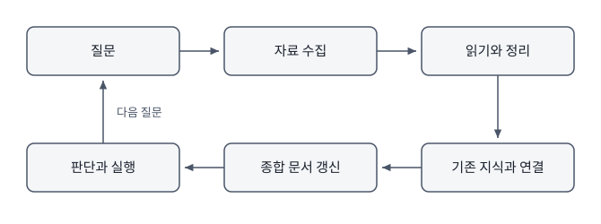

# 1장. LLM-Wiki란 무엇인가

어떤 사람이 반년 동안 AI와 매일 대화했다고 하자. 논문을 요약시키고 코드를 고치고 발표 자료의 흐름을 상의하고 학생에게 보낼 메일의 어조를 다듬었다. 대화 하나하나는 만족스러웠다. 그런데 반년이 지난 뒤 "지금까지 정리한 내용 중에 이 주제와 관련된 것을 모아 달라"고 요청하면 아무것도 나오지 않는다. 대화는 서비스 안에 시간순으로 쌓여 있지만 그 안에서 무엇이 결론이었고 무엇이 폐기된 아이디어였는지는 구분하기 어렵다. LLM-Wiki는 반년 동안 쌓인 판단과 결과물을 폴더 하나와 Markdown 문서 몇 개에 기록하고 서로 연결한다. 문서가 사용자의 파일 시스템에 남으므로 다음 대화에서도 다시 읽을 수 있다. 오늘 바로 시작할 수 있는 크기다.

# 대화가 남지 않는 이유

대화형 AI를 쓰는 사람들이 반복해서 겪는 상황이 세 가지 있다. 첫째는 같은 배경 설명과 결과 형식을 매번 다시 적는 일이다. 웹에서 ChatGPT를 쓸 때 나는 새 대화를 열 때마다 무엇을 연구하는지, 이 논문을 왜 읽는지, 어느 측면을 중점적으로 볼지 설명해야 한다. 필요한 정보를 표로 받을지 문단으로 받을지, 열 이름과 요약 길이는 어떻게 할지도 다시 정한다. 대화가 바뀔 때마다 연구 맥락과 출력 형식을 복원하는 데 시간이 들고 설명이 조금씩 달라지면 결과의 형식도 흔들린다. 둘째는 이전에 내린 결정을 잊는 일이다. 두 달 전에 어떤 방법을 쓰지 않기로 정했는데 그 이유가 기억나지 않아 같은 논의를 다시 한다. 셋째는 좋았던 답을 다시 찾지 못하는 일이다. 분명 잘 정리된 설명을 받았는데 어느 대화에 있었는지 알 수 없어 결국 다시 물어본다. 세 상황의 원인은 같다. 채팅 기록은 시간순으로 쌓이지만 지식은 시간순으로 조직되지 않는다. 어제 나눈 대화와 석 달 전에 나눈 대화가 같은 주제를 다루었다면 그 둘은 서로 옆에 있어야 하는데 채팅 기록에서 둘 사이의 거리는 석 달이다.

1. 최근 한 달 동안 반복해서 찾았거나 남에게 설명한 주제를 세 가지 적는다.
2. 각 주제에 대해 그때 만들어진 결과물이 지금 어디에 있는지 적는다. 찾을 수 없다면 찾을 수 없다고 적는다.
3. 각 주제에 대해 무엇이 사라졌는지 한 줄로 적는다. 사라진 것이 사실인지, 판단인지, 근거인지, 아니면 그 셋을 이었던 맥락인지 구분한다.
4. 세 주제를 놓고 "내가 만들 LLM-Wiki는 무엇을 기억해야 하는가"에 대한 다섯 문장짜리 선언문을 쓴다.
5. 선언문을 `readme` 또는 `목적`이라는 이름의 Markdown 문서로 저장해 앞으로 만들 위키의 첫 문서로 삼고 세 주제와 각각에서 사라진 것을 표로 정리해 같은 문서 아래에 붙인다.

성공 기준은 세 주제 중 최소 하나에서 사라진 것이 판단이나 맥락이었다는 점을 스스로 확인하는 것이다. 사실은 다시 찾을 수 있지만 판단과 맥락은 다시 만들어야 하고 그것이 이 책 전체가 다루는 문제다. 2장에서 폴더를 만들 때 이 표가 무엇을 어디에 둘지 정하는 근거가 된다. 지식은 주제와 관계를 축으로 조직되어야 다시 꺼낼 수 있고 시간축은 그 조직을 만들어 주지 않는다. 검색 기능이 있어도 사정은 크게 달라지지 않는다. 검색은 내가 그때 어떤 단어를 썼는지를 기억해야 작동하고 무엇보다 서로 다른 대화에서 내린 판단들이 서로 모순되는지 알려주지 않는다. 대화의 편리함과 기억의 지속성은 서로 다른 문제다. 대화형 인터페이스가 편리한 이유는 준비 없이 시작할 수 있기 때문이다. 폴더를 정하지 않아도 되고 파일 형식을 고르지 않아도 되고 어디에 저장할지 미리 결정하지 않아도 된다. 그 편리함의 대가가 바로 아무것도 정해지지 않았다는 사실이다. 저장할 위치를 정하지 않았으므로 저장되지 않고 조직할 축을 정하지 않았으므로 조직되지 않는다.

# LLM-Wiki의 한 문장 정의

LLM-Wiki는 폴더 안의 Markdown 문서를 사람이 소유하고 AI 에이전트가 함께 읽고 고치는 지식 작업 환경이다. 정의에 들어 있는 요소를 하나씩 풀어 보면 뜻이 분명해진다. 폴더 안에 있다는 것은 문서가 사용자의 파일 시스템 위에 놓인다는 뜻이다. Markdown 문서라는 것은 사람이 직접 열어 읽고 고칠 수 있는 일반 텍스트라는 뜻이다. 사람이 소유한다는 것은 무엇을 남기고 무엇을 버릴지 사람이 정한다는 뜻이고 AI가 함께 읽고 고친다는 것은 AI가 자료를 찾고 초안을 쓰고 형식을 맞추는 일을 실제로 수행한다는 뜻이다. 이 환경에서 일은 하나의 순환을 이룬다. 원자료가 들어오고 읽어서 정리하고 기존 지식과 연결하고 여러 문서를 묶어 종합하고 그 종합에서 다음 행동이 나온다. 이 순환의 각 단계가 서로 다른 문서로 남고 문서끼리 링크로 이어진다. 다음에 비슷한 질문이 들어오면 이미 만들어진 정리와 종합에서 출발한다. 같은 일을 두 번 하지 않는다는 것이 이 구조의 이익이다. Wiki라는 이름을 쓰는 이유는 문서 사이의 연결과 지속적인 개정에 있다. 새 문서가 들어오면 기존 문서를 고치고 고친 흔적이 남고 문서끼리 서로를 가리킨다. 위키를 만든다는 말은 계속 고쳐지는 문서 체계를 유지한다는 뜻이다. 이 책에서 위키라는 말은 언제나 이 의미로 쓴다.

# LLM-Wiki를 시작하게 된 계기

챗지피티가 등장하고 AI를 이용해서 논문을 빠르게 요약하고 읽는 일이 많아졌다. 읽어야 할 논문은 늘 밀려 있고 전문을 처음부터 끝까지 눈으로 훑을 시간은 없으니, 흥미로운 논문을 발견할 때마다 PDF를 대화창에 올려 빠르게 파악하는 방식을 썼다. 이 방식은 한 편을 읽는 동안에는 잘 작동한다. 문제는 며칠 뒤에 온다. 이삼일 지나 또 흥미로운 논문을 발견하고 같은 방식으로 읽다 보면, 그 논문이 며칠 전에 읽은 논문과 이어져 있다는 것을 알아채게 된다. 연구자가 읽는 논문은 무작위로 흩어져 있지 않다. 자기 관심사를 따라 비슷한 주제를 계속 찾아 읽으므로 새로 발견한 논문의 내용이 앞서 읽은 것과 맞물리는 일이 오히려 흔하다. 그래서 다음 단계는 자연스럽게 정해졌다. 두 편의 PDF를 한 대화에 함께 올려 두 논문을 비교해 달라고 시키는 것이다.

두 편일 때는 이 방식이 잘 통한다. 문제는 편수가 늘어날 때 생긴다. 같은 주제를 따라 읽다 보면 그런 논문이 열 편이 되고 스무 편이 되고 쉰 편까지 늘어난다. 그때 이 논문들을 어떻게 서로 비교하면서 읽을 것인가라는 질문이 남는다. 웹 대화창에는 한 번에 올릴 수 있는 파일 수가 정해져 있고 대화에 남는 기록에도 한계가 있어 앞서 읽은 내용을 언제까지나 기억하지는 못한다. 열 편째를 읽을 때 첫 편에서 무엇을 확인했는지가 이미 대화 밖으로 밀려나 있다는 뜻이다. 논문이 늘어날수록 비교의 가치는 커지는데 비교할 수 있는 능력은 줄어드는 구조였다. 그 무렵 Google의 NotebookLM이 나왔다. 자료 여러 편을 한 노트북에 넣어 두고 그 안에서 묻고 요약하게 하는 방식이라, 한 편씩 올려 가며 읽던 웹 대화창보다 훨씬 나았다. 무료 등급 기준으로 노트북 하나에 자료를 50개까지 넣을 수 있었고 한 주제의 논문을 모아 놓고 읽는 일이 처음으로 가능해졌다. 그러나 두 가지 한계가 남았다. 하나는 그 편수를 넘기기 어렵다는 것이고 다른 하나가 더 중요했다. 한 노트북에서 쉰 편을 읽고 다른 노트북을 열어 또 쉰 편을 읽을 수는 있지만 두 노트북에 나뉘어 들어간 논문들 사이의 연결은 볼 수 없다. 연구자가 읽는 논문은 노트북 경계를 따라 나뉘지 않는다. 앞의 쉰 편과 뒤의 쉰 편은 같은 관심사에서 나온 것이므로 서로 이어져 있는데 그 연결을 확인할 방법이 없었다. 결국 같은 문제가 규모만 키워 돌아온 셈이다.

조금 더 넓게 보면 문제가 하나 더 있었다. 논문을 읽고 머릿속에 요약이 남는 것으로 일이 끝나지 않는다. 거기서부터 질문이 갈라져 나오고 그 질문마다 다른 작업이 붙는다. 논문을 쓰고 발표 자료를 만들고 미팅을 준비하고 공동연구를 설계한다. 네 작업 모두 같은 논문에서 출발하는데 각각 다른 곳에서 처음부터 다시 시작하고 있었다. 읽기와 그 뒤에 오는 일을 같은 폴더의 문서로 이어 갈 구조가 필요했다. 그러던 차에 안드레이 카파시가 제안한 위키 방식을 보고 이것이라면 연구에 본격적으로 쓸 수 있겠다고 판단했다. 이 책은 그 판단에서 시작해 실제로 운영해 본 결과다.

논문을 읽고 요약하는 일은 어렵지 않다. AI가 등장하기 전에도 어렵지 않았고 지금은 더 쉬워졌다. 어려운 것은 이미 읽은 논문과 지금 읽는 논문이 어떤 관계인지 기억하는 일이다. 같은 현상을 다른 방법으로 측정한 두 논문이 서로 다른 결론을 냈을 때, 그것이 진짜 모순인지 아니면 측정 대상이 달랐던 것인지는 두 논문을 나란히 놓아야 판단할 수 있다. 논문 한 편을 요약한 문서가 백 개 있어도 이 판단은 만들어지지 않는다. 요약은 논문 안에서 끝나고 관계는 논문 사이에 있기 때문이다. 같은 지식이 서로 다른 작업에서 반복해서 필요해진다는 문제도 있다. 어떤 방법의 한계를 설명하는 일은 연구 질문을 세울 때도 필요하고 강의에서 설명할 때도 필요하고 학생의 분석 계획을 검토할 때도 필요하고 논문의 고찰을 쓸 때도 필요하다. 네 번 모두 처음부터 다시 정리한다면 네 번 모두 조금씩 다른 설명이 만들어지고 어느 것이 현재의 판단인지 알 수 없게 된다. 한 번 정리한 내용을 네 작업이 함께 참조하도록 연결해야 한다. AI를 쓸수록 산출물은 늘어난다. 요약, 초안, 표, 코드, 슬라이드가 계속 만들어진다. 그런데 만들어진 것을 다시 사용할 구조가 없으면 늘어나는 것은 일회성 산출물뿐이다. 파일이 많아지는 것과 지식이 축적되는 것은 다른 일이다. 지식이 축적되었다는 말은 새 질문에 답할 때 예전에 만든 것에서 출발할 수 있다는 뜻이고 그러려면 산출물이 서로를 가리키고 있어야 한다.

# 일반적인 메모, 검색, 채팅과의 차이

| 방식 | 잘하는 것 | 쉽게 잃는 것 |
|---|---|---|
| 메모 앱 | 빠른 기록과 개인 정리 | 출처와 판단 규칙, AI가 작업을 이어 갈 구조 |
| 검색 | 이미 존재하는 정보 찾기 | 내가 이전에 내린 결정과 관심사의 누적 |
| 웹 채팅 | 즉각적인 설명과 아이디어 생성 | 폴더 전체의 맥락, 지속적으로 관리되는 정본 |
| 문서형 RAG | 저장 문서에서 관련 내용 검색 | 지식 구조의 능동적 개정과 실행 규칙 |
| LLM-Wiki | 자료와 해석, 연결, 규칙, 작업 이력의 누적 | 자동으로 정확해지지 않으며 사람의 검증이 필요함 |

표의 마지막 줄에 적은 대로 이 방식은 자동으로 정확해지지 않는다. 틀린 정리를 넣으면 틀린 정리가 축적되고 검증하지 않은 요약을 정본으로 삼으면 그 오류가 이후의 모든 종합에 들어간다. 이 구조가 주는 것은 추적 가능성이다. 어떤 주장이 어느 원자료에서 나왔는지, 언제 누가 고쳤는지, 지금 이 판단이 무엇에 근거하는지를 되짚을 수 있다는 것이 이 방식의 이익이고 그 위에서 정확성을 만드는 일은 사람의 몫이다. 메모 앱은 여전히 빠르고 검색은 여전히 필요하고 웹 채팅은 여전히 생각을 열어 보기에 좋다. LLM-Wiki는 이 도구들의 결과를 어디에 놓을지 정하는 상위 작업 방식이다. 웹 채팅에서 좋은 설명을 얻었다면 그것을 위키의 어느 문서에 반영할지 정하고 검색으로 찾은 자료라면 원자료로 남길지 아니면 참고만 하고 넘어갈지 정한다. 도구를 여러 개 쓰면서도 그 결과가 흩어지지 않게 붙잡아 두는 일이다.

# LLM-Wiki를 이루는 다섯 층

이 환경은 성격이 다른 다섯 종류의 문서로 이루어진다. 층을 나누는 이유는 각 층의 수정 권한과 신뢰 수준이 다르기 때문이다. 원자료는 논문, 회의록, 데이터, 링크, 이미지처럼 다시 확인할 수 있는 근거다. 이 층은 고치지 않는다. 원문 PDF를 편집하기 시작하면 무엇이 원래 있던 내용이고 무엇이 나중에 붙인 해석인지 구분할 수 없게 된다. 정리 문서는 원자료의 내용과 맥락을 읽을 수 있는 형태로 옮긴 기록이다. 이 층은 원자료를 대체하지 않는다. 수치나 조건이 결론을 좌우하는 대목에서는 원자료로 돌아가야 한다. 연결과 종합은 여러 문서를 비교하고 개념, 쟁점, 질문으로 엮은 문서다. 앞서 말한 두 논문의 모순이 진짜 모순인지 판단하는 일이 이 층에서 일어난다.

운영 규칙은 파일을 어디에 두고 무엇을 확인하며 어떻게 고칠지를 정한 지침이다. 이 층이 없으면 사람마다, 세션마다 다른 방식으로 문서를 만들게 되고 결국 구조가 무너진다. 작업 이력과 다음 행동은 무엇이 바뀌었고 어떤 문제가 남았는지를 이어 주는 기록이다. 이 층이 있어야 다음 세션이 이전 세션의 끝에서 시작할 수 있다. 처음부터 다섯 층을 모두 만들 필요는 없다. 첫 실습은 원자료, 정리 문서, 그리고 그 둘을 가리키는 목차 문서 세 가지로 시작한다. 나머지 층은 필요가 생겼을 때 추가한다. 종합 문서는 비교할 대상이 두 건 이상 쌓였을 때 의미가 있고 운영 규칙은 같은 판단을 세 번쯤 반복했을 때 쓰면 된다. 층 다섯 개를 미리 만들어 놓고 채우려 들면 대부분 빈 채로 남는다.

# 사람이 맡을 일과 AI가 맡을 일

역할을 나누는 기준은 책임이다. 사람이 맡는 것은 목적을 정하는 일, 자료의 신뢰도를 판단하는 일, 무엇이 중요한지 고르는 일, 충돌하는 근거 사이에서 결정하는 일, 그리고 그 결정의 최종 책임을 지는 일이다. 이 다섯 가지는 AI가 대신할 수 있는지 여부와 무관하게 사람이 해야 한다. 잘못된 판단의 결과를 감당하는 것이 사람이기 때문이다. AI 에이전트가 맡는 것은 파일을 탐색하는 일, 초안을 쓰는 일, 형식을 통일하는 일, 연결 후보를 제안하는 일, 반복적인 검사를 수행하는 일, 그리고 빠진 것을 찾아내는 일이다. 이 여섯 가지는 양이 많고 규칙이 분명하며 사람이 하면 지치는 일이다. 특히 마지막 두 가지가 실제 이익이 크다. 문서 200개에서 링크가 끊긴 곳을 찾거나 새로 들어온 논문과 관련될 만한 기존 문서를 찾는 일은 사람이 성실하게 하기 어렵다. 둘이 함께 하는 영역도 있다. 문서 구조를 설계하는 일, 기존 주장과 새 증거를 비교하는 일, 다음 질문을 도출하는 일이 여기에 속한다. 이 세 가지는 AI가 후보를 만들고 사람이 고르는 방식이 잘 작동한다. AI가 비교 축을 다섯 개 제안하면 사람이 그중 실제로 의미 있는 두 개를 고르는 식이다. 두 논문의 결과가 왜 다른지 같은 판단에서 AI는 그럴듯한 설명을 만들어 낼 수 있고 그 설명이 맞는지 확인하려면 사람이 원자료로 돌아가야 한다. AI가 생각을 대신하는 것과 AI가 생각의 흔적을 정리하고 다시 꺼내 주는 것은 다르다. 앞의 것을 기대하면 실망하거나 더 나쁘게는 검증하지 않은 결과를 믿게 된다. 뒤의 것을 기대하면 실제로 얻을 수 있다.

# 사람마다 달라지는 쓰임새

파일과 지식을 다루고 관심사가 시간이 지나도 이어지고 같은 주제를 여러 번 다시 만나는 일이라면 형태만 달라진다. 나는 LLM-Wiki에서 매 작업의 로그를 남긴다. 로그에는 어떤 문서를 만들고 고쳤는지, 어떤 판단을 보류했는지, 다음 작업에서 무엇을 확인할지가 쌓인다. 반복해서 쓰는 지시와 문서 형식은 운영 규칙에 반영한다. 그렇게 쓰다 보면 에이전트는 내 폴더 구조와 자주 쓰는 형식, 작업 순서를 기준으로 움직이게 된다. 위키의 내용과 함께 작업 환경도 내 방식에 맞춰 변한다. 같은 도구로 시작해도 사용자의 연구와 습관에 따라 전혀 다른 위키가 만들어진다. 학생에게 이 환경은 관심사가 학기마다 이어지는 학습 지도가 된다. 이번 학기에 배운 개념이 다음 학기의 과목과 어떻게 이어지는지가 문서로 남는다. 연구자에게는 주장과 증거가 갱신되는 연구 기억이 된다. 새 논문이 들어올 때마다 기존 판단이 강화되는지 좁아지는지가 기록된다. 교사에게는 수업 반응과 설명 방식이 축적되는 교육 위키가 된다. 어떤 설명이 어느 학년에서 통했는지가 남는다. 기획자와 실무자에게는 결정과 근거, 후속 작업이 연결되는 프로젝트 기억이 된다. 왜 그렇게 정했는지를 반년 뒤에 되짚을 수 있다. 창작자에게는 소재와 초안, 피드백, 설정이 서로를 참조하는 작업실이 된다. 이 다섯 가지에서 공통된 것은 참조이고 저장한 것들이 서로를 가리키고 있는지가 이 환경의 성패를 가른다.

# 계속 갱신되는 순환

*원자료 수집에서 정리, 연결, 종합, 판단, 실행으로 이어진다. 실행에서 생긴 질문이 다시 자료 수집으로 돌아오면서 위키가 갱신된다.*

이 그림에서 눈여겨볼 곳은 판단과 실행에서 질문으로 되돌아가는 왼쪽 화살표다. 자료가 들어오는 것만으로는 위키가 자라지 않는다. 새 자료가 기존 생각을 강화하는지, 적용 범위를 좁히는지, 아니면 틀렸다고 드러내는지를 판단해 종합 문서에 반영할 때 비로소 지식이 축적된다. 이 판단을 건너뛰면 문서 수만 늘고 다음 질문에 답하는 능력은 그대로다. 잘 나눈 폴더에 정리되지 않은 파일을 넣으면 잘 나뉜 채로 흩어지므로 구조는 필요조건까지만 채워 준다. 좋은 LLM-Wiki는 새 질문과 작업을 더 정확하게 이어 주는 위키다. 판단 기준은 단순하다. 지금 이 위키에 새 질문을 던졌을 때, 반년 전의 나와 지금의 내가 같은 출발점에 서는가. 그렇다면 위키가 일하고 있는 것이고 다른 출발점에 선다면 문서가 쌓이기만 한 것이다.
