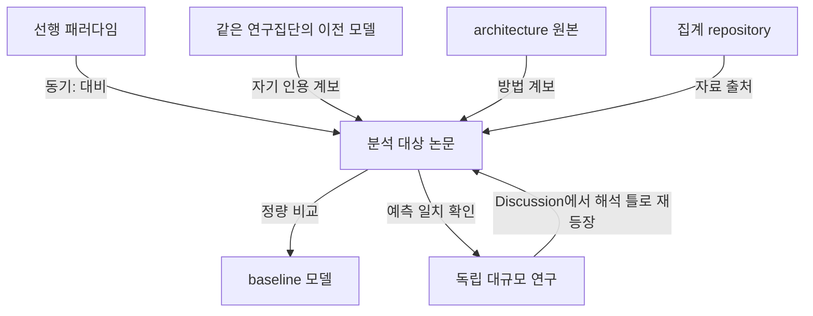

# 10장. 논문의 구조를 해부하기

참고문헌 목록에는 논문의 동기와 방법과 데이터와 비교가 조립되어 있는데 결과 요약은 그 조립을 보여 주지 않는다. 구조 분석은 지적 계보, 신뢰를 만드는 방식, 학습 자료의 출처 구조, 자기 위키에 비어 있는 부분을 찾는다. 절차는 여섯 묶음이고 마지막 묶음은 다음에 읽을 논문의 목록을 만든다. 대학원 논문 발표 수업에서 반복해서 보게 되는 장면이 있다. 발표자가 분야를 대표하는 모델 논문 한 편을 맡아 30분 동안 잘 만든 슬라이드를 넘긴다. 문제 설정, 구조 그림, 성능 표, 저자가 밝힌 한계까지 빠진 것이 없다. 그런데 청중에서 "이 논문은 왜 하필 그 모델들과 비교했는가", "학습에 쓴 데이터는 누가 모은 것인가", "저자들이 넘어서려는 기존 관점은 어느 논문에 있는가" 같은 질문이 나오면 발표가 멈춘다. 발표자가 논문을 읽는 동안 그 질문을 하지 않았기 때문이고 세 질문의 답은 모두 참고문헌 목록과 본문 사이의 대응 관계에 들어 있다.

# 결과 요약과 구조 분석의 차이

논문을 읽고 남기는 기록은 대개 결과 요약이다. 무엇을 물었고 어떻게 했고 무엇을 얻었고 어디까지가 한계인가. 4장에서 만든 source note도 큰 틀에서는 그 형식을 따른다. 결과 요약이 답하는 질문은 하나다. 이 논문이 무엇을 주장했는가. 답이 정확하다면 그 기록은 제 일을 다 한 것이고 논문 한 편을 다시 열지 않고도 내용을 되살릴 수 있다. 구조 분석이 답하는 질문은 다르다. 그 주장은 무엇 위에 서 있는가. 대규모 사전학습으로 세포 상태를 예측했다는 논문이 있다고 하자. 요약은 그 문장에서 끝나지만 구조 분석은 예측이 믿을 만하다는 논증이 어디에서 나오는지를 묻는다. 독립적으로 수행된 다른 대규모 연구의 결과와 예측이 겹쳐서인가, 같은 과제에서 기존 방법들보다 점수가 높아서인가, 아니면 기존 분석 파이프라인에 끼워 넣었더니 그 파이프라인이 나아져서인가. 세 답은 서로 다른 종류의 논증이고 무너지는 지점도 다른데, 요약문은 셋을 구분하지 않는다.

인용마다 이름표를 붙여 "3번 인용은 배경, 7번 인용은 benchmark"까지 적고 끝내면 재료만 만든 것이다. Introduction에서 한계로 지목된 논문이 Results에서 비교 대상으로 다시 나오고 Discussion에서 결과를 일반화하는 틀로 세 번째 나오는 경우가 있다. 세 번의 등장은 하나의 논증이다. 저자는 그 논문을 넘어서겠다고 선언하고 넘어섰다고 수치로 보이고 넘어선 결과를 다시 그 논문의 언어로 해석한다. 이름표만 세면 세 단계가 사라지고 등장 횟수 3만 남는다. 같은 읽기가 연구 논문 밖에서도 통한다. 정책 보고서의 각주를 순서대로 따라가 보면 어느 통계를 근거로 삼았는지, 반대 견해를 어느 대목에서 인용했는지, 그 견해를 어디에서 반박했는지가 드러난다. 인용의 배치가 문서의 논증을 보여 준다. 다큐멘터리 끝에 붙는 자료 출처, 판결문의 선례 인용도 같은 방식으로 읽힌다. 문서가 자기 주장을 어디에 기대어 세웠는지는 본문과 출처의 대응에 적혀 있다.

Deep Structure Analysis는 한 논문의 모든 인용을 등장한 section과 수행하는 기능에 따라 지도로 만들고 논지를 떠받치는 인용은 원문까지 읽어 그 논문의 지적 계보와 신뢰 전략과 자료 출처 구조를 드러내는 절차다. 이 책이 근거로 삼은 연구용 위키에는 절차를 규정한 개념 정본 문서가 있고 2026년 7월에 작성되었다. 지금까지 다섯 편의 논문에 적용되었고 다섯 결과는 모두 위키의 overview 층에 페이지로 남아 있다. 방법을 규정한 문서와 적용 결과가 같은 위키 안에서 서로를 가리키기 때문에, 새 논문에 적용할 때 이전 사례를 그대로 본으로 삼을 수 있다. 절차의 뿌리는 세 갈래다. 인용의 수사적 역할을 배경, 사용, 비교, 대조로 나누는 citation function analysis(Teufel 외, 2006)가 있고 인용 주변 문장을 읽어 인용한 이유를 복원하는 citation context analysis가 있으며 인용 관계를 기계가 읽을 수 있는 유형으로 규정한 CiTO가 있다. Deep Structure Analysis는 세 갈래의 특수화이고 거기에 더하는 것은 두 가지다. 하나는 section별 지도를 반드시 만든다는 것이고 다른 하나는 분석 결과를 자기 knowledge base의 보유 여부와 대조하는 단계다. 두 번째가 이 책의 맥락에서 결정적인데, 분석이 해석으로 끝나지 않고 위키의 작업 목록으로 이어지기 때문이다.

이 절차는 Geneformer 한 편을 분석하면서 만들어졌고 그 뒤에 이름이 붙어 다른 논문에도 같은 형태로 적용되었다. 요약으로 답이 나오지 않던 질문은 이 논문이 무엇에 기대어 설득하고 있는가였다. 요약은 논문이 무엇을 했고 어떤 결과를 얻었는지까지 알려 주고 거기서 멈춘다. 참고문헌을 처음 끝까지 대응시켜 보니 서로 다른 두 무리가 드러났다. 본문에서 논지를 떠받치는 인용이 46건이었고 Methods에 붙어 학습 자료가 어디서 왔는지를 기록하는 인용이 110건 남짓이었다. 두 무리를 섞어 세면 참고문헌 150여 건짜리 논문이 되지만 나누어 세면 지적 계보는 46건 규모이고 나머지는 자료 출처의 꼬리다. 같은 대응 작업에서 위키가 아직 가지고 있지 않은 open access 논문 6건도 함께 드러났고 그 목록이 다음에 읽을 것을 정하는 작업 목록이 되었다. 이 방법이 인용 기능 분석이라는 기존 연구 전통의 특수화라는 것은 정본 문서에 밝혀 두었으며 거기에 더한 것은 section별 지도와 위키가 그 인용을 이미 가지고 있는지 대조하는 단계 두 가지다.

# 인용이 맡는 여덟 가지 기능

구조 분석의 첫 도구는 인용이 그 논문 안에서 하는 일에 이름을 붙이는 것이다. 기능은 지금 분석 중인 논문 안에서 그 인용이 맡은 역할이다. 같은 논문이 어떤 논문에서는 비교 대상 baseline으로, 다른 논문에서는 label을 공급한 자료로, 또 다른 논문에서는 배경 생물학으로 인용된다. 4장에서 다룬 카테고리와 혼동하지 않아야 한다. 카테고리는 위키 전체에서 그 논문을 어디에 두고 어떤 질문으로 다시 찾을지에 대한 결정이고 기능 분류는 논문 한 편 안에서의 위치다. 하나는 위키의 좌표이고 다른 하나는 논증의 좌표다. 축이 고정되어 있어야 논문 사이의 비교가 성립한다. 논문마다 다른 눈으로 읽으면 인상이 여러 개 생기고 그 인상들은 서로 비교되지 않는다. 축을 늘리는 것은 기존 축 어디에도 들어가지 않는 역할이 실제로 발견되었을 때이고 다섯 편을 분석하는 동안 그런 일이 한 번 있었다. 이름의 목록은 여덟 개이고 각 이름은 그때 던져야 할 질문과 짝을 이룬다.

| 기능 | 구조 분석에서 묻는 질문 |
|---|---|
| Motivation / inspiration | 이 연구를 시작하게 한 지적 씨앗과 대비 대상은 무엇인가 |
| Method and engineering lineage | Architecture, objective, 학습 장치는 어디에서 왔는가 |
| Core benchmarking | 무엇과 정량 비교하며 어떤 외부 ground truth를 쓰는가 |
| Label / supervision set | Fine-tuning과 평가에 쓰는 label은 누가 어떻게 정의했는가 |
| Dataset / material provenance | 원자료, atlas, cohort, 재료는 어디에서 왔는가 |
| Background biology | 결과를 생물학적으로 해석하는 근거는 무엇인가 |
| Interpretation frame | 결과를 일반화하는 데 쓰인 다른 분야의 틀은 무엇인가 |
| Tools and resources | Software, database, annotation resource는 무엇인가 |

인용 하나에는 기능을 하나만 배정한다. 부차적인 역할이 있으면 괄호로 덧붙이되 집계에는 넣지 않는다. 두 개를 나란히 허용하면 애매한 인용마다 두 개를 붙이게 되고 그 순간 축별 집계가 의미를 잃는다. 하나로 강제해도 재사용은 사라지지 않는데 같은 인용이 여러 section에서 다른 역할을 하는 모습은 뒤에 만들 section별 지도가 보존하기 때문이다. 분류표는 무게중심을 재는 도구이고 지도는 움직임을 기록하는 도구다. 여덟 축 가운데 자료와 재료의 출처를 적는 축을 따로 떼어 놓은 데에는 이유가 있다. Foundation model 논문이나 자료를 만드는 논문은 Methods에 corpus를 어떻게 모았는지 기록하는 긴 인용 꼬리를 달고 그 꼬리가 참고문헌의 다수를 차지하기도 한다. 꼬리를 지적 계보와 같은 통에 넣으면 논지를 실제로 움직이는 인용이 그 안에 묻힌다. 꼬리를 따로 세고 따로 묶는 작업은 방법의 일부다.

# 원문과 인용의 연결

첫 작업은 분석 대상 논문의 원문 PDF 전체와 참고문헌 목록을 확보하는 것이다. 출판사 웹페이지를 브라우저로 저장한 파일이나 화면 인쇄본은 쓰지 않는데 3장에서 다룬 운영 원칙이면서 동시에 이 작업에 고유한 이유가 있다. 웹 화면은 인용 번호를 링크로 감추고 참고문헌 목록을 접어 두는 경우가 많아, 본문 번호와 목록 항목의 대응이 애초에 끊긴 상태로 저장된다. 대응이 끊긴 자료로 시작하면 뒤의 모든 단계가 추측이 된다. PDF는 조판된 그대로를 보존하므로 번호와 항목이 함께 남는다. 대응 작업 자체는 단순하지만 조용히 틀리기 쉽다. 본문의 numeric citation이나 author-year citation을 참고문헌 목록의 각 항목에 하나씩 맞춰 나간다. 여기서 4장에서 말한 텍스트 추출 문제가 되돌아온다. 위첨자가 무너져 인용 번호가 본문의 일반 숫자와 섞이면 대응이 통째로 어긋나고 표의 각주 기호가 인용 번호처럼 보이는 경우도 있다. 대응이 끝났다고 선언하기 전에 목록의 마지막 번호와 본문에서 발견한 가장 큰 번호가 일치하는지, 목록에 있는데 본문 어디에서도 호출되지 않는 항목이 있는지 확인한다.

대응과 함께 등장 위치를 기록한다. Introduction, Results의 각 하위 절, Discussion, Methods, 그리고 Supplementary까지 나눈다. 같은 reference가 여러 곳에 나오면 각각의 등장을 따로 남긴다. 등장을 합쳐 한 줄로 만들면 앞에서 말한 세 단계 논증이 사라지고 그 논문이 세 번 쓰였다는 사실만 남는다. 위치를 남기는 비용은 줄 몇 개지만 되살리려면 원문을 처음부터 다시 읽어야 한다. 이 단계의 산출물은 표 하나다. 인용 번호, 서지 정보, 등장한 section, 그때 하는 일 한 줄. 이후의 모든 작업이 그 표 위에서 이루어진다. 대응을 만드는 일은 에이전트가 잘하고 사람이 하면 지치는 종류의 작업이므로 넘겨도 되지만 표본을 뽑아 대응이 맞는지 확인하는 일은 사람이 한다. 스무 건 가운데 다섯 건을 골라 원문의 해당 문장을 열어 보면 대응이 통째로 밀렸는지 아닌지가 금방 드러난다.

1. 이미 읽어 내용을 아는 짧은 논문 한 편에서 Introduction과 첫 Results 하위 절만 범위로 잡는다
2. 두 section에 등장하는 인용을 모두 뽑는다
3. 번호, 서지, 등장 위치, 그때 하는 일 한 줄로 표를 만든다
4. 표에서 인용 10건을 골라 여덟 축 가운데 하나씩 배정하고 애매한 것은 애매하다고 표시한다

# 인용문 읽기와 원문 읽기의 차이

구조 분석은 인용된 원문을 읽지 않을 때 가장 자주 무너진다. 분석 대상 논문이 "선행 연구는 X를 보였다(12)"라고 쓴 문장을 풀어 쓰고 12번 논문을 읽었다고 적는 일이 흔하다. 그 문장은 인용하는 쪽이 만든 요약이자 해석이고 대개 자기 논지에 맞게 각도가 잡혀 있다. 조건을 좁혀 인용하거나 부차적 결과를 주된 결과처럼 옮기거나 원문에는 없는 인과를 붙이는 일이 드물지 않다. 인용하는 쪽의 문장을 번역해 놓고 인용된 논문을 분석했다고 부르면, 그 오차가 그대로 위키에 들어와 다음 사람에게 사실로 전달된다. 논지를 떠받치는 인용에 대해서는 그 논문의 PDF 본문을 읽는다. 저자들이 실제로 무엇을 했는지, 어떤 데이터를 썼는지, 수치가 얼마였는지, 어디까지 주장했는지를 원문에서 확인한다. 읽어야 하는 것은 방법과 결과다. 인용하는 쪽이 "성능이 좋았다"고 옮긴 대목이 원문에서는 특정 조건에서만 성립했다는 것을 확인하는 순간, 두 논문의 관계에 대한 서술이 달라진다. 구조 분석의 깊이는 그런 확인이 몇 건 있었는지로 결정된다.

두 가지 대체는 명시적으로 금지되어 있다. 첫째는 인용된 논문의 PDF 대신 위키의 source note를 읽는 것이다. Source note는 원문에서 한 단계 건너온 기록이고 이 절차에서는 원문을 찾아가는 locator로만 쓴다. 둘째는 초록이나 요약 카드, 출판사 landing page로 본문 전체를 대신하는 것이다. 두 대체 모두 결과를 요약의 요약으로 떨어뜨리고 떨어진 뒤에는 그 사실이 결과물에 남지 않기 때문에 나중에 구분할 수도 없다. 작업 순서는 네 단계다. 먼저 모든 인용을 원문 PDF를 보유한 것과 아닌 것으로 나눈다. 다음으로 논지를 떠받치는 인용 가운데 보유한 것의 본문을 읽는다. 보유하지 않은 것은 합법적으로 원문을 구한 뒤 본문을 읽는다. 끝내 구하지 못한 것은 인용 정보와 확보를 시도한 경로를 사람에게 넘긴다. 깊이 읽기에 해당하는 서술은 이 네 단계가 끝난 뒤에 시작한다.

1. 10건 가운데 논지를 떠받치는 인용 2건을 고른다
2. 그 두 논문의 PDF 본문을 실제로 읽고 방법과 수치를 확인한다
3. 인용하는 쪽의 서술과 다른 점이 있으면 적는다

이 확인을 건너뛴 분석은 새 세션을 시작한 에이전트에게 이 논문이 무엇으로 신뢰를 얻는지 물었을 때 근거를 내놓지 못한다. 구하지 못한 인용은 구하지 못했다고 적는다. 결과물에 접근 불가 목록이 그대로 남고 그 목록 자체가 정보다. 가장 나쁜 결과는 읽지 못한 논문에 대해 제목과 초록에서 추론한 그럴듯한 두 문장을 써 넣는 것이다. 그 두 문장은 검증할 수 없고 다음에 이 페이지를 읽는 사람은 원문을 확인한 서술과 구분하지 못한다. 확인한 것과 확인하지 못한 것의 경계를 문서에 남기는 일이 이 방법이 지키려는 최소한이다. 인용 전체의 원문을 읽을 수는 없으므로 무엇이 논지를 떠받치는 인용인지 판단해야 한다. 판단 기준은 논증이 그 인용에 실제로 기대고 있는지다. 정량 비교의 대상이 된 baseline, label을 공급한 자료, 동기에서 넘어서겠다고 지목한 대비 대상, 결과 해석의 틀이 여기에 해당한다. Methods의 자료 출처 꼬리는 대개 여기에서 빠진다. 다만 그 꼬리를 읽지 않는 것과 세지 않는 것은 다른 문제이고 크기와 구성은 반드시 센다.

# Section별 인용 지도

지도를 만드는 목적은 각 section이 논증에서 맡은 일을 복원하는 것이다. 분야와 저널이 달라도 논문은 대체로 같은 흐름을 지난다.

```text
문제 정의
  ↓ 동기와 선행 연구의 한계
방법 선택
  ↓ architecture와 dataset lineage
비교와 검증
  ↓ baseline, metric, ground truth
결과 해석
  ↓ biology와 다른 분야의 틀
주장의 범위
```

각 화살표에 인용이 붙는다. 문제 정의에서 동기로 넘어가는 화살표에는 motivation 축의 인용이 오고 방법 선택에는 method lineage와 자료 출처 인용이, 비교와 검증에는 baseline과 label과 ground truth가, 결과 해석에는 background biology와 interpretation frame이 온다. 어느 화살표에 인용이 하나도 없다면 그 빈칸도 정보다. 비교 대상 없이 성능을 제시했거나 해석의 근거를 본문 안에서만 만들었다는 뜻일 수 있다. 지도는 있는 인용을 정리하는 동시에 없는 인용을 드러낸다. 지도는 구조 분석에서 가장 두꺼운 산출물이 된다. Section마다 인용을 하나씩 짚으면서 그 위치에서의 역할, 다른 인용과의 연결, 논문이 실제로 제시한 수치를 함께 적는다. 지도라고 부르는 이유는 위치가 보존되기 때문이다. 나중에 "이 논문이 어떤 근거로 그 주장을 했는가"라는 질문이 들어오면 지도의 해당 section만 열면 되고 원문을 처음부터 다시 읽지 않아도 된다. 논문 한 편의 지도가 원문보다 길어지는 경우도 있는데 길이를 줄이려고 위치를 합치면 지도가 또 하나의 요약으로 주저앉는다. 지도가 잡아내는 것 가운데 요약으로는 절대 나오지 않는 종류가 있다. AlphaGenome(Avsec 외, 2026)의 구조 분석에서는 서론이 어떤 도구의 이름과 함께 단 인용 번호가 실제로는 다른 논문을 가리키고 있고 그 도구의 논문은 다른 번호에 있다는 것이 드러났다. 출판된 논문에 남은 인용 번호 오류이고 본문을 읽는 것만으로도 참고문헌을 읽는 것만으로도 보이지 않는다. Section별로 번호와 내용을 하나씩 맞춰 볼 때만 어긋남이 표면으로 올라온다. 대응을 끝까지 만들어야 하는 근거가 여기에 있다.

# Intellectual core와 provenance tail의 분리

인용을 두 집단으로 갈라 따로 세는 것이 이 장의 방법적 핵심이다. 한쪽은 Introduction과 Results와 Discussion에서 논지를 직접 움직이는 인용이고 다른 쪽은 Methods에서 corpus와 도구의 출처를 기록하는 인용이다. 두 집단은 성격이 다르고 규모도 대개 크게 다르다. 섞어 놓으면 참고문헌 전체가 하나의 덩어리로 보이고 그 덩어리의 크기는 논문에 대해 거의 아무것도 말해 주지 않는다. 갈라 놓아야 계보가 보인다. Geneformer(Theodoris 외, 2023)의 구조 분석이 그 차이를 처음 보여 주었다. 논지를 움직이는 main-text 인용은 46건이었고 Methods 층에서 자료와 도구의 출처를 기록하는 인용은 약 110건이었다. 참고문헌의 다수가 데이터가 어디에서 왔는지를 적는 데 쓰인 셈이다. 두 집단을 섞으면 46건이 만드는 논증이 110건 안에 묻히고 이 논문이 어떤 전통을 이어받았는지가 보이지 않는다. 46건만 따로 놓고 기능별로 분류했을 때 비로소 동기와 방법과 비교가 각각 어디에서 왔는지가 드러났다.

NTv3(Boshar 외, 2025)에서는 같은 분리가 세 층으로 나뉘었다. Main-text의 지적 인용 64건, Methods 층의 공학, 도구, 자료 인용 44건, 그리고 Supplementary에서 해석에 쓰인 인용 4건이다. Supplementary의 4건은 문서상의 위치로만 보면 부록이지만 하는 일은 main text의 해석 인용과 같다. 나누는 기준은 인용이 하는 일이고 이 사례가 그 점을 분명히 한다. 위치는 출발점이고 최종 배정은 그 인용이 논증의 어느 자리에 서 있는지로 정한다. 두 집단의 크기 비율은 그 논문이 어떤 종류의 작업인지를 말한다. 자료 출처 꼬리가 참고문헌의 다수인 논문은 자료를 모으고 정리하는 일 자체가 기여의 큰 부분이다. 꼬리가 거의 없고 목록의 대부분이 경쟁 모델인 논문은 기여가 비교 우위에 있다. 신뢰가 만들어지는 자리가 서로 다르다는 뜻이고 따라서 그 논문을 의심할 때 봐야 할 곳도 다르다. 앞의 논문은 자료의 편향을, 뒤의 논문은 비교 대상 집합의 폭을 먼저 본다.

꼬리가 짧아지는 방향의 변화도 두 집단을 갈라 놓아야 보인다. Single-cell foundation model인 scFoundation(Hao 외, 2024)은 참고문헌 75건 가운데 68건이 main-text에서 일을 하고 5천만 세포 규모의 학습 corpus를 기록하는 인용은 약 12건뿐이다. 개별 데이터셋 수백 건을 하나씩 인용하는 대신 자료를 모아 둔 집계 repository 몇 개를 통해 인용했기 때문이다. AlphaGenome은 한 걸음 더 갔다. 참고문헌 67건 가운데 5,930개 track으로 이루어진 학습 corpus를 기록한 것이 거의 없고 출처는 Supplementary의 자료 목록으로 통째로 넘어갔다. 꼬리가 짧아진 것은 자료의 출처가 참고문헌에서 보이지 않게 되었다는 뜻이며 인용 건수만 세는 분석은 그 차이를 놓친다. 그래서 이 단계는 문장 하나를 결론으로 남긴다. 이 논문의 참고문헌에서 지적 계보에 해당하는 것은 몇 건이고 자료의 출처는 어디에 기록되어 있으며 기록되지 않은 부분은 어디로 밀려났는가. 세 질문에 답하고 나면 그 논문을 재현하거나 검증하려 할 때 무엇을 먼저 구해야 하는지가 함께 정해진다. 출처가 Supplementary 목록으로 넘어간 논문은 그 목록을 구하지 못하면 학습 자료를 확인할 방법이 없고 그 사실 자체가 그 논문에 대한 중요한 판단 재료다.

1. 이 논문의 main-text 인용 수와 Methods 층 인용 수를 각각 센다
2. 두 수를 나란히 적고 비율이 무엇을 뜻하는지 한 문장으로 쓴다

# 인용 관계의 도식화

분류표는 인용을 통에 담고 도식은 인용 사이의 방향과 의존을 보여 준다. 구조 분석의 결과물은 위키의 overview 층에 두는 페이지이고 관계 도식은 그 페이지 안에 mermaid flowchart로 그린다. 노드는 인용이나 모델이 되고 화살표에는 관계의 종류를 적는다. 표로 대신할 수 없는 이유는 방향이 표에 담기지 않기 때문이다. 어떤 논문이 다른 논문을 이겼다는 것과 그 논문에 기대고 있다는 것은 표에서 같은 칸에 들어가지만 도식에서는 반대 방향의 화살표가 된다. 도식을 그리다 보면 지도에서 놓친 것이 드러난다. 화살표가 들어오기만 하고 나가지 않는 노드, 어느 화살표에도 붙지 못하는 인용이 눈에 띈다. 뒤의 경우는 분류가 틀렸거나 그 인용이 실제로는 논지에 기여하지 않는다는 뜻이고 둘 다 확인할 가치가 있다. 도식은 결과를 보여 주는 그림이면서 앞 단계의 검산이기도 하다. 그리기 어려우면 대개 지도가 아직 덜 만들어진 것이다. 화살표에 붙는 관계는 다섯 종류다.

- Validation chain: 예측이 어떤 독립 연구의 결과와 대조되어 검증되었는가.
- Self-reference lineage: 같은 연구집단의 이전 결과물이 어떻게 이어졌는가.
- Multi-role reuse: 같은 인용이 서로 다른 section에서 다른 역할로 다시 쓰였는가.
- Benchmark contrast: 무엇을 정량적으로 이겼다고 주장하는가.
- 자료 출처: 학습과 평가에 쓰인 자료가 어디에서 왔는가.



1. 앞에서 만든 표를 보고 인용 관계를 mermaid flowchart 한 장으로 그린다
2. 노드는 열 개를 넘기지 않는다

# 위키 coverage의 교차 점검

마지막 묶음이 이 방법을 일반적인 인용 분석과 갈라놓는다. 인용 하나하나에 대해 그 논문을 지금 위키가 보유하고 있는지 확인하고 보유한 것은 wikilink로 연결한다. 연결이 끝나면 분석 대상 논문의 페이지에서 그 논문이 기대고 있는 논문들의 페이지로 실제 경로가 생긴다. 경로가 생겼다는 것은 다음 세션의 에이전트가 "이 논문의 비교 대상이 어떤 방법이었는가"를 물었을 때 위키 안에서 답할 수 있다는 뜻이다. 연결하지 않으면 분석 결과는 잘 쓴 문서 한 편으로 남고 위키의 나머지와 이어지지 않는다. 보유하지 않은 논문의 목록이 작업 목록이 된다. Geneformer 분석에서는 위키가 가지고 있지 않은 open-access 논문 6건이 이렇게 드러났다. 6건은 분석이 만든 가장 실용적인 결과다. 무엇을 읽을지 고르는 문제가 여기서 자동으로 풀리는데 지금 이해하려는 논문이 실제로 기대고 있는 논문들이 후보가 되기 때문이다. 관심 가는 제목을 모아 대기열을 만드는 것과는 다른 방식으로 다음 읽기가 정해진다.

1. 10건 가운데 지금 위키에 없는 것을 목록으로 만든다
2. 각 항목에 원문 확보 가능 여부를 적는다

원문을 구하는 방법에도 규칙이 있다. 참고문헌 목록의 링크를 그대로 누르는 대신 제목으로 저장소를 검색한다. 링크는 죽어 있거나 접근 권한 뒤에 있을 수 있고 같은 논문이 다른 저장소에 공개되어 있는 경우가 많다. 한 저장소에서 찾지 못했다고 해서 어디에도 없다고 결론 내리지 않는다. 여러 경로를 시도한 뒤에도 구하지 못하면 구하지 못했다는 사실과 이유를 기록하고 그 항목은 다음에 접근 권한이 생겼을 때 다시 시도할 대상으로 남는다. Coverage 목록은 별도의 대기열 문서로 남기고 항목마다 인용 정보와 원문 확보 가능 여부와 확보를 시도한 경로를 적는다. 다음 ingest는 이 대기열의 위에서부터 가져가고 대기열이 비면 그 논문의 계보가 위키 안에서 이어진 것이며 남은 항목은 이 위키가 아직 답할 수 없는 영역이다. 확보한 논문은 4장의 ingest 절차로 들어간다. 구조 분석 한 번이 여러 건의 ingest를 만들고 그 ingest가 끝나면 다시 이 논문의 구조 분석 페이지에 링크가 채워진다. 순환이 한 바퀴 도는 셈이다. 이 순환을 몇 번 돌리면 위키에서 그 주제의 계보가 실제로 이어지기 시작하는데 논문이 개별 페이지로 쌓이는 것과 계보가 이어지는 것은 다른 상태다. 앞의 상태에서는 새 논문이 늘어도 답할 수 있는 질문이 늘지 않고 뒤의 상태에서는 논문 한 편이 들어올 때마다 그 주변 판단이 함께 갱신된다. 결과물은 overview 층의 페이지 하나로 저장하고 양쪽에 양방향으로 연결한다. 분석 대상 논문의 페이지에서 구조 분석 페이지로, 구조 분석 페이지에서 Deep Structure Analysis 개념 문서로, 그리고 반대 방향으로도 연결한다. 한쪽에만 링크가 있으면 개념 문서에서 적용 사례를 찾을 수 없고 사례에서 방법을 찾을 수 없다. 다섯 번째 논문을 분석할 때 첫 번째 논문의 페이지를 본으로 삼을 수 있었던 것은 개념 문서가 다섯 사례를 모두 가리키고 있었기 때문이다.

# 같은 축으로 다섯 편을 재면

반복 가능한 방법의 값은 같은 축으로 두 번째 논문을 재는 순간 나온다. 그때 첫 번째 논문에 대해 몰랐던 것이 보인다. 다섯 편의 foundation model 논문에 같은 여덟 축을 적용한 결과, 신뢰를 만드는 방식이 세 갈래로 갈렸다. 갈래는 논문의 성능이나 인기와 무관하고 논증이 무너질 수 있는 지점이 서로 다르다는 데 의미가 있다. 한 편만 읽어서는 자기가 읽은 방식이 유일한 방식인 줄 알게 된다. 첫 번째 갈래는 외부 ground truth와의 일치다. Geneformer의 논증은 모델의 예측이 독립적으로 수행된 대규모 연구의 결과와 얼마나 겹치는지에 기댄다. 인용 구조에서는 core benchmarking 축에 독립 연구가 들어와 있는 모습으로 나타난다. 이 전략의 강점은 비교가 방법 바깥에서 온다는 것이고 약점은 외부 연구가 틀렸거나 측정 조건이 다를 때 논증 전체가 함께 흔들린다는 것이다. 그래서 이 갈래의 논문을 검토할 때 먼저 확인할 것은 대조에 쓰인 그 외부 연구다.

두 번째 갈래는 방법 대 방법 벤치마킹이다. Single-cell foundation model인 scGPT(Cui 외, 2024)의 논증은 같은 과제에서 기존 방법들보다 점수가 높다는 데 기대고 인용 구조에서 core benchmarking 축은 경쟁 모델들로 채워진다. NTv3와 AlphaGenome도 같은 갈래에 속한다. AlphaGenome은 극단에 가까운데, 참고문헌 67건이 사실상 modality마다 하나씩 이겨 낸 경쟁 모델의 계보에 가깝고 자료 출처는 본문 밖으로 나가 있다. 이 갈래의 약점은 비교 대상 집합이 좁으면 우위의 의미도 함께 좁아진다는 것이므로 검토는 어떤 모델이 비교에서 빠졌는지를 묻는 데서 시작한다. 세 번째 갈래는 기존 파이프라인 위의 개선이다. 여기에서 scFoundation은 자신의 embedding을 이미 쓰이고 있는 분석 파이프라인에 끼워 넣고 그 파이프라인이 원래보다 나아지는 것으로 신뢰를 얻는다. 인용 구조에서 이 방식은 여덟 축 어디에도 깔끔히 들어가지 않는 인용을 만들어 냈다. 끼워 넣는 대상이 되는 논문은 방법 파트너이면서 동시에 이겨야 할 baseline이고 두 역할이 한 인용에 겹친다. 네 번째 사례에서 축이 하나 늘어난 셈인데, 사례를 만나 분류가 자라는 것은 방법이 살아 있다는 표시다.

신뢰 전략과 나란히 놓이는 두 번째 비교축은 자료 출처를 안에 적는가 밖으로 내보내는가다. Geneformer는 Methods에 110건 남짓의 출처 인용을 달아 corpus 조립을 본문 안에 기록했고 AlphaGenome은 같은 종류의 기록을 Supplementary 목록으로 통째로 넘겼다. 참고문헌의 길이만 비교하면 앞의 논문이 훨씬 넓게 읽은 것처럼 보이지만 같은 축으로 재면 차이는 출처를 어디에 적었는가에 있다. 개별 데이터셋 대신 집계 repository를 인용해 꼬리를 압축한 scFoundation은 둘 사이에 있다. 세 논문을 나란히 놓으면 자료 출처를 참고문헌에 남기는 관행이 어느 방향으로 움직이고 있는지가 보인다. 세 번째 비교축은 계보의 폭이다. NTv3에서는 자기 인용이 계보를 지배했는데 한 연구집단이 이전에 내놓은 여러 유전체 모델을 하나의 backbone으로 통합하는 작업이었기 때문이다. Method lineage 축의 상당 부분이 같은 집단의 이전 논문으로 채워지는 모습은 여러 전통을 봉합하는 논문과 형태가 확연히 다르다. 자기 인용이 많다는 사실은 그 논문이 무엇을 하는 작업인지를 말해 줄 뿐 좋고 나쁨을 판정하지 않는다. 통합형 논문은 외부 전통과의 접점이 적으므로 그 모델을 다른 맥락에 옮길 때 무엇이 함께 따라와야 하는지를 별도로 확인해야 한다. 세 축의 비교가 가능했던 것은 여덟 개의 축이 다섯 편 내내 고정되어 있었기 때문이다. 논문마다 그때그때 인상적인 것을 적었다면 다섯 개의 인상이 생기고 서로 비교되지 않았을 것이다. 9장에서 여러 논문을 나란히 놓고 종합할 수 있었던 조건과 같다. 여섯 번째 논문을 같은 축으로 재면 세 갈래 중 하나에 들어가거나 네 번째 갈래를 만들 텐데, 어느 쪽이든 앞의 다섯 편에 대한 이해가 함께 갱신된다.

인용 수와 기능 분류는 서로 다른 것을 센다. 인용 수는 그 논문이 몇 번 불렸는지를 세고 기능 분류는 그 논문이 다른 논문 안에서 무슨 일을 하고 있는지를 센다. 한 논문이 벤치마킹 대상으로 100번 불린 것과 해석의 틀로 100번 불린 것은 같은 수로 나타나지만 다른 사실이다. 자료 출처로 불린 것까지 같은 수에 섞이면 그 차이는 더 흐려진다. 앞 절에서 본 것처럼 자기 인용이 계보를 지배하는 논문도 인용 수만으로는 외부 전통과 넓게 이어진 논문과 구분되지 않는다. 이 축들은 같은 목록을 다른 질문으로 다시 세는 방법을 제공한다. 두 수를 함께 보면 자주 불린 논문이 어느 기능으로 불렸는지까지 알 수 있고 그 조합이 인용 수 하나보다 판단에 쓸모가 있다.
