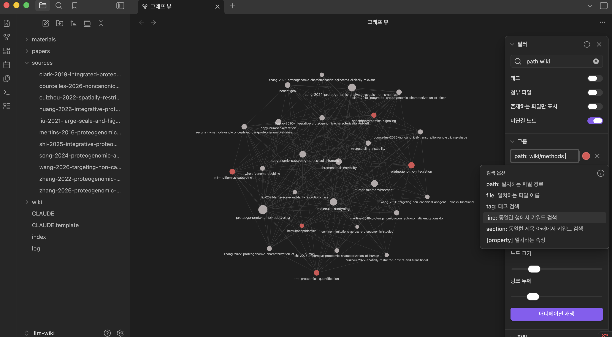
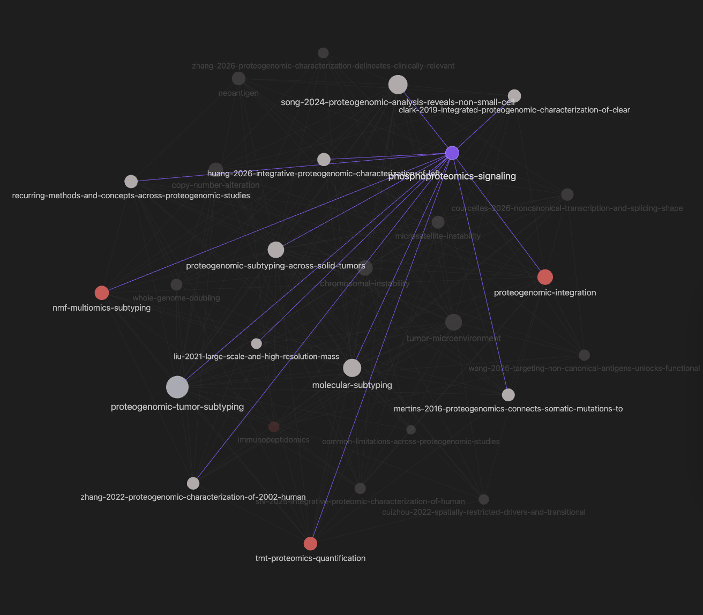

# 12장. Obsidian으로 보기와 채팅으로 묻기

강의에서 가장 자주 받는 질문 가운데 하나가 Obsidian을 꼭 써야 하느냐는 것이다. 위키를 만들었다고 하면 그 위키를 눈으로 보는 화면을 떠올리게 되고 Markdown 문서를 다루는 도구 가운데 가장 널리 쓰이는 것이 Obsidian이기 때문이다. 답은 간단하다. 쓰면 좋고 안 써도 위키는 굴러간다. 3장의 설계 원칙에 Obsidian 호환을 유지한다는 항목이 들어 있고 위키링크와 표준 Markdown만 쓰기로 한 이유도 이 도구에서 열리게 하기 위해서인데, 열 수 있게 했을 뿐 실제 작업은 주로 채팅에서 이어진다. Obsidian은 위키의 구조를 눈으로 보여 준다. 파트 1에서 만든 위키는 두 경로로 쓰인다.

# 폴더를 여는 도구

Obsidian은 Markdown 파일이 든 폴더를 하나 골라 그 안을 탐색하고 편집하는 프로그램이다. 파일을 자기 형식으로 가져가지 않고 폴더에 있는 그대로 읽는다는 점이 이 도구를 쓰는 이유다. 위키가 만들어 둔 폴더를 그대로 지정하면 되고 그 안의 파일은 여전히 일반 텍스트로 남는다. 도구를 지우더라도 문서는 그곳에 있고 다른 프로그램으로 열어도 같은 내용이 보인다. 설치는 [내려받기 페이지](https://obsidian.md/download)에서 자기 운영체제에 맞는 파일을 받으면 된다. 계정 없이 쓸 수 있고 처음 열면 어느 폴더를 열 것인지 묻는다. 여기서 새로 만들지 말고 이미 있는 폴더를 여는 쪽을 고른다. 위키의 지식 층 폴더를 여는 것이 기준인데, 3장에서 본 위키링크 규약이 그 폴더를 뿌리로 삼아 적혀 있기 때문이다. 저장소 최상위를 열면 링크가 전부 어긋난다.

열고 나면 왼쪽에 폴더와 파일 목록이 뜨고 문서를 누르면 본문이 보인다. 링크가 걸린 자리를 누르면 그 문서로 이동하고 문서 아래쪽에는 이 문서를 가리키는 다른 문서 목록이 나온다. 마지막 것이 특히 쓸모 있다. 어떤 개념 문서를 열었을 때 그 개념을 인용하는 논문 페이지가 몇 개이고 무엇인지가 바로 보이므로 그 개념이 실제로 쓰이고 있는지를 눈으로 확인할 수 있다. 아무 데서도 가리키지 않는 문서는 이 목록이 비어 있고 그것이 13장에서 말한 고립된 페이지다. 링크가 걸려 있지만 대상 문서가 없는 경우도 표시가 다르게 나타난다. 검사 스크립트로 잡는 것과 눈으로 보는 것 가운데 눈이 빠른 경우가 있고 특히 문서를 만들다가 오타를 낸 링크는 이 화면에서 곧바로 걸린다.

# 그래프가 보여 주는 것

이 도구에서 가장 눈에 띄는 화면은 그래프다. 문서를 점으로, 링크를 선으로 그려 폴더 전체를 한 장에 놓는다. 이 화면이 실제로 쓸모 있어지는 것은 문서가 어느 정도 쌓인 뒤다. 열 개짜리 폴더에서는 점 열 개가 흩어져 있을 뿐이고 몇백 개가 되면 어느 쪽이 촘촘하고 어느 쪽이 성긴지가 보이기 시작한다. 다음은 논문 열 편 남짓을 넣은 위키를 그래프로 연 화면이다.

왼쪽에 폴더 구조가 보이고 가운데가 그래프다. 점 하나가 문서 하나이고 논문 페이지와 개념 페이지가 같은 평면에 놓인다. 오른쪽 설정에서 경로로 범위를 좁힐 수 있어서 지식 층만 보거나 특정 카테고리만 볼 수 있다. 화면에서는 방법을 다루는 하위 폴더에 색을 따로 주었다. 색을 나누면 자기 위키가 어느 축으로 자라고 있는지가 한눈에 드러난다. 논문 페이지만 늘고 개념 페이지가 거의 없으면 정리는 하고 있는데 종합은 하지 않는 상태이고 그 상태는 4장에서 이름 붙인 그것이다. 점의 크기는 그 문서를 가리키는 링크 수에 따라 달라지므로 큰 점이 여러 논문이 함께 기대고 있는 개념이다. 화면 가운데를 보면 논문 파일명으로 된 점들과 개념 이름으로 된 점들이 섞여 있는데 개념 쪽 점이 대체로 크다. 여러 논문이 같은 개념을 가리키고 있다는 뜻이고 그것이 종합 층이 하는 일이다. 반대로 논문 점끼리만 이어져 있고 개념 점이 작으면 논문을 서로 링크하기만 하고 개념으로 올리지는 않은 상태다.

한 점을 고르면 그 문서와 이어진 것만 강조되고 나머지는 흐려진다. 이 기능이 그래프에서 가장 자주 쓰게 되는 것인데, 전체 그림보다 한 문서의 이웃을 보는 일이 실제로 더 많기 때문이다.

가운데 강조된 점이 개념 하나이고 거기서 뻗어 나간 선이 그 개념을 인용하는 논문들이다. 선이 닿은 점들의 이름을 읽으면 이 개념이 어느 연도의 어느 논문들에 걸쳐 있는지가 그대로 보인다. 이 화면이 알려 주는 것은 그 개념이 몇 편의 논문에 걸쳐 있는가다. 한두 편에만 걸려 있다면 아직 개념으로 승격할 때가 아니었을 수 있고 열 편이 넘게 걸려 있다면 그 개념이 이 위키의 축 가운데 하나다. 새 논문을 넣은 뒤에 이 화면을 열어 그 논문이 어디에 붙었는지 보는 것도 확인 방법이 된다. 아무 데도 붙지 않은 채 외곽에 떠 있으면 종합 층 연결을 빠뜨린 것이다.

# 화면에서 눈에 걸리는 것들

그래프 말고도 눈으로 확인하기 좋은 것이 몇 가지 있다. 첫째는 문서의 머리말이다. 논문 페이지마다 어느 원문에서 왔고 어느 카테고리에 속하며 어떤 도구로 추출했는지가 적혀 있는데 여러 문서를 빠르게 넘기며 이 부분만 훑으면 형식이 어긋난 문서가 눈에 띈다. 스크립트로도 잡히지만 형식이 어긋난 이유까지는 알려 주지 않고 화면으로 보면 왜 그렇게 되었는지가 대체로 함께 보인다. 둘째는 검색 결과다. 이 도구의 검색은 위키의 검색과 성격이 다르다. 문자열을 그대로 찾는 것이라 답을 만들어 주지는 않지만 어떤 표현이 몇 개 문서에 몇 번 나오는지를 세어 준다. 같은 개념을 서로 다른 표현으로 적어 둔 자리를 찾을 때 이 방식이 빠르다.

셋째는 폴더 배치다. 왼쪽 목록을 펼쳐 두면 카테고리마다 문서가 몇 개인지가 대략 보이고 이상하게 큰 카테고리와 비어 있는 카테고리가 드러난다. 3장에서 카테고리를 다섯에서 열 개로 시작하라고 한 뒤에 실제로 어떻게 되었는지를 확인한다. 넷째는 만들다 만 문서다. 링크는 걸었는데 대상 문서를 만들지 않은 경우가 표시로 구분되므로 그 목록이 다음에 채울 것의 목록이 된다. 네 가지 모두 검사 스크립트로 대신할 수 있지만 스크립트를 만들기 전에는 화면으로 확인한다.

다섯째는 문서를 나란히 놓고 보는 일이다. 두 문서를 좌우로 열어 두면 같은 논문을 다룬 정리 문서와 논문 페이지가 서로 무엇을 다르게 적고 있는지가 보인다. 4장에서 두 층을 나눈 이유가 여기서 눈으로 확인된다. 정리 문서는 원문의 세부를 담고 논문 페이지는 다른 논문과의 관계를 담는데 둘이 같은 내용을 반복하고 있다면 층을 나눈 값이 사라진 것이다. 여러 논문의 정리 문서를 나란히 놓고 같은 항목끼리 비교하는 작업에도 이 화면이 편하다. 표본 수와 대조군과 판정 기준을 세 편에서 각각 뽑아 비교할 때, 세 창을 띄워 두고 훑는 편이 하나씩 열어 기억하는 것보다 정확하다. 이 작업은 채팅으로도 되지만 결과를 눈으로 확인하고 싶을 때가 있고 그때 이 화면을 쓴다.

# 그래프가 보여 주지 못하는 것

그래프는 연결의 유무를 보여 주고 연결의 내용은 보여 주지 않는다. 두 문서가 이어져 있다는 것은 알 수 있지만 그 논문이 그 개념을 강화하는지 반박하는지는 선의 모양에 나타나지 않는다. 14장과 4장에서 ingest의 최소 조건에 판정을 넣어 둔 이유가 여기 있다. 강화인지 좁힘인지 반박인지 대체인지는 문서의 문장으로 적혀 있어야 하고 그 문장을 읽어야 알 수 있다. 그래서 그래프가 촘촘해 보이는 것과 그 위키가 답을 잘 하는 것은 별개다. 링크만 많이 걸어 두면 그래프는 빽빽해지고 답의 품질은 그대로다.

두 번째 한계는 규모다. 문서가 수백 개일 때는 그래프가 지도로 작동하지만 만 개를 넘어가면 점이 뭉쳐 아무것도 읽히지 않는다. 범위를 좁혀야 볼 수 있는데 그 좁히는 조건을 정하려면 이미 무엇을 찾는지 알고 있어야 한다. 무엇을 찾는지 알고 있다면 검색으로 가는 편이 빠르다. 세 번째는 그래프가 답을 만들어 주지 않는다는 점이다. 두 논문이 이어져 있다는 것을 보고 나서 실제로 알고 싶은 것은 두 논문의 결과가 왜 다른가인데, 그 답은 두 문서를 읽어야 나온다.

# 다른 도구를 고를 때

다른 Markdown 도구들도 같은 일을 하고 무엇을 고르든 위키 쪽에서 달라질 것은 없다. 폴더의 파일을 그대로 읽고 그대로 저장하는 도구라면 무엇이든 된다. 고를 때 확인할 것은 세 가지다. 첫째는 파일을 자기 형식으로 가져가지 않는가다. 가져가는 도구는 그 도구를 지운 뒤에 문서를 열 수 없게 만들고 그러면 위키가 그 도구에 묶인다. 둘째는 위키링크를 이해하는가다. 표준 Markdown의 링크만 지원하는 도구에서는 문서 사이의 연결이 그냥 텍스트로 보인다. 셋째는 폴더 구조를 그대로 보여 주는가다. 자기 방식으로 다시 묶어 보여 주는 도구는 13장에서 정한 폴더 배치를 화면에서 지워 버린다.

3장의 설계 원칙이 표준 Markdown과 위키링크만 쓰고 특정 도구에만 있는 문법을 쓰지 않는다고 못 박아 둔 이유가 여기 있다. 도구 하나에 맞춘 문법을 쓰기 시작하면 그 문법이 문서에 박히고 몇 년 뒤에 도구를 바꿀 때 문서 전체를 손봐야 한다. 위키의 수명이 도구의 수명보다 길다는 전제에서 만들어진 규칙이고 실제로 도구는 몇 년 단위로 바뀐다. 이 원칙을 지키면 도구를 고르는 일이 가벼운 결정이 된다. 마음에 들지 않으면 지우고 다른 것을 열면 되고 문서는 그대로 있다.

# 채팅 쪽을 주로 쓰는 이유

이 책이 근거로 삼은 위키는 그래프를 여는 것보다 폴더를 지정해 세션을 열고 그 안에서 대화하는 방식으로 운영한다. 키보드로 질문을 치기도 하지만 요즘은 14장에서 다룬 대로 휴대폰 앱에서 마이크로 말하는 비중이 늘었다. 채팅을 하면 답이 나오고 어떤 정보가 확인되는데 그것을 눈으로 읽고 나서 머릿속에서 그 지식을 다시 한번 구성하게 된다. 그 재구성이 지식을 자기 것으로 만드는 과정이다. 그래프를 보는 일에는 그 단계가 없다. 구조가 잘 만들어졌다는 확인은 되지만 그 안의 내용이 머리로 들어오지는 않는다.

말로 물으면 한 단계가 더 붙는다. 질문을 소리 내어 만드는 동안 자기가 아는 것을 자기 입으로 한 번 다시 읽게 되고 그 과정에서 다시 한번 생각하게 된다. 이 반복이 지식을 내재화하고 구조적으로 만드는 데 도움이 된다는 것이 지금까지의 경험이다. 답을 받은 뒤에도 마찬가지다. 받은 내용을 자기 언어로 다시 옮겨 다음 질문을 만들면 그 왕복 자체가 학습이 된다. 19장에서 학생에게 정리된 문서를 건네지 않고 직접 정리하게 하는 이유와 같은 원리이고 서문에서 처리 과정의 출력을 눈으로 한 번은 읽어야 한다고 적은 이유도 같다. 읽지 않고 파일만 늘리면 남는 것이 없다.

그래서 이 방식에서 위키의 값은 멋진 그래프를 만들어 내는 데 있지 않다. 에이전트를 일종의 동료로 두고 계속 대화하고 이것저것 구상해 보고, 에이전트가 찾아온 내용을 자기 머리로 이해하면서 자기 언어로 해석하고 다시 전달하는 그 과정에 있다. 위키는 그 대화가 매번 처음부터 시작하지 않게 만드는 장치다. 반년 전에 내린 판단이 문서로 남아 있으므로 오늘의 대화가 그 위에서 시작하고 오늘 내린 판단이 다시 문서가 되어 반년 뒤의 대화를 받쳐 준다.

네 번째 한계는 그래프가 시간을 담지 않는다는 점이다. 어느 논문이 먼저 들어왔고 어느 판단이 나중에 뒤집혔는지는 점과 선에 나타나지 않는다. 위키에서 실제로 중요한 것 가운데 하나가 이 변화인데, 새 논문이 기존 주장을 좁혔다면 그 사실은 종합 문서의 문장과 그날의 작업 로그에 있다. 그래프만 보면 지금의 상태만 보이고 어떻게 여기까지 왔는지는 보이지 않는다. 다섯 번째는 무엇이 없는지를 보여 주지 않는다는 점이다. 위키에 있는 것들의 관계는 그려지지만 이 주제에서 다뤄야 하는데 아직 넣지 않은 논문은 화면 어디에도 없다. 빈자리를 찾는 일은 문서를 읽고 판단해야 나오고 그래서 6장이 미보유 목록을 따로 두라고 한 것이다.

# Obsidian과 채팅 나누기

두 방식이 배타적이지는 않고 잘하는 일이 다르다. 그래프와 화면이 나은 자리는 구조를 확인할 때다. 새 카테고리를 만든 뒤에 그 카테고리가 실제로 자라고 있는지, 논문을 스무 편 넣은 뒤에 종합 층에 붙지 않은 것이 있는지, 링크에 오타가 있는지를 보는 데는 눈이 빠르다. 문서를 직접 손보는 일에도 편하다. 여러 문서를 나란히 열어 두고 표현을 맞추거나 잘못된 링크를 고치는 작업이 그렇다. 채팅이 나은 자리는 내용을 다룰 때다. 무엇을 알고 싶은지에서 시작해 근거를 찾고 판단을 만드는 일, 여러 문서에 흩어진 것을 하나로 묶는 일, 그리고 그렇게 만든 답을 다시 문서로 되돌리는 일이 여기 해당한다.

시작하는 사람에게 권할 순서가 있다면 채팅부터다. 도구를 하나 더 설치하고 익히는 데 시간이 들고 그 시간에 논문 몇 편을 넣어 보는 편이 위키가 무엇인지 이해하는 데 빠르다. 문서가 백 개쯤 쌓여 무엇이 어디 있는지 감이 흐려질 때 그때 열어 보면 화면이 실제로 뭔가를 알려 준다. 그 시점이 언제인지는 사람마다 다르므로 정해진 편수는 없고 폴더 목록을 훑어 어디에 무엇이 있는지 떠오르지 않기 시작하면 그때다. 처음부터 열면 점 몇 개가 흩어져 있을 뿐이고 그 화면에서 배울 것은 없다. 반대로 화면을 보는 일이 목적이 되면 문서를 만드는 기준이 흔들린다. 그래프를 예쁘게 만들려고 링크를 더 걸게 되고 그렇게 걸린 링크는 판정이 없는 링크다.

# 화면을 여는 일이 목적이 될 때

이 도구를 쓰다가 어긋나는 자리가 하나 있다. 화면이 좋아 보이는 쪽으로 문서를 만들게 되는 경우다. 그래프가 촘촘한 편이 보기 좋으므로 링크를 더 걸고 싶어지고 개념 문서가 많으면 구조가 잘 짜인 것처럼 보이므로 개념 문서를 미리 만들게 된다. 두 가지 모두 위키의 답을 좋게 만들지 않는다. 판정 없이 걸린 링크는 그 논문이 그 개념을 어떻게 다루는지 알려 주지 않고 논문 두세 편만 기대는 개념 문서는 나중에 다시 열리지 않는다. 4장에서 종합 층 연결의 최소 조건에 본문 한 문장 반영을 넣어 둔 이유가 여기 있다. 기준은 그 종합 문서의 본문이 바뀌었는지다.

같은 이유로 그래프를 성과 지표로 쓰지 않는다. 점이 늘고 선이 늘었다는 것은 문서가 늘었다는 뜻이고 문서가 늘었다는 것과 답할 수 있는 질문이 늘었다는 것은 다르다. 1장에서 파일이 많아지는 것과 지식이 축적되는 것이 다른 일이라고 한 대목이 그래프에서도 그대로 성립한다. 판단할 기준을 하나 두자면 이렇다. 지금 이 위키에 새 질문을 던졌을 때 근거가 붙은 답이 나오는가. 그 답이 나오면 그래프가 어떻게 생겼든 상관이 없고 나오지 않으면 그래프가 아무리 촘촘해도 소용이 없다.
