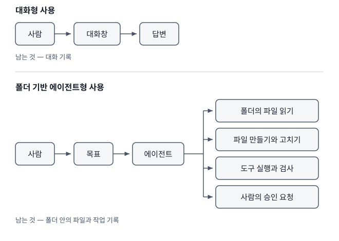
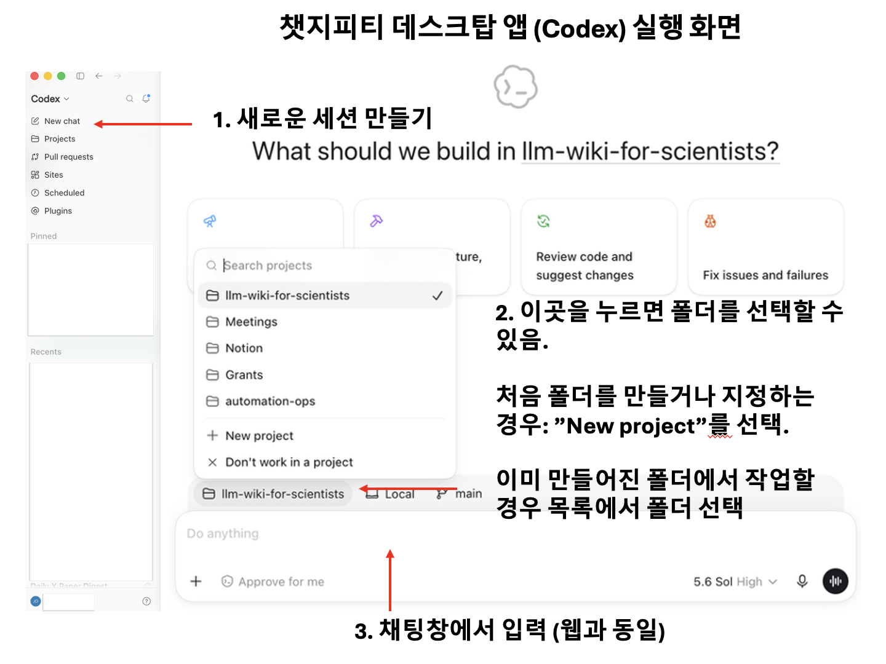
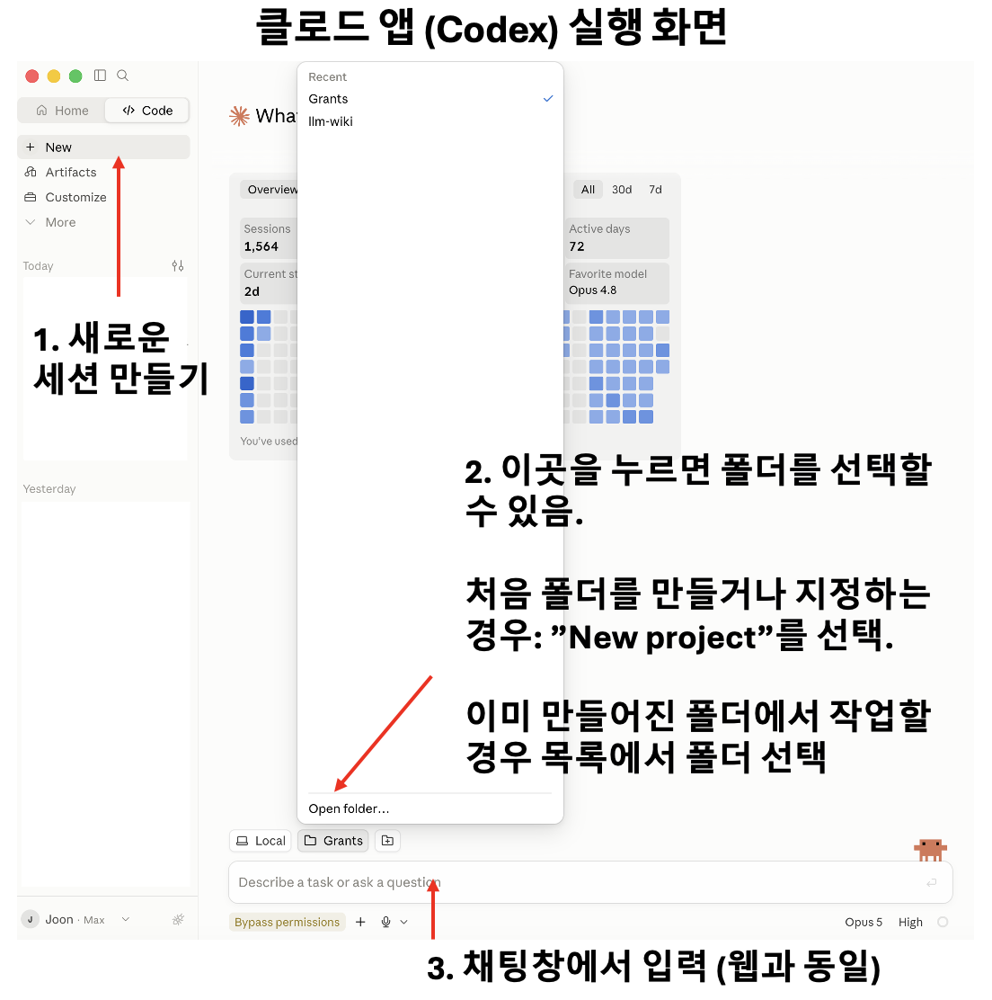
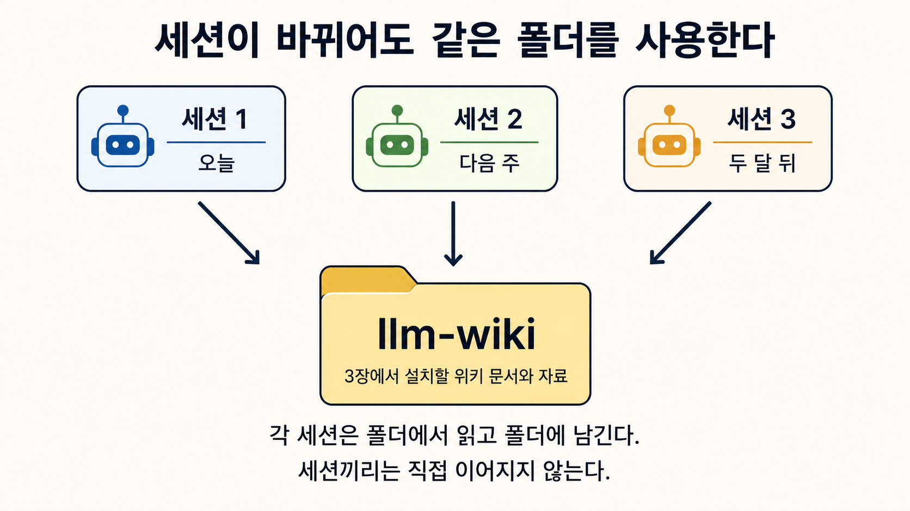

# 2장. AI 에이전트와 작업 폴더

한 학기 강의를 준비하는 사람을 떠올려 보자. 매주 자료를 올리고 설명을 다듬고 예제를 고른다. 3주차에는 어떤 주제를 넣었다가 수강생 수준에 맞지 않아 뺐고 5주차에는 예제를 통계 쪽에서 생물 쪽으로 바꿨다. 8주차쯤 되면 그 결정들이 왜 그렇게 내려졌는지 기억나지 않는다. 다음 해에 같은 강의를 다시 준비할 때 남아 있는 것은 슬라이드 파일 몇 개이고 슬라이드가 왜 그 순서인지, 무엇을 왜 뺐는지는 어디에도 없다. 작업 폴더에 결정과 이유를 문서로 남겨야 다음 해 강의에서 이어 쓸 수 있다. 프롬프트를 정교하게 다듬는 일만으로는 그 기록이 만들어지지 않는다.

# 챗봇에서 에이전트로

이 책에서 챗봇은 대화에 답을 돌려주는 사용 방식을 가리킨다. 입력은 대화창에 적은 글과 붙인 자료이고 기본 출력은 대화 기록에 나타난 글이다. 대화는 여러 차례 이어질 수 있고 프로젝트 자료나 기억을 함께 쓸 수도 있다. 다만 로컬 파일이나 외부 상태를 바꾸는 도구를 붙이지 않았다면 결과를 어느 문서에 남길지는 사람이 따로 정한다. 이 방식은 개념을 설명하고 아이디어를 여러 갈래로 펼쳐 보이고 초안을 빠르게 만드는 일을 잘한다. AI 에이전트의 동작 단위는 여러 단계로 이루어진 하나의 작업이다. 목표를 받으면 어떤 파일과 도구가 필요한지 정하고 자료를 읽고 필요한 부분을 고치고 만든 결과가 정해진 규칙에 맞는지 검사한다. 폴더 기반 작업에서는 중간 산출물과 최종 결과가 파일로 남기 때문에 작업이 끝난 뒤에도 무엇이 만들어졌는지 확인할 수 있다. 열 편의 문서에서 링크가 끊긴 곳을 찾아 고치는 일처럼 같은 동작을 여러 번 반복하고 실제 상태를 바꾸는 일이 에이전트가 유용한 지점이다. 같은 ChatGPT나 Claude 안에서도 대화에 답만 받으면 대화형 사용이고 로컬 프로젝트나 외부 도구로 여러 단계를 맡기면 에이전트형 사용이다.

*챗봇은 결과를 대화 기록에 남기고 폴더 기반 에이전트는 사용자가 정한 파일을 직접 고친다. 그림의 핵심은 결과가 어디에 남는가다.*

두 그림의 차이는 결과의 기본 도착점에 있다. 대화형 사용에서 결과는 먼저 대화 기록에 남고 폴더 기반 작업에서는 결과를 사용자가 소유한 파일에 남길 수 있다. 대화 기록은 서비스의 프로젝트와 검색과 기억 기능으로 다시 찾을 수 있지만 로컬 파일처럼 사용자가 정한 폴더 구조와 이름을 그대로 따르지는 않는다. 파일은 폴더 구조와 링크에 따라 쌓이고 다른 도구에서도 그대로 읽을 수 있다. 남는 것의 성격이 다르면 다음에 꺼내 쓰는 방식도 달라진다. 이 구분은 제품별 고정 속성이 아니며 같은 앱에서도 어떤 프로젝트와 도구를 켰는지에 따라 달라진다. 에이전트의 자율성은 허용된 범위 안에서 여러 작업 단계를 스스로 연결한다는 뜻이다. 어느 폴더에서 일할지, 어떤 파일을 고칠 수 있는지, 어떤 외부 서비스에 접근할 수 있는지, 어떤 동작에 사람의 승인을 받아야 하는지는 모두 사람이 정한다. 범위를 정하지 않은 채 목표만 던지면 에이전트는 범위를 스스로 추측하고 추측은 자주 어긋난다. 좋은 지시는 무엇을 하라는 말과 어디까지 하라는 말을 함께 담는다.

요청하는 방식도 달라진다. 챗봇에게는 무엇을 알고 싶은지만 말하면 되지만 에이전트에게는 무엇을 어디에 남길지까지 말해야 한다. "이 논문을 요약해 달라"는 요청은 챗봇에서는 완결되지만 에이전트에서는 절반만 정해진 요청이다. 요약을 화면에 띄울지 파일로 만들지, 만든다면 어느 폴더에 어떤 이름으로 둘지, 기존 문서에 연결할지가 비어 있다. 빠진 조건은 에이전트가 추측해서 정하므로 결과가 매번 조금씩 달라진다. 지시를 한 줄 더 쓰는 수고가 결과를 예측 가능하게 만든다. 에이전트의 행동 경계는 세 겹으로 이루어진다. 첫째는 파일 권한이다. 읽기만 허용된 파일과 고쳐도 되는 파일을 구분하고 원자료 폴더는 대체로 읽기 전용으로 둔다. 둘째는 사람의 승인이다. 파일을 지우거나 여러 파일을 한꺼번에 옮기거나 되돌리기 어려운 변경을 하기 전에는 사람이 확인한다. 셋째는 외부 서비스 권한이다. 메일을 보내거나 공개 저장소에 올리는 동작은 폴더 안에서 끝나지 않으므로 별도로 다룬다. 폴더 접근을 허용한 뒤에도 무엇이 바뀌었는지는 사람이 직접 본다.

이 책이 근거로 삼은 작업 환경에서 그 선은 되돌릴 수 있는가와 밖으로 나가는가 두 가지로 정해져 있다. 파일을 읽고 검색하고 초안을 만들고 형식을 맞추고 빠진 것을 찾는 동작은 승인 없이 맡긴다. 결과가 마음에 들지 않으면 지우고 다시 만들 수 있기 때문이다. 밖으로 나가는 동작은 예외 없이 멈춘다. 메일은 초안을 만들고 파일로 저장하고 내용을 보여주고 기다리고 명시적인 승인을 받은 뒤에 발송한다. 초안을 고쳤으면 고친 것을 다시 보여주고 새 승인을 받는데 앞선 승인은 고치기 전의 초안에 대한 것이기 때문이다. 되돌리기 어려운 동작도 한곳에 놓여서 덮어쓰기 전에 먼저 읽고 무엇을 어떻게 바꿀지 보이고 승인을 받은 뒤에 쓴다. 사람의 화면을 건드리는 동작은 요청받은 턴에만 하는데 배경에서 도는 작업이 팝업이나 권한 대화상자를 띄우면 그것을 누르는 사람은 무엇에 승인하는지 모르는 상태로 누르게 된다.

# Markdown이라는 형식

컴퓨터에서 사용하는 파일 형식은 바이너리 파일과 텍스트 파일로 나누어 이해하면 쉽다. 사진, PDF, 워드 문서 같은 바이너리 파일은 전용 프로그램이 내부 구조를 해석해야 사람이 볼 수 있고 일반 텍스트 편집기로 열면 내용이 그대로 읽히지 않는다. 텍스트 파일은 글자가 그대로 저장되므로 사람과 컴퓨터가 모두 읽을 수 있다. Markdown은 텍스트 파일에 제목, 목록, 링크, 표 같은 구조를 간단한 기호로 표시하는 형식이며 확장자는 `.md`다. 파일을 열면 기호와 문장이 함께 보이므로 전용 프로그램이 없어도 내용을 읽을 수 있다. 특정 회사의 서비스에 묶이지 않아 도구를 바꿔도 문서를 그대로 가져갈 수 있고 무엇이 바뀌었는지도 줄 단위로 비교할 수 있다. 한 문단만 고쳤다면 그 문단만 바뀐 것으로 나타나므로 두 달 전 판단이 언제 어떻게 바뀌었는지 되짚을 수 있다. LLM-Wiki에서는 에이전트가 읽은 자료를 Markdown 문서로 자동 정리한다. 에이전트는 내용에 맞춰 제목을 나누고 목록과 링크를 붙인 뒤 `.md` 파일로 저장한다. 사용자는 Markdown 문법을 외워서 문서를 직접 만들 필요가 없고 필요할 때 파일을 열어 읽고 문장을 고칠 수 있으면 충분하다.

Markdown의 제목은 문서 안의 주소 역할을 한다. 문서에 제목 구조가 있으면 "이 문서의 한계 절만 고쳐라"나 "결과 절 아래에 이 문단을 넣어라" 같은 지시가 성립한다. 제목이 없는 긴 텍스트에서는 에이전트가 고칠 범위를 정확히 잡기 어렵다. 문서를 통째로 다시 쓰면 원래 있던 내용이 조용히 사라지고 무엇이 사라졌는지 알아채기 어렵다. 링크는 한 문서가 다른 문서를 가리키게 한다. 사람은 링크를 따라 관련 문서를 읽고 에이전트는 어떤 문서를 함께 읽어야 하는지 알 수 있다. 같은 폴더에 파일이 모여 있어도 링크가 없으면 문서 사이의 관계는 기록되지 않는다. 에이전트가 자료를 정리할 때 관련 문서로 가는 링크까지 함께 적어야 다음 작업에서 앞서 만든 내용을 다시 쓸 수 있다. Markdown은 문서의 구조를 표현하며 무엇이 원자료이고 무엇이 해석인지 구분하는 규칙은 LLM-Wiki의 지침 파일이 맡는다. 이 지침 파일과 폴더 구조는 3장의 설치 과정에서 에이전트가 만든다.

# 폴더가 작업 공간이라는 뜻

에이전트에게 폴더를 지정하면 다음 네 가지가 한꺼번에 정해진다.

1. 보이는 자료 — 어떤 파일을 우선 읽을 수 있는가.
2. 작업 범위 — 어디에 새 파일을 만들고 무엇을 고칠 것인가.
3. 적용 규칙 — 어떤 지침 파일을 따라야 하는가.
4. 지속 기억 — 세션이 끝난 뒤 무엇이 남는가.

네 가지는 함께 움직인다. 첫 항목이 정하는 것은 읽을 수 있는 범위이고 에이전트는 그 범위 안에서 필요하다고 판단한 파일을 골라 읽는다. 그 판단은 지침 파일과 목차 문서가 얼마나 잘 안내하는지에 달려 있고 무엇을 읽었는지 확인하고 싶으면 물어보면 된다. 폴더를 바꾸면 볼 수 있는 자료도, 고칠 수 있는 대상도, 따라야 할 규칙도, 결과가 저장되는 폴더도 같이 바뀐다. 같은 질문을 던져도 어느 폴더에서 던졌느냐에 따라 답이 달라지는 이유가 여기에 있다. 연구 폴더에서 "이 방법의 한계를 정리해 달라"고 하면 그 폴더의 논문들을 근거로 답하고 강의 폴더에서 같은 요청을 하면 수강생 수준과 지난 학기 반응을 근거로 답한다. 둘 다 맞는 답이지만 쓸모는 다르다. 수업, 연구, 글쓰기, 행정은 목적이 다르고 따라서 규칙도 다르다. 연구 폴더에서는 근거 없는 문장을 쓰지 않는 것이 최우선이지만 강의 자료 폴더에서는 정확한 만큼이나 쉬운 설명이 중요하다. 두 규칙을 한 지침 파일에 넣으면 예외 조항이 붙기 시작하고 예외가 다섯 개를 넘으면 에이전트도 사람도 규칙을 제대로 적용하지 못한다. 목적이 다르면 작업 공간을 나누는 편이 낫다.

반대로 너무 잘게 쪼개도 문제가 생긴다. 폴더가 열 개로 늘어나면 같은 자료가 여러 곳에 복제되고 어느 폴더의 문서가 최신인지 알 수 없게 된다. 나누는 기준은 규칙이다. 같은 지침으로 일할 수 있는 작업들은 한 폴더에 두고 지침이 서로 충돌하기 시작하면 그때 나눈다. 폴더 사이의 연결은 실제 의존이 있을 때만 만든다. 강의 자료가 연구 논문을 근거로 삼는다면 연결하고 그저 같은 사람이 한다는 이유로는 연결하지 않는다. 두 폴더가 같은 자료를 필요로 하는 경우는 반드시 생긴다. 그때 파일을 양쪽에 복사해 두면 한쪽만 고쳐지는 순간부터 어느 것이 최신인지 알 수 없게 된다. 정본을 한 폴더에 두고 다른 폴더에서는 그 위치를 가리키는 짧은 문서를 둔다. 가리키는 문서에는 경로와 함께 왜 이 자료가 여기서 필요한지를 한 줄 적는다. 경로만 적어 두면 반년 뒤에 그 링크가 왜 있는지 알 수 없고 이유를 알 수 없는 링크는 결국 지워진다.

# 웹 채팅과 폴더 기반 도구의 차이

두 방식은 기본 작업 경계가 다르다. 웹 대화는 현재 대화와 프로젝트에 올리거나 연결한 자료를 중심으로 시작하고 로컬 프로젝트는 선택한 컴퓨터 폴더와 그 안의 문서를 작업 경계로 삼는다. 웹 프로젝트도 여러 대화에서 파일과 지침을 공유할 수 있으므로 언제나 빈 대화창에서 시작한다고 설명하면 틀린다. 출발점이 다르면 잘하는 일과 놓치는 것도 달라진다. 지금 하려는 일이 설명과 탐색에서 끝나는지, 사용자가 소유한 파일을 여러 번 고치며 축적할 일인지를 먼저 물으면 어느 쪽을 열어야 할지가 정해진다.

| 관점 | 웹 채팅 | 폴더 기반 AI 에이전트 |
|---|---|---|
| 시작점 | 현재 대화와 프로젝트에 올리거나 연결한 자료 | 선택한 작업 폴더와 그 안의 지침과 문서 |
| 지속 맥락 | 대화 기록, 프로젝트 자료, 서비스가 제공하는 기억 | 사용자가 소유한 파일과 명시적인 작업 기록 |
| 작업 | 설명, 아이디어, 일회성 초안 | 여러 파일을 읽고 고치는 연속 작업 |
| 범위 | 현재 대화가 중심 | 폴더가 기본 작업 경계 |
| 적합한 일 | 빠른 질문, 탐색, 가벼운 초안 | 장기 프로젝트, 반복 작업, 지식 축적 |
| 주의점 | 중요한 결과가 대화에 묻힘 | 잘못된 범위나 규칙 아래 파일이 바뀜 |

아직 무엇을 물어야 할지 모르는 단계에서는 웹 대화에서 여러 방향으로 생각을 펼쳐 보는 편이 빠르고 그 과정에서 나온 결론만 위키로 옮기면 된다. 반대로 폴더 기반 에이전트가 만든 초안을 웹 대화에서 다른 관점으로 검토받을 수도 있다. 두 방식은 작업의 다른 단계를 맡는다. 탐색은 앞쪽에, 축적은 뒤쪽에 놓인다. 웹 대화의 결론을 위키로 옮길 때는 결론만 옮기지 않는다. 어떤 질문에서 출발했는지, 무엇을 근거로 그렇게 판단했는지, 확인하지 못한 채 남긴 부분이 무엇인지를 함께 적는다. 결론 한 줄만 옮긴 문장은 한 달 뒤에 읽으면 근거를 알 수 없어 다시 검증해야 한다. 옮기는 데 서너 문장이 더 들지만 그 문장이 다음에 실제로 쓰일 확률이 올라간다. 옮기지 않기로 정하는 것도 판단이므로 좋았던 대화를 전부 남겨야 한다고 생각할 필요는 없다. 외부 도구를 붙이지 않은 대화형 사용에서는 잘못된 답이 파일이나 외부 서비스의 상태를 바로 바꾸지 않는다. 로컬 파일이나 외부 도구를 다루는 에이전트형 사용에서는 잘못된 범위와 규칙이 실제 상태를 바꾼다. 원래 있던 문서가 덮이거나 지워질 수 있고 메일이나 일정처럼 다른 사람이 보는 상태가 바뀔 수도 있다. 그래서 로컬 프로젝트로 넘어갈 때 가장 먼저 확보할 것은 되돌릴 수 있는 상태와 승인 경계다. 버전 기록을 남기는 동기화 서비스든 사본이든, 잘못되었을 때 되돌릴 방법이 있어야 마음 놓고 파일 권한을 줄 수 있다.

# AI 에이전트 도구 고르기

강의에서 자주 받는 질문이 있다. Codex와 Claude 가운데 무엇을 쓰느냐는 질문이다. 나는 Codex를 추천한다. 2026년 8월까지 LLM-Wiki를 운영하며 매긴 순위는 Codex, Claude Cowork 또는 Claude Code 순이다. Claude를 고른다면 컴퓨터에 익숙하지 않은 독자에게는 폴더를 연결하고 자연어로 작업을 맡길 수 있는 Claude Cowork가 편하다. 터미널에 익숙한 독자는 Claude Code로 같은 위키를 운영할 수 있다. Gemini CLI는 순위에서 제외한다. 폴더를 지정하고 지침을 읽히고 문서를 만들고 고치고 링크와 빠진 항목을 검사하는 긴 작업에서 Gemini CLI는 규칙을 자주 빠뜨렸다. 검증을 마치기 전에 완료했다고 보고한 경우도 잦았다. 출력은 빨랐지만 결과를 처음부터 다시 확인해야 했다. 이 책에서 요구하는 AI 에이전트 도구로는 부적합하다는 것이 내 판단이다.

| 추천 순서 | 도구 | 이 책에서의 판단 |
|---:|---|---|
| 1 | Codex | 기본 추천. 긴 폴더 작업과 규칙 준수에 가장 안정적이었다. |
| 2 | Claude Cowork 또는 Claude Code | 폴더를 연결해 이 책의 실습을 수행할 수 있는 대안이다. |
| 제외 | Gemini CLI | 긴 작업의 규칙 준수와 완료 검증이 부족해 권하지 않는다. |

Codex 안에서는 복잡한 판단과 대규모 교정에 Sol을 먼저 고른다. 일상적인 논문 ingest와 위키 페이지 작성은 Terra로도 충분히 좋은 품질이 나온다. 2026년 8월 2일에 같은 28쪽 논문을 두 모델로 처리해 비교했을 때 Sol과 Terra Extra High 모두 논문 신원, 사실, 문서 구조에서 중대한 오류 없이 통과했다. Terra는 근거 추적성, 방법의 구체성, 수치의 범위, 한계 처리에서 더 자세했고 Sol은 더 간결했다. 한 편을 대상으로 한 비교이므로 모든 작업의 우열을 판정한 시험은 아니지만 Terra를 일상적인 위키 생성에 써도 된다는 근거로는 충분했다.

*Gemini CLI를 써 본 인상은 이 장면과 닮았다. 에이전트 작업에서는 빠른 출력보다 지침 준수와 결과 검증이 중요하다.*

새 도구를 검토할 때는 빈 폴더에 같은 지침과 같은 자료를 넣고 실제 결과를 비교한다. 파일을 올바른 곳에 남겼는지, 지침을 작업 끝까지 지켰는지, 요청하지 않은 변경을 만들지 않았는지를 보면 LLM-Wiki에 쓸 만한지 판단할 수 있다. 모델과 앱은 계속 바뀌므로 이 순위도 같은 시험을 다시 돌려 갱신한다.

설치는 데스크톱 앱을 받는 것으로 시작한다. Claude는 [내려받기 페이지](https://claude.ai/download)에서 앱을 받고 ChatGPT도 [내려받기 페이지](https://chatgpt.com/download)에서 받는다. ChatGPT 데스크톱 앱에서는 로컬 프로젝트에 폴더를 붙이고 그 폴더를 읽고 고치는 Codex 작업을 시작한다. Claude 데스크톱 앱에서는 Cowork나 Claude Code에서 폴더를 연결한다. 터미널에서 쓰는 도구는 검색 색인을 세우거나 스크립트를 돌리는 단계에서 추가해도 늦지 않다. 이 책과 같은 규모의 LLM-Wiki를 지속해서 운영하려면 유료 구독을 필수 비용으로 잡는다. 무료 등급은 장기간 반복되는 폴더 작업의 사용량을 감당하는 운영 수단으로 보지 않는다. OpenAI에는 API 사용량에 따라 결제하는 별도 인증 경로도 있지만 그것은 무료 대안이 아니며 일부 기능과 계정 정책도 구독 로그인과 다르다. 앱을 설치하고 폴더 하나를 지정해 열면 준비가 끝나고 위키의 구조는 3장에서 세운다.

# Codex, Claude Code, ChatGPT가 속한 카테고리

제품 이름을 외우는 일은 오래 가지 않는다. 이름은 바뀌고 기능은 늘어나고 화면은 계절마다 달라진다. 오래 가는 것은 그때 선택한 작업 방식이다. 웹 대화 환경은 브라우저에서 질문하고 파일이나 연결된 자료를 쓰며 컴퓨터의 로컬 폴더를 직접 작업 경계로 삼지 않는다. 로컬 프로젝트 환경은 컴퓨터의 폴더를 붙이고 그 안의 파일을 직접 읽고 고친다. 외부 도구 연결 환경은 대화나 로컬 프로젝트에 메일, 일정, 문서 서비스와 같은 도구를 더한다. 한 제품이 세 환경을 오갈 수도 있다. ChatGPT 웹의 프로젝트는 업로드한 파일과 연결된 자료를 여러 대화가 함께 쓰지만 컴퓨터 폴더에 직접 접근하지 않는다. ChatGPT 데스크톱 앱의 로컬 프로젝트는 하나 이상의 컴퓨터 폴더를 붙일 수 있고 기본 폴더를 기준으로 Codex가 `AGENTS.md`와 설정을 찾는다. Codex 명령줄과 편집기 확장도 현재 작업 폴더를 프로젝트 경계로 삼는다. 따라서 ChatGPT를 웹 대화 도구로, Codex를 별도의 폴더 도구로 고정해 외우면 현재 제품 구조를 잘못 이해하게 된다.

혼합 환경은 편리한 만큼 경계가 흐리다. 대화창에서 파일을 다루는 것처럼 보이지만 결과가 서비스 안에만 남고 사용자의 폴더에는 아무것도 생기지 않는 경우가 있다. 반대로 대화처럼 보이는 요청 하나가 실제 파일 여러 개를 고치는 경우도 있다. 두 경우를 구분하는 방법은 작업이 끝난 뒤 폴더를 직접 열어 보는 것이다. 무엇이 새로 생겼고 무엇이 바뀌었는지 눈으로 확인하는 습관이 붙기 전까지는, 화면에 나온 설명만으로 결과를 판단하지 않는 편이 안전하다. 새 도구를 검토할 때 세 가지를 확인하면 그 도구가 어느 카테고리인지 알 수 있다. 내 파일을 실제로 읽고 쓰는가, 어떤 지침 파일을 읽는가, 작업 결과가 세션 밖에 남는가. 세 질문에 모두 답할 수 있으면 그 도구로 위키를 운영할 수 있고 하나라도 답할 수 없으면 그 부분은 사람이 손으로 메워야 한다.

# 같은 회사의 두 도구를 고르는 기준

한 회사가 대화 중심 화면과 명령줄 도구를 함께 내놓는 경우가 있고 둘 중 어느 것으로 시작할지가 첫 질문이 된다. Claude Cowork와 Claude Code가 그런 사용 방식의 차이를 보여 주며 ChatGPT 데스크톱 앱의 로컬 프로젝트와 Codex 명령줄도 비슷한 선택지를 제공한다. 대화 중심 화면에서는 폴더를 연결한 뒤 자연어로 작업을 맡긴다. 명령줄에서는 현재 폴더를 출발점으로 명령과 파일 작업을 함께 다룬다. LLM-Wiki를 운영하는 데 필요한 기본 동작은 폴더를 읽고 문서를 만들고 고치고 링크를 맞추고 빠진 것을 찾는 일이다. 이 범위는 대화 중심 화면으로도 덮을 수 있다. 명령줄은 명령을 여러 개 이어 붙이거나 스크립트를 만들고 돌리거나 수백 개의 파일을 정해진 검사로 훑을 때 편하다. 파트 1의 실습은 대화 중심 화면에서 시작하고 검색 색인과 배치가 필요해질 때 명령줄을 더해도 된다. 다만 도구마다 자동으로 찾는 지침 파일 이름과 우선순위가 같지는 않다. 공통 규칙의 정본을 하나 두고 각 도구가 실제로 읽는 지침 파일에서 그 규칙을 일관되게 유지해야 도구를 옮겨도 같은 경계를 쓸 수 있다.

터미널 기반 도구를 쓸 때 한 가지 거절할 것이 있다. 버전 관리 도구를 설치하자는 제안이다. 코드 작업을 전제로 만들어진 도구라 폴더를 열면 버전 관리를 붙이자고 권하는 경우가 있는데 위키 폴더에는 설치하지 않는다. 이 책이 근거로 삼은 위키는 2026년 7월 17일에 그 도구를 걷어냈고 계기는 그해 5월 23일에 버전 관리 도구의 내부 상태 파일이 동기화 충돌 사본으로 꼬이면서 멀쩡한 파일 980건이 삭제로 표시된 사고였다. 동기화 폴더 안에서 두 시스템이 같은 파일을 관리하려 들면 어느 쪽도 안전하지 않다. 문서 수천 건이 매일 조금씩 바뀌는 폴더에서는 버전 관리가 주는 이익보다 두 시스템이 충돌할 위험이 크다. 되돌릴 수단은 동기화 서비스의 파일 버전 기록으로 충분하다. 날짜별 작업 로그에는 파일 버전 기록이 알려 주지 않는 변경 이유를 남긴다.

# 여러 대의 컴퓨터에서 같은 위키를 쓰는 방법

연구실과 집, 노트북과 데스크톱에서 같은 위키를 열고 싶어지는 시점이 곧 온다. 이 책이 근거로 삼은 위키는 두 대의 Mac이 Dropbox로 같은 폴더를 공유하는 방식으로 운영된다. 파일 동기화 서비스를 쓰는 이유는 별도의 절차 없이 어느 기계에서 열어도 같은 상태가 보이기 때문이다. 서비스를 고를 때 기준이 하나 있는데 수만 개의 작은 파일을 다룰 수 있는가다. 논문 만 편 규모의 위키에는 PDF와 Markdown 문서가 삼만 개 넘게 들어가고 이 규모에서 동기화가 밀리거나 충돌 사본을 만들기 시작하면 어느 파일이 최신인지 알 수 없게 된다. 실제로 운영해 보면 Dropbox가 이 조건에서 안정적이었다. OneDrive와 Google Drive는 파일 수가 많아질 때 동기화가 지연되거나 사본이 생기는 문제가 반복되어 이 용도에는 맞지 않았다.

여러 기계를 쓰면 따로 정해야 할 것이 몇 가지 생긴다. 첫째는 작업 로그를 기계마다 나누는 일이다. 같은 날 두 기계에서 작업하면 로그 파일 하나에 두 흐름이 섞이므로 파일 이름에 기계 이름을 넣어 갈라 둔다. 지금 어느 기계인지는 기억으로 정하지 않고 명령으로 확인하는데 같은 날 두 기계에서 작업이 돌아 명령을 실행해야만 구분된 적이 실제로 있었다. 둘째는 동기화 폴더 밖에 두어야 할 것을 정하는 일이다. 검색 색인과 실행 환경은 기계마다 따로 만들어지고 크기가 크며 자주 바뀌므로 동기화 대상에서 뺀다. 두 기계가 같은 색인 파일을 동시에 다시 만들면 어느 쪽도 온전하지 않은 상태가 된다. 셋째는 세션을 시작할 때 지침 파일을 다시 읽는 습관이다. 다른 기계에서 규칙을 고쳤을 수 있으므로 이전 세션의 기억에 의존하지 않는다. 이 세 가지는 9장에서 검색 환경을 세울 때 다시 나온다.

# 폴더를 정하고 새 세션을 여는 법

이 절에서 사람이 직접 할 일은 데스크톱 앱을 설치하고 로그인한 뒤 새 세션에 작업 폴더를 연결하는 것까지다. Codex를 쓰려면 ChatGPT 데스크톱 앱을 설치한다. Claude를 쓰려면 Claude 데스크톱 앱을 설치한다. Codex와 Claude 가운데 사용할 앱 하나를 골라 같은 이름의 폴더를 만들면 된다. 폴더 이름은 이 책 전체에서 `llm-wiki`로 통일한다. 폴더를 만든 뒤에는 새 세션을 열 때마다 그 폴더가 선택되어 있는지만 확인한다. 앱 판에 따라 `New`, `New chat`, `New project`, `Open folder`처럼 버튼 이름이 조금 달라질 수 있다. LLM-Wiki 문서와 하위 폴더는 3장의 Gist 설치 과정에서 만들므로 여기서는 빈 `llm-wiki` 폴더를 선택한 상태에서 멈춘다.

## Codex에서 첫 세션 만들기

1. [ChatGPT 데스크톱 앱 공식 내려받기](https://chatgpt.com/download/)에서 운영체제에 맞는 앱을 받아 설치한다.
2. 앱을 실행하고 LLM-Wiki에 사용할 ChatGPT 계정으로 로그인한다.
3. 왼쪽의 `New chat`을 눌러 Codex의 새 세션을 연다.
4. 입력창 위에 표시된 현재 프로젝트나 폴더 이름을 누른다.
5. 처음 만드는 경우 `New project`를 선택하고 `llm-wiki` 폴더를 만든다. 이미 폴더가 있으면 목록에서 고르거나 `Open folder`로 찾는다.
6. 입력창 위에 `llm-wiki`가 표시되면 첫 세션의 폴더 지정이 끝난다.

*왼쪽에서 새 세션을 열고 입력창 위의 프로젝트 이름을 누르면 폴더를 선택할 수 있다. 화면에는 저자가 작업 중인 폴더가 보이지만 처음 실습하는 독자는 `New project`에서 `llm-wiki`를 만든다.*

## Claude에서 첫 세션 만들기

1. [Claude 데스크톱 앱 공식 내려받기](https://claude.com/download)에서 운영체제에 맞는 앱을 받아 설치한다.
2. 앱을 실행하고 LLM-Wiki에 사용할 Claude 계정으로 로그인한다.
3. 왼쪽의 `Code`를 선택하고 `New`를 눌러 새 세션을 연다.
4. 입력창 아래에 표시된 현재 폴더 이름을 누른다.
5. 처음 만드는 경우 `New project`를 선택해 `llm-wiki` 폴더를 만든다. 이미 폴더가 있으면 목록에서 고르거나 `Open folder`로 찾는다.
6. 입력창 아래에 `llm-wiki`가 표시되면 첫 세션의 폴더 지정이 끝난다.

*Claude 데스크톱 앱에서는 `New`로 세션을 열고 입력창 아래의 폴더 이름을 눌러 작업 폴더를 고른다. 새로 시작할 때는 `New project`에서 `llm-wiki`를 만든다.*

작업이 달라질 때마다 새 세션을 연다. 논문을 넣는 일, 특정 질문을 조사하는 일, 여러 문서를 고치는 일을 각각 새 세션으로 시작해도 같은 `llm-wiki` 폴더를 선택하면 기존 문서를 함께 읽을 수 있다. 로컬 프로젝트에서 `llm-wiki`를 선택해 두면 새 세션도 같은 폴더에서 시작할 수 있다. 세션마다 대화 기록은 따로 남지만 파일은 같은 폴더를 사용한다. 같은 작업을 계속할 때는 이전 세션을 다시 열어도 되고 작업 주제가 바뀌었으면 새 세션을 열면 된다. 세션이 길어져 앞부분의 설명을 다시 찾기 어려워졌을 때도 새 세션에서 같은 폴더를 선택하면 된다. 중요한 판단과 진행 상황은 대화 기록에만 두지 않고 에이전트가 폴더의 Markdown 문서와 작업 로그에 적게 한다. 새 세션의 에이전트는 폴더에 남은 문서를 읽고 이전 작업의 결과를 이어 간다. 모든 세션이 같은 `llm-wiki` 폴더를 읽도록 지정하면 작업 기록이 세션이 바뀐 뒤에도 이어진다.

*세션의 대화 기록은 서로 분리되지만 세 세션 모두 같은 `llm-wiki` 폴더를 읽고 파일을 남긴다.*

다른 폴더에서 세션을 시작하면 목적과 규칙, 자료의 우선순위가 달라진다. 같은 도구, 같은 사람, 같은 질문이어도 결과가 달라지는 것이 정상이다. 여러 폴더의 자료가 함께 필요한 작업에서는 최종 산출물을 소유하는 폴더를 주 작업 공간으로 삼고 나머지는 근거를 제공하는 보조 공간으로 다룬다. 논문 초고를 쓴다면 원고 폴더가 주 작업 공간이고 논문 위키는 보조 공간이다. 주 작업 공간을 정하지 않으면 결과물이 두 폴더에 나뉘어 남고 어느 쪽이 정본인지 나중에 알 수 없게 된다. 다음 세션으로 넘기는 작업 기록은 길 필요가 없지만 형식은 정해 두는 편이 낫다. 무엇을 했는지, 무엇이 남았는지, 다음에 무엇부터 할지를 각각 한 문장으로 적는다. 세 문장을 쓸 때는 두 달 뒤에 이 폴더를 처음 여는 사람이 읽는다고 생각하고 쓴다. "이어서 진행"이나 "검토 필요" 같은 문장은 쓴 사람만 알아볼 수 있고 쓴 사람도 두 달 뒤에는 알아보지 못한다. 어느 문서의 어느 부분을 어떻게 할 차례인지 적어 두면 다음 세션이 첫 십 분을 상황 파악에 쓰지 않는다. 앱을 설치하고 로그인한 뒤 `llm-wiki` 폴더를 선택하면 도구 쪽 준비가 끝난다.
