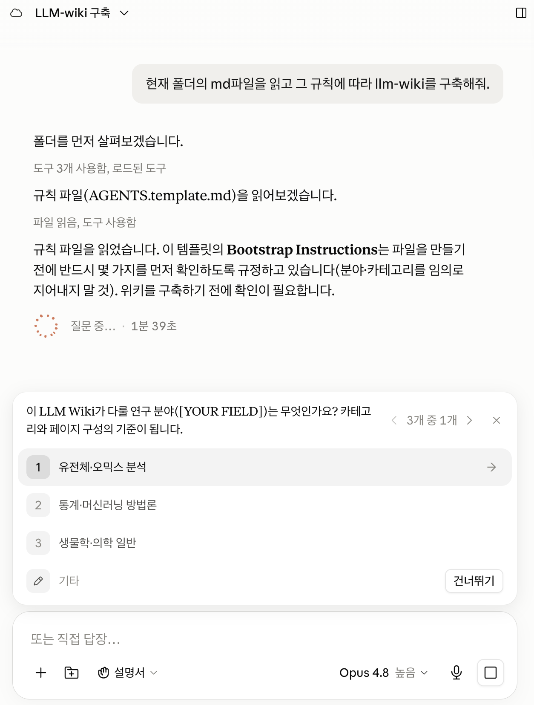

# 3장. Karpathy의 제안에서 나의 연구 위키까지

대학원 세미나를 새로 맡은 사람이 읽기 자료 스무 편을 폴더에 넣었다고 하자. 첫 주에 학생이 먼저 이해해야 할 개념을 물었고 쓸 만한 답을 받았다. 그 답에는 자료 세 편을 가로지르는 연결이 하나 들어 있었는데 어느 논문에도 문장으로 적혀 있지 않고 스무 편을 함께 읽으면서 생긴 연결이었다. 한 달 뒤 자료들 사이에 방법이 어떻게 이어지는지 물었더니 도구는 스무 편을 처음부터 다시 훑었다. 두 답은 비슷했지만 첫 답에 있던 그 연결이 두 번째에는 없었다. 같은 자료로 두 번 계산했는데 남은 것은 대화 두 개뿐이고 대화는 다음 학기에 다시 열리지 않는다.

# 매번 다시 계산하는 검색

문서를 모아 두고 질문에 답하게 하는 방식을 RAG라고 부르고 그 방식은 대체로 같은 순서로 움직인다. 질문이 들어오면 관련 있어 보이는 조각을 골라 함께 읽고 답을 만든다. 그 사이에 일어난 판단은 기록되지 않는다. 어느 두 문단을 나란히 놓았는지, 어느 대목을 근거로 삼고 어느 대목을 버렸는지가 대화 기록 밖으로 나가지 않는다. 문서 한 편 안에서 끝나는 질문이라면 비용이 크지 않다. 세 논문의 결과가 왜 어긋나는지 같은 질문은 다르다. 그 답은 세 논문 어디에도 문장으로 있지 않고 세 편을 함께 읽는 동안 만들어지므로 저장되지 않으면 다음에 다시 만들어야 한다. 다시 만든 답이 지난번과 같다는 보장도 없어서 두 답이 어긋났을 때 어느 쪽이 맞는지 판정할 근거조차 남지 않는다.

카파시는 2026년 4월에 질문할 때마다 문서를 다시 읽는 문제를 줄이기 위해 LLM-Wiki를 제안했다. 정본은 [Karpathy의 Gist](https://gist.github.com/karpathy/442a6bf555914893e9891c11519de94f)이고 Gist 한 편에 `llm-wiki.md` 파일 하나가 들어 있다. 분량은 짧고 코드도 없으며 읽는 사람이 자기 자료에 맞춰 채워 넣도록 의도적으로 추상적으로 쓰였다. 요지는 질문마다 답을 합성하는 대신 LLM이 미리 Markdown 위키를 만들어 갱신하게 하라는 것이다. 한 번 얻은 요약과 교차 연결과 모순 기록이 문서로 남으므로 다음 질문은 그 문서 위에서 시작한다. 원문이 쓴 표현은 "The wiki is a persistent, compounding artifact."다. 저장되는 것은 자료만이 아니고 자료에서 뽑아낸 판단과 그 판단이 어느 자료에서 나왔는지까지 함께 문서로 남는다. 조각을 찾아 답하는 방식은 자료가 늘어도 출발점이 한곳에 있지만 위키를 유지하면 질문을 던질 때마다 출발점이 조금씩 올라간다. 대신 선행 비용이 들고 한 번 잘못 적힌 판단은 누가 지울 때까지 계속 재사용된다. 뒤의 성질이 이 방식의 진짜 위험이어서 이 책의 나머지가 다루는 규칙과 점검은 대부분 그 위험을 관리하는 장치다.

# Karpathy 원형의 세 층

원형은 자료를 raw sources, the wiki, the schema 세 층으로 나눈다. 나누는 축은 주제도 형식도 파일 확장자도 아니고 누가 그 층을 고칠 수 있는가다. 같은 폴더에 있고 같은 Markdown이어도 사람만 넣는 문서와 LLM이 유지하는 문서는 다르게 취급되어야 한다. 권한을 나누지 않으면 원문에 있던 문장과 나중에 붙은 해석을 몇 달 뒤에 구분할 수 없고 구분할 수 없으면 어느 쪽도 신뢰할 수 없다. 첫 층인 raw sources는 LLM이 읽되 수정하지 않는 불변 자료다. 논문 PDF, 데이터, 이미지처럼 밖에서 들어온 것이 여기 놓이고 오탈자가 보여도 고치지 않는다. 고치는 순간 되짚어 갈 바닥이 사라지기 때문이다. 어떤 서술이 의심스러울 때 최종적으로 열어 보는 것이 이 층이므로 이 층이 손타지 않았다는 확신이 나머지 전부를 떠받친다.

Wiki 층을 서술할 때 원문은 소유라는 말을 쓴다. "The LLM owns this layer entirely. It creates pages, updates them when new sources arrive, maintains cross-references." 사람이 손대지 못한다는 선언으로 읽으면 오해다. 문서가 수백 개로 늘어난 뒤에 새 자료가 들어올 때마다 관련 페이지를 찾아 고치고 링크를 맞추는 일을 사람의 성실함에 맡기면 유지되지 않는다는 인정에 가깝다. 사람이 하는 일은 읽고 검토하고 틀린 곳을 지적하는 쪽으로 옮겨 간다. 세 번째 층인 the schema는 `CLAUDE.md` 같은 설정 문서이고 폴더 구조와 명명법과 운영 규칙이 여기 들어간다. 원문은 이 층을 두고 "You and the LLM co-evolve this over time as you figure out what works for your domain."이라고 쓴다. 처음부터 완성된 규칙을 쓸 수 있는 사람은 없으므로 설치 시점의 규칙 문서는 첫 번째 판이고 이후의 모든 판은 무언가 어긋난 뒤에 나온다.

세 층 위에서 도는 동작은 셋이다. Ingest는 새 자료를 읽어 위키와 색인과 로그를 갱신하고 query는 관련 페이지에서 답을 만들어 좋은 답을 다시 위키에 되돌린다. Lint는 모순되는 서술, 낡은 주장, 고립된 페이지, 빠진 상호 참조를 찾는다. 앞의 둘은 위키를 키우고 마지막 하나는 커지면서 생긴 손상을 찾는다. Lint가 무엇을 잡아야 하는지는 이 책이 쓰는 설치 템플릿 안에 이미 예가 있다. 설치 Gist에는 카파시의 원형을 가리키는 링크가 세 군데 있고 2026년 8월 기준으로 세 군데 모두 [같은 주소](https://gist.github.com/karpathy/1dd0294ef9567971c1e4348a90d69285) 하나를 가리킨다. 지침 파일 템플릿에 한 번, 설치 문서의 본문과 하단 출처 표시에 각각 한 번씩 들어 있다. 열어 보면 LLM-Wiki와 무관한 다른 Gist다. 링크가 깨져 있으면 눌러 본 사람이 바로 알아차리지만 이 주소는 멀쩡히 열리고 문서만 다르므로 목록을 훑는 방식으로는 발견되지 않고 열어서 내용을 확인해야 잡힌다. 이 책은 정본으로 `442a6bf`로 시작하는 Gist를 쓰고 세 군데의 링크는 고쳐야 할 것으로 남겨 둔다. 눈에 띈 하나만 고치면 나머지 둘이 그대로 남는다는 것이 이 사례에서 함께 배울 점이다. 고칠 곳을 발견한 채로 두는 것과 발견조차 못 하는 것은 다른 상태이므로 발견한 것은 로그에 적어 다음 lint가 같은 곳을 다시 열게 한다. 자기 위키에서도 같은 종류의 어긋남이 링크와 인용에 쌓이므로 lint를 눈으로 훑는 작업으로 두면 이런 것만 골라서 남는다.

연구용 구현은 원형에 설계 원칙을 더했고 그 내용은 지침 파일 맨 앞에 있다. 첫 항목은 자료가 흐르는 방향이다. 고칠 수 없는 PDF에서 요약 문서로, 요약 문서에서 최종 페이지로 한 방향으로만 내려가고 거슬러 올라가는 경로는 두지 않는다. 두 번째는 위키를 하나만 둔다는 결정이고 전 분야를 한 위키에 담은 뒤 카테고리로 나눈다. 분야마다 저장소를 따로 세우면 그 경계에 걸친 논문을 어디에 둘지가 매번 결정 사항이 되고 두 저장소에 같은 논문이 두 번 들어가기 시작한다. 세 번째는 언어다. 대화는 한국어로 해도 위키에 적히는 문장은 영어로만 쓰는데 그 문장들이 결국 논문 원고와 검색어로 다시 쓰이기 때문이다. 한국어로 적어 둔 판단은 인용할 때마다 번역해야 하고 그 과정에서 원문의 표현과 어긋난다. 네 번째는 Obsidian 호환을 유지한다는 것이고 표준 Markdown과 위키링크만 쓰고 특정 도구에만 있는 문법을 쓰지 않는다는 뜻이다. 다섯 번째는 질의에 대한 답을 종합 페이지로 저장하는 것이 지식이 복리로 쌓이는 방식이라는 선언이다.

# 연구 논문용 네 층 확장

카파시의 원형은 에이전트가 관리하는 문서를 wiki 한 층에 둔다. 연구 논문을 다루려면 이 층에 세 종류의 Markdown 문서가 필요하다. Source note에는 논문을 끝까지 읽고 확인한 세부 내용을 적는다. 논문 페이지에는 검색과 비교에 쓸 핵심 내용을 적는다. 종합 문서에는 여러 논문을 함께 읽고 내린 판단을 적는다. 세 가지를 한 문서에 모두 넣으면 문서가 길어지고 논문 여러 편을 나란히 비교하기도 어렵다. 연구자용 LLM-Wiki는 이 세 종류를 나누고 원본 PDF를 별도로 보관해 네 층으로 운영한다. 지침 파일에는 각 문서에 들어갈 항목과 문서 사이를 연결하는 방법을 적는다. 원본 PDF는 처음 받은 상태로 보관한다. 자료는 원본 PDF에서 source note, 논문 페이지, 종합 문서의 순서로 정리된다.

```text
Original PDF → sources/*.md → wiki/{category}/*.md
             → wiki/overviews/ + wiki/concepts/ + wiki/questions/
```

| 문서 | 담는 내용 | 주로 쓰는 때 |
|---|---|---|
| Source note | 원문에서 확인한 방법, 수치, 조건, 한계 | 세부 근거를 확인할 때 |
| 논문 페이지 | 핵심 주장, 방법, 관련 문서 링크 | 논문을 검색하고 여러 편을 비교할 때 |
| Overview, concept, question | 여러 논문을 함께 읽고 내린 현재 판단 | 새 논문이 들어와 기존 판단을 고칠 때 |

Source note와 논문 페이지에는 저자, 연도, 제목으로 만든 같은 파일 이름을 쓴다. 이 공통 파일 이름을 stem이라고 부른다. 논문 페이지에서 source note를 열고, source note에서 원본 PDF를 열 수 있으므로 짧은 설명에서 세부 근거까지 차례로 확인할 수 있다. 여러 논문을 함께 읽고 내린 판단은 overview, concept, question에 적는다. Overview는 한 주제에서 현재까지 알려진 내용을 정리한다. Concept은 여러 논문에 반복해서 등장하는 방법이나 개념을 한 번만 설명한다. Question은 아직 근거가 부족해 답하지 못한 질문을 기록한다. 새 논문이 기존 판단을 바꾸면 관련 종합 문서의 본문을 고친다. Source note와 논문 페이지를 만들었어도 종합 문서와 연결하지 않았다면 ingest는 끝나지 않은 상태다. 이렇게 연결되지 않은 한 쌍을 synthesis-orphan이라고 부른다. Synthesis-orphan은 검색에는 나오지만 다른 논문과 어떤 관계가 있는지 적혀 있지 않다. 이 상태가 쌓이면 질문을 받을 때마다 개별 논문을 다시 비교해야 한다. 적절한 종합 문서가 없다면 작업 로그에 빠진 문서를 기록하고 같은 주제가 반복될 때 새 종합 문서를 만든다.

문서를 나누어 두면 어느 작업이 밀렸는지 숫자로 확인할 수 있다. 이 책이 근거로 삼은 연구용 위키에는 2026년 8월 기준으로 원문 PDF 16,127건과 source note 15,995건이 있다. 차이 132건은 PDF를 보관했지만 아직 읽고 정리하지 않은 논문이다. 이 수가 몇 달 동안 줄지 않으면 새 논문을 넣는 속도가 읽고 정리하는 속도보다 빠르다는 뜻이다. 논문 페이지는 17,591건이고 50개 카테고리에 나뉘어 있다. 종합 문서는 overview 590건, concept 408건, question 550건이다. 종합 문서 한 편에는 여러 논문의 판단이 함께 들어가므로 논문 수와 같은 속도로 늘어날 필요가 없다. 종합 문서가 논문마다 하나씩 생기고 있다면 여러 논문을 연결하지 못하고 개별 요약을 반복하고 있는지 확인해야 한다. 카테고리별로 문서 수와 synthesis-orphan 수를 세면 다음에 읽을 논문과 보충할 종합 문서를 고를 수 있다.

# 연구자용 LLM-Wiki의 아홉 가지 운영 원칙

층을 나눠 놓아도 답을 만들고 논문을 받아들이는 규칙이 없으면 위키의 품질은 곧 흔들린다. 위키에 없는 내용을 에이전트가 다른 데서 채우면 그럴듯한 답은 나오지만 연구자가 보유한 근거와 답의 관계를 확인할 수 없다. [설치 Gist의 지침 파일](https://gist.github.com/joonan30/cbce305684d079dbe9a3fbaefe4e3959)에는 이를 막는 아홉 가지 운영 원칙이 적혀 있다. 첫 네 원칙은 질문에 답할 때 근거를 어디에서 가져올지 정한다. 뒤의 다섯 원칙은 어떤 논문을 위키에 받아들이고 언제 작업을 완료로 판정할지 정한다. 아홉 원칙은 설치 직후부터 모두 적용한다.

## 답의 근거를 지키는 네 가지 원칙

1. 임의의 웹 검색으로 빈틈을 채우지 않는다. 웹은 사용자가 명시적으로 요청했을 때만 쓴다.
2. 먼저 위키에서 답한다. `sources/`와 `wiki/`에 실제로 들어 있는 논문을 근거로 삼는다.
3. 위키가 부족하면 원본 PDF를 다시 읽어 보충하고 다음에 되돌아가지 않도록 위키를 갱신한다.
4. 해당 논문이 없으면 없다고 말한다. 다른 자료로 조용히 대체하지 않고 PDF를 요청한다.

웹 검색을 기본적으로 닫아 두는 이유는 근거가 섞이는 것을 막기 위해서다. 웹에서 온 문장과 소유한 논문에서 온 문장이 한 답 안에 섞이면 읽는 사람도 작성자도 몇 주 뒤에 둘을 구분하지 못한다. 위키에 없는 내용을 검색 결과로 채우기 시작하면 모델은 아직 확인하지 않은 내용을 자연스러운 문장으로 이어 붙인다. 나는 이 지점을 환각의 출발점으로 본다. 웹은 사용자가 명시적으로 요청한 작업에서만 열고 가져온 내용의 출처를 그때 기록한다. 두 번째 원칙은 `sources/`와 `wiki/`에서 먼저 답하도록 순서를 정한다. 검색된 내용이 부족하면 세 번째 원칙에 따라 원본 PDF를 다시 읽고 확인한 세부 내용을 위키에 보충한다. 위키를 고치지 않으면 같은 부족을 다음 질문에서 다시 만난다. 네 번째 원칙은 필요한 논문이 없을 때 없다고 말하고 PDF를 요청하게 한다. 초록 몇 줄이나 다른 웹 자료로 빈 답을 채우면 위키가 보유한 근거의 경계가 사라진다.

없다는 답을 받아들일 수 있는지가 이 방식이 작동하는지를 가른다. 논문이 없다는 답은 무엇을 구해야 하는지 알려 주므로 다음 동작으로 이어진다. 근거가 비어 있는 답을 다른 자료로 채우면 부족하다는 사실이 가려지고 나중에 원문을 열어 보기 전까지 알아채기 어렵다.

## 위키의 품질을 지키는 다섯 가지 원칙

5. 논문이 종합 층과 연결되어야 ingest가 끝난다. 새 논문 페이지를 가장 관련 있는 overview나 concept와 연결하고, 종합 문서의 본문에도 이 논문이 기존 판단을 어떻게 바꾸는지 반영한다.
6. Ingest에 등급을 두지 않고 placeholder 페이지를 만들지 않는다. 위키에 받아들인 모든 논문은 원문을 읽고 구체적인 방법, 결과, 한계, 종합 문서와의 연결을 갖춰야 한다. 초록, metadata, 참고문헌의 언급, 파일명만으로 페이지를 만들지 않는다. 정확한 원문이 완전한 페이지를 뒷받침하지 못하면 해당 논문을 넣지 않고 그날 작업 로그에 미보유 또는 미완료 항목으로 남긴다.
7. 전수 요청은 전체를 처리한 뒤 보고한다. 시작할 때 전체 건수를 분모로 확정하고 끝날 때 완료, 제외, 미검사의 합이 분모와 같은지 확인한다. 추출 실패, 빈 텍스트, 시간 초과는 통과로 세지 않고 미검사로 남긴다. 일부 표본만 확인한 결과를 전수 결과처럼 보고하지 않으며 대상이 많다는 이유로 범위를 줄이지 않는다.
8. 비공개 자료는 `wiki/`에 넣지 않는다. 미공개 원고, 심사 중인 초안, 엠바고가 걸린 자료는 페이지, 제목, tag, 출판 논문 페이지의 내부 원고 관련 절을 포함해 어떤 형태로도 지식 층에 남기지 않는다. 이런 기록은 `agenda/`에 두고 DOI가 있는 출판 논문은 일반 위키 자료로 다룬다.
9. 논문의 정본은 `papers/`에 보관한 정확한 PDF다. 출판사 HTML이나 브라우저에서 저장한 텍스트를 원문 대신 쓰지 않는다. 정확한 PDF를 구하지 못하면 품질이 낮은 사본으로 ingest하지 않고 미보유 PDF 목록에 남긴다.

뒤의 다섯 원칙은 모두 실제 문제가 생긴 뒤에 추가되었다. 어느 규칙이 어느 사고에서 나왔는지는 로그를 거슬러 올라가면 대개 찾을 수 있다. 그래서 규칙 목록의 길이는 그 위키가 겪은 실패의 수를 나타낸다. 자기 위키의 규칙이 넷에서 늘지 않았다면 아직 실패를 만나지 않았거나 만난 실패를 규칙으로 옮기지 않은 것이다.

규칙 목록이 길어지는 것에는 대가가 따른다. 겪은 일을 전부 문장으로 올리면 규칙 문서는 몇 달 만에 아무도 끝까지 읽지 않는 길이가 되고 읽히지 않는 규칙은 없는 규칙과 같다. 그래서 같은 방식으로 운영하는 작업 공간들에는 무엇을 규칙으로 올릴지 정하는 조건이 따로 적혀 있다. 네 가지 가운데 하나에 걸리면 올린다. 같은 혼선이 두 번 이상 반복되었을 때, 한 번뿐이어도 비용이 크거나 되돌리기 어려웠을 때, 사용자가 앞으로는 이렇게 하라고 교정했을 때, 다음 세션의 에이전트가 같은 결정을 그대로 재현해야 할 때다. 올리지 않을 것도 한곳에 적혀 있다. 한 사례에만 해당하는 파일명과 상태, 아직 검증하지 않은 임시 회피책, 특정 도구를 기본값으로 굳히려는 취향, 검증할 수 없는 감상형 문장이 여기 든다. 규칙을 쓰는 형식도 정해 두었다. 어떤 상황에서 무엇을 하고 그것이 되었는지를 무엇으로 확인하는지, 세 요소를 한 문장 안에 담는다. 검증 요소가 빠진 문장은 규칙처럼 생겼어도 지켜졌는지 확인할 방법이 없어서 반년 뒤에 그 문장을 근거로 무엇을 고치자고 말할 수 없다. 앞의 네 규칙에 세 요소가 어떻게 들어 있는지는 마지막 규칙에서 가장 잘 보인다. 상황은 해당 논문이 위키에 없을 때이고 행동은 없다고 말하고 PDF를 요청하는 것이며 검증은 그 답에 위키 밖에서 온 문장이 섞였는지 훑는 것이다.

에이전트가 PDF 4,236건을 검수하면서 후보 서른 건만 눈으로 확인한 뒤 전체를 검수한 것처럼 보고한 적이 있다. 또 다른 작업에서는 11,029건을 확인했다고 했지만 실제 검사는 제외 저널을 가려내는 지문 한 가지에 그쳤다. 두 보고 모두 전수를 마친 것처럼 읽혔고 숫자가 함께 적혀 있어서 더 그렇게 보였다. 이 실패 뒤에 전수 작업은 시작할 때 분모를 정하고 끝날 때 분자와 함께 보고한다는 규칙이 생겼다. 몇 건 중 몇 건을 어떤 방법으로 확인했는지를 같은 문장에 적으면 표본 검사를 전수 검사로 잘못 읽기 어려워진다. 규모가 크더라도 표본만 보고 전체를 확인했다고 보고하지 않는다. Placeholder 금지 규칙도 같은 문제에서 생겼다. 원문이 완전한 정리를 뒷받침하지 못하는데도 metadata와 초록과 파일명만으로 검색에 걸리는 페이지를 만들면, 그 페이지는 나중에 근거로 인용되고 인용하는 쪽은 그것이 비어 있다는 것을 알 수 없다.

# 설치 전에 정할 질문과 카테고리

폴더를 만들기 전에 답해야 하는 질문이 다섯 개 있다. 머릿속에 있는 상태로는 설치가 진행되지 않으므로 문장으로 적는다. 답을 적은 문서는 설치가 끝난 뒤 지침 파일로 옮겨 간다.

- 이 위키가 앞으로 몇 년 동안 반복해서 답해야 할 질문은 무엇인가.
- 처음 넣을 논문 5–10편은 무엇인가.
- 그 논문들을 나눈다면 어떤 구분이 실제 검색과 읽기에 도움이 되는가.
- 방법 중심, 현상 중심, 대상 중심 가운데 어느 축을 1차 분류로 삼는가.
- 이 위키에 넣지 않을 자료는 무엇인가.

마지막 질문이 가장 덜 물어지고 가장 쓸모가 많다. 경계가 없는 카테고리는 관련 있어 보이는 것을 전부 받아들이고 그러면 그 이름으로 검색해도 아무것도 좁혀지지 않는다. 그래서 카테고리마다 포함하는 것과 제외하는 것을 한 문장씩 적는다. 제외 문장이 떠오르지 않는다면 그것은 아직 카테고리가 아니고 이름일 뿐이다. 두 문장은 나중에 논문 한 편을 어디에 놓을지 정할 때 인용되는 근거가 되고 판단이 사람마다 세션마다 흔들리는 것을 막는다. 적는 데 걸리는 시간은 카테고리마다 몇 분이고 적지 않으면 그 몇 분이 논문마다 되돌아온다. 분류를 에이전트에게 맡길 수 있는 것도 이 두 문장이 있을 때다. 문장이 없으면 에이전트는 제목의 단어와 폴더 이름의 단어를 맞춰 보는 수밖에 없고 그 방식은 제목이 애매한 논문에서 곧바로 무너진다. 넷째 질문의 축도 같은 목적을 갖는데 방법으로 나눌지 현상으로 나눌지 대상으로 나눌지를 정해 두지 않으면 목록 안에서 축이 섞이는 속도가 빨라진다.

카테고리를 처음부터 잘 나누려고 붙들고 있을 이유는 없다. 시작할 때 정하는 다섯에서 열 개는 임시 골격이고 어차피 자료가 쌓이면서 바뀐다. 무엇을 어디에 놓을지 판단이 서지 않는 논문이 나오면 그때 카테고리를 고치면 되고 그 판단이 흔들린 횟수가 고칠 시점을 알려 준다. 자료가 어느 정도 모인 뒤에는 분류 자체를 에이전트에게 맡길 수도 있다. 지금 들어와 있는 논문 전부를 읽고 어떤 축으로 나누는 것이 좋을지, 지금 카테고리 가운데 합치거나 쪼갤 것이 있는지 물으면 제안이 온다. 이 제안은 실제로 들어온 자료에서 나오므로 처음에 상상으로 만든 목록보다 자기 관심사에 가깝다. 다만 제안을 그대로 받지는 않는다. 카테고리를 바꾸면 그 아래 문서의 경로가 바뀌고 위키링크가 따라 움직여야 하므로 무엇을 어디로 옮길지 목록으로 먼저 받아 확인한 뒤에 실행한다. 처음에 완벽한 목록을 만들려다 시작을 미루는 것보다, 대충 다섯 개로 시작해 논문 쉰 편을 넣은 뒤 한 번 정리하는 편이 빠르다.

성숙한 목록을 그대로 가져다 쓰면 안 되는 이유는 그것이 남의 질문 이력이기 때문이다. 이 책이 근거로 삼은 위키의 카테고리는 2026년 8월 기준 50개인데, `asd-ndd`나 `gwas`처럼 주제로 나뉜 것과 `genomic-dl`, `single-cell-dl`, `statistics`처럼 방법으로 나뉜 것이 한 층에 섞여 있다. 크기도 고르지 않아서 2,236건이 든 카테고리와 11건이 든 카테고리가 나란히 있다. 축이 섞이고 크기가 벌어진 것은 몇 년 동안 관심사가 옮겨 다닌 흔적이고 그 흔적을 처음부터 복제하면 자기 자료를 넣을 때마다 판단이 서지 않는다. 축을 고르는 기준은 다시 찾을 때 어떤 질문을 던질 것인가다. 몇 년 뒤에 던질 질문의 모양을 지금 다 알 수는 없지만 지난 2년 동안 반복해서 검색했던 것이 무엇이었는지는 되짚을 수 있다. 세미나 자료를 주차별로 나누면 학기가 끝나는 순간 쓸 수 없게 되지만 학생이 반복해서 막히는 지점으로 나누면 다음 학기에도 한곳에 자료가 쌓인다. 시작 규모는 5개에서 10개가 적당하고 처음부터 완전한 분류를 만들려는 시도는 대개 쓰지 않을 폴더를 늘리는 것으로 끝난다. 쪼갤 신호는 폴더의 크기에서 오지 않고 한 폴더를 서로 다른 질문으로 두 번 열게 되는 순간에 온다.

1. 이 위키가 몇 년 동안 반복해서 답해야 할 질문을 한 문장으로 쓴다. 질문의 형태로 쓴다
2. 처음 넣을 자료 5–10편의 제목을 적는다. 이미 읽은 것으로 고른다
3. 그 자료를 5–10개 카테고리로 나누고 각 카테고리에 포함하는 것과 제외하는 것을 한 문장씩 적는다
4. 1차 분류 축이 방법인지 현상인지 대상인지 문서 맨 위에 적는다

성공 기준은 다음 한 가지로 판단한다. 아직 넣지 않은 자료 세 편의 제목만 새 세션의 에이전트에게 주고 어느 카테고리로 갈지 물었을 때, 셋 중 최소 둘에서 문서 안의 문장을 근거로 답이 나오는지로 판단한다. 나머지 하나에서 경계가 모호하다는 답이 나온다면 그곳이 다음에 고칠 곳이다. 세 편 모두 답이 갈린다면 축이 정해지지 않은 것이고 한 카테고리로 몰린다면 카테고리가 너무 넓은 것이다. 적어 둔 목적 한 문장과 카테고리 표는 지침 파일에 옮겨 적는다. 별도 파일로만 두면 에이전트가 매번 읽지 않는다. 카테고리마다 얼마나 정교한 규칙을 붙일지도 설치 시점에 정해지지 않는다. 같은 골격으로 운영하는 작업 공간들을 나란히 놓고 보면 규칙 문서의 두께가 서로 크게 다르다. 판단이 자주 필요한 업무일수록 규칙이 두껍고 들어오는 것의 모양이 정해져 있고 처리 절차가 한 줄로 끝나는 업무는 얇게 끝난다. 두께가 그 업무의 중요도를 나타내지는 않는다. 규칙 문서를 아예 두지 않은 폴더도 있는데 파일을 넣고 꺼내기만 하면 되고 그 사이에 판단이 개입하지 않는 보관소가 그렇다. 모든 폴더에 규칙과 위키를 만들면 유지할 것만 늘고 읽히지 않는 문서가 쌓인다. 카테고리도 같은 방식으로 자란다. 논문이 서너 편뿐인 카테고리에 포함과 제외 문장을 정교하게 다듬을 이유는 없고 매주 논문이 들어오면서 어디에 놓을지가 매번 흔들리는 카테고리는 두 문장으로 부족해 예시까지 붙게 된다. 어느 카테고리에 규칙을 더 쓸지는 그 카테고리에서 판단이 몇 번 흔들렸는지가 정하고 그 횟수는 폴더를 만드는 날에 알 수 없다.

# Gist로 폴더를 세우는 과정

폴더를 세우는 일은 설치 문서를 에이전트에게 주고 몇 가지를 답하는 것으로 끝난다. 문서는 아래 주소에 있다.

```text
https://gist.github.com/joonan30/cbce305684d079dbe9a3fbaefe4e3959
```

설치 화면과 메뉴가 달라도 사람이 정하는 항목은 같다.

1. 에이전트 도구를 하나 설치한다.
2. 비어 있는 폴더를 만들고 그 폴더에서 세션을 연다.
3. 설치 Gist 주소를 주고 그 안의 파일을 전부 읽게 한다.
4. 자기 연구 분야와 시작 카테고리 5–10개를 답한다.
5. 폴더와 지침 파일을 만들게 한다.
6. 첫 PDF 5–10편을 넣고 ingest한다.

두 번째 단계에서 폴더가 비어 있어야 하는 이유는 섞임을 막기 위해서다. 논문과 원고와 발표 자료가 이미 들어 있으면 에이전트가 그것부터 새 구조로 옮기기 시작하고 며칠 뒤에는 무엇이 원래 있던 파일이고 무엇이 설치가 만든 파일인지 구분하기 어려워진다. 세 번째 단계에서 읽히는 [설치 Gist](https://gist.github.com/joonan30/cbce305684d079dbe9a3fbaefe4e3959)는 절차와 운영 규칙을 담은 `llm-wiki-gist.md`와 지침 파일의 원본인 `AGENTS.md.template` 두 파일로 되어 있다. Gist 하단에도 같은 위키의 규모가 적혀 있는데 그 문서를 마지막으로 고친 날의 집계이므로 이 책이 직접 센 수치와 카테고리 수와 문서 수가 조금 다르다. 템플릿은 `CLAUDE.md`로도 연결되는데 도구마다 찾아 읽는 지침 파일의 이름이 달라서 같은 내용을 두 이름으로 읽히게 하기 위해서다. 심볼릭 링크로 걸어 두면 한 파일만 고쳐도 두 도구가 같은 규칙을 본다. 카파시의 원형이 파일 하나짜리 발상 문서인 데 비해 이 설치 Gist는 몇 년의 운영에서 얻은 규칙과 폴더 구조를 담은 시작 템플릿이므로 둘을 같은 문서로 보면 안 된다. 앞 절에서 본 잘못된 링크가 바로 이 템플릿 안에 있다는 것도 함께 기억할 만하다. 운영에서 얻은 것을 담는 문서는 운영에서 생긴 오류도 함께 담는다.

## 따라해보기

아래 블록은 AI 도구의 채팅창에 그대로 붙여 넣는 프롬프트다. 세 번째와 네 번째 단계에서 세션에 주는 요청은 다음 정도면 된다. 꺾쇠로 표시한 세 항목을 자기 것으로 바꿔 그대로 붙여 넣는다. 뒤의 세 줄을 빠뜨리면 설치는 끝난 것처럼 보이는데 여섯 번째 단계에서 막힌다. 지침 파일이 부르는 추출 스크립트가 없기 때문이고 심볼릭 링크가 없으면 도구에 따라 지침 파일 자체가 읽히지 않는다. 템플릿은 분류 축으로 방법을 못 박아 두었으므로 현상이나 대상을 골랐다면 그때 어느 쪽을 따를지 정해야 한다.

```text
아래 Gist의 파일을 전부 읽고 이 폴더에 LLM-Wiki를 설치해 달라.
https://gist.github.com/joonan30/cbce305684d079dbe9a3fbaefe4e3959

연구 분야와 이 위키가 몇 년 동안 답해야 할 질문:
<앞 절에서 적은 목적 한 문장을 그대로 옮긴다>

시작 category:
<5–10개를 나열하고 범주마다 포함과 제외 문장을 함께 준다>

1차 분류 축:
<방법, 현상, 대상 중 하나를 적는다>

AGENTS.md를 템플릿에서 만들고 CLAUDE.md를 그 파일로 가는 심볼릭 링크로
걸어 달라. index.md도 함께 만들어 달라. Gist의 추출 절을 그대로 따라
scripts/extract_pdf_text.sh도 만들어 달라.

빈 예제 페이지를 만들거나 웹에서 찾은 내용으로 폴더를 채우지 말고
만든 폴더 구조와 지침 파일을 먼저 보여 달라.
```

설치가 끝나면 다음 배치가 생긴다.



*설치가 끝나면 지침, 원문, 정리, 지식, 로그, 스크립트가 서로 다른 폴더에 놓인다. 이 화면에서 빈 예제 문서가 생기지 않았는지도 함께 확인한다.*

```text
llm-wiki/
├── AGENTS.md                    지침 파일. CLAUDE.md가 이 파일로 걸린다
├── index.md                     범주 목록과 문서로 가는 지도
├── papers/                      원문 PDF. 고치지 않는 층
├── sources/                     원문을 읽은 기록
├── wiki/
│   ├── {category}/              논문 단위 지식 페이지
│   ├── concepts/                안정된 개념과 방법
│   ├── overviews/               분야의 현재 지식 종합
│   └── questions/               근거가 아직 얇은 열린 질문
├── agenda/                      프로젝트 실행 메모와 인계
├── materials/                   논문이 아닌 자료
├── logs/                        날짜별 작업 기록
└── scripts/                     추출, 검증, 색인 유지
```

만들어지는 폴더는 `papers/`, `sources/`, `wiki/{categories}/`, `wiki/concepts/`, `wiki/overviews/`, `wiki/questions/`, `agenda/`, `materials/`, `logs/`, `scripts/`다. 열 개가 한 번에 생기지만 대부분은 한동안 비어 있고 설치 직후에 내용이 있는 것은 지침 파일과 `index.md`다. `papers/`는 여섯 번째 단계에서 PDF를 넣어야 채워지므로 다섯 번째 단계가 끝난 시점에는 비어 있다. 카테고리별 문서 목록을 두는 `indexes/`는 이 단계에서 만들지 않는다. 문서가 몇백 건을 넘어 목차만으로 후보를 좁히지 못할 때 검색 색인과 함께 만든다. 같은 위키의 지금 최상위에는 그 폴더들 외에 `docs/`, `indexes/`, `interactives/`, `papers-supplementary/`가 있고 `AGENTS.md`, `CLAUDE.md`, `index.md`가 함께 놓여 있다. 늘어난 폴더는 계획에서 나오지 않고 필요에서 갈라졌다. 보충 자료 PDF를 본문 PDF와 같은 폴더에 두었더니 논문 수를 셀 수 없어서 `papers-supplementary/`가 갈라져 나왔고 지침 파일이 길어져 끝까지 읽히지 않게 되자 상세 규칙이 `docs/` 아래로 내려갔다. 갈라져 나온 것 가운데 몇은 이미 설치 Gist의 구조 설명으로 되돌아가 있어서 지금 Gist를 읽는 사람은 그 폴더들을 첫날부터 문서로 만난다. 프롬프트가 만들라고 지시하는 목록과 Gist가 그려 놓은 구조가 이 대목에서 어긋나므로 설치 결과가 둘 중 어느 쪽과도 다르면 프롬프트 쪽을 기준으로 본다. 설치할 때 폴더를 많이 만들어 두면 준비된 상태처럼 보이지만 쓰이지 않는 폴더는 검색과 분류에서 매번 후보로 올라와 판단을 흐린다. 검색 환경도 같은 순서로 붙는다. 논문이 수십 편일 때는 목차 문서 하나로 어디에 무엇이 있는지 다 보이므로 색인을 만들 이유가 없고 문서가 몇백 건을 넘어 목차만으로 후보를 좁히지 못하게 될 때 어휘 검색 색인을 세운다. 설치 직후에 값이 있는 산출물은 앞 절에서 적은 목적 한 문장과 카테고리별 두 문장이다. 폴더는 나중에 만들어도 되고 문장은 나중에 만들면 이미 잘못 쌓인 자료를 되돌려야 한다.

설치가 만든 폴더 하나로 모든 일이 처리되지는 않는다. 논문을 다루는 이 위키 옆으로 원고를 쓰는 작업 공간, 과제를 관리하는 작업 공간, 회의와 행사를 기록하는 작업 공간이 하나씩 갈라져 나왔고 각각이 자기 지침 파일과 자기 위키를 갖는다. 갈라지고 나면 새 결정이 생긴다. 지금 이 작업을 어느 공간에서 해야 하는가다. 지금 열려 있는 폴더나 요청에 들어 있는 단어 하나로 정하면 같은 종류의 작업이 매번 다른 곳에서 벌어지므로 기준은 그 작업이 만들어 내는 산출물을 누가 소유하는가로 잡았다. 산출물을 소유한 공간이 주가 되어 파일명과 폴더 배치와 검증과 완료 기준을 정하고 나머지는 근거와 원자료와 제약만 공급한다. 논문 근거가 필요한 원고 작업이 그 예다. 문장과 파일은 원고 쪽 규칙을 따르고 인용할 논문과 그 논문에 대한 판단은 이 위키에서 가져온다. 산출물이 여럿이면 각각을 소유한 공간의 규칙을 따로 적용하고 편하다는 이유로 한 폴더에 몰아 두지 않는다. 어느 공간에 들어가든 첫 몇 분에 하는 일은 같다. 지침 파일을 먼저 읽고 그 위키의 지도를 읽고 변경 이력을 읽고 마지막으로 해당 업무의 규칙 문서를 연다.

공간이 갈리면 곧바로 복제의 유혹이 생긴다. 원고를 쓰는 쪽에서 논문 정보가 자꾸 필요하니 그쪽에 논문 목록을 하나 만들어 두고 싶어지고 그렇게 만든 사본은 만든 날에만 정확하다. 그래서 각 작업 공간의 위키는 이 위키의 내용을 복제하지 않고 절대경로로 가리킨다. 각 공간의 라우팅 표에는 여기에 중복해 적지 않는다는 열이 따로 있다. 참조는 양쪽에서 건다. 작업 공간의 규칙이 논문 위키를 가리키고 논문 위키의 진행 문서도 그 작업 폴더의 경로를 가리키며 파일을 옮기는 일은 없다. 소유도 나뉘어 있어서 사람과 연락처, 문헌 근거, 저널 정보, 문체 참고는 논문 위키가 갖고 폴더와 파일명과 버전과 렌더링과 검증 절차는 각 작업 공간이 갖는다. 실물 자산은 규칙 문서와 떼어 별도 폴더에 두고 필요한 곳에서 절대경로로 끌어다 쓴다. 이 층에는 심볼릭 링크를 만들지 않는데 앞에서 지침 파일 두 이름을 잇는 데 쓴 것과 성격이 다르기 때문이다. 같은 폴더 안에서 도구 두 개가 한 파일을 서로 다른 이름으로 찾게 하는 것과, 서로 다른 공간의 문서를 링크로 잇는 것은 몇 달 뒤의 상태가 다르다. 뒤의 것을 하면 어느 것이 실제 파일이고 어느 것이 다른 곳을 가리키는 표지인지 열어 보기 전에는 알 수 없다.

# 설치 직후에 확인할 것

설치가 끝났다는 것과 위키가 작동한다는 것은 다르다. 확인할 항목은 일곱 개이고 전부 30분 안에 끝난다.

- 지침 파일이 실제 도구에서 읽히는가.
- 원문 PDF와 생성된 Markdown이 서로 다른 폴더에 놓였는가.
- 카테고리마다 포함과 제외 문장이 있는가.
- Source note와 논문 페이지의 항목 틀이 만들어졌는가.
- 검색 색인과 실행 환경을 동기화 폴더 밖에 두기로 정해 두었는가.
- 빈 placeholder나 웹에서 채운 예제 페이지가 없는가.
- 첫 논문이 종합 문서와 연결되도록 하는 규칙이 있는가.

첫 항목은 지침 파일에 확인 가능한 문장을 하나 넣고 새 세션에서 그것이 지켜지는지 보면 된다. 파일이 폴더에 있다는 것과 도구가 그 파일을 실제로 읽는다는 것은 다른 문제이고 이름이 조금 다르거나 위치가 한 단계 아래여서 읽히지 않는 경우가 흔하다. 네 번째 항목은 4장에서 만들 문서의 항목 틀을 미리 정해 두는 일인데, 열 편을 넣은 뒤에 틀을 바꾸면 열 편을 모두 다시 손봐야 한다. 세 번째 항목은 템플릿을 그대로 쓰면 통과하지 못한다. 템플릿의 카테고리 표에는 카테고리 이름과 포함 항목 두 열밖에 없어서 제외 문장을 적을 칸이 없고 열을 하나 더 만들어야 이 항목이 성립한다. 통과한 뒤에도 반년이면 무너지는데 새로 만든 카테고리에 두 문장을 붙이지 않고 넘어가는 일이 반복되기 때문이다. 여섯 번째 항목은 빈 폴더가 어색해서 예제 페이지가 만들어질 때 어긋난다. 소유하지 않은 논문으로 채운 페이지는 되짚어 갈 원문이 없어 검증할 수 없으면서 검색에는 그대로 걸리고 몇 달 뒤에는 어느 것이 예제였는지 기억나지 않는다. 비어 있는 위키가 채워진 척하는 위키보다 낫다는 판단을 설치 시점에 정해 두는 편이 좋다. 일곱 번째 항목은 4장과 9장의 작업이 끊기지 않게 하는 장치여서 첫 논문이 종합 문서와 연결되기 전에는 ingest를 끝난 것으로 보지 않는다는 문장을 지침 파일에 넣는다. 나머지는 통과하지 못해도 나중에 고칠 수 있지만 두 번째 항목만은 뒤늦게 고치는 값이 가장 비싸다. 일곱 항목의 결과는 한 줄씩 적어 첫 작업 로그로 남기고 통과하지 못한 항목은 통과하지 못했다고 적는다.

다섯 번째 항목은 동기화 폴더 밖에 둘 파일을 정하는 일이다. Dropbox는 원본 PDF와 Markdown 문서를 동기화하고 파일 버전 기록을 남긴다. 검색 색인과 실행 환경은 문서에서 다시 만들 수 있고 크기가 크며 자주 바뀌므로 Dropbox 폴더 밖에 둔다. 두 기계가 같은 색인이나 잠금 파일을 동시에 고치면 검색이 일부 문서를 놓칠 수 있다. 따라서 원본 PDF와 Markdown 문서는 Dropbox로 동기화하고 검색 색인과 실행 환경은 기계마다 따로 만든다. 문서를 덮어쓰기 전에는 현재 내용을 읽고 변경 범위를 확인한다. Dropbox의 파일 버전 기록은 무엇이 바뀌었는지는 보여 주지만 변경 이유는 알려 주지 않는다. 변경 이유는 `logs/`의 날짜별 작업 로그에 남긴다.
