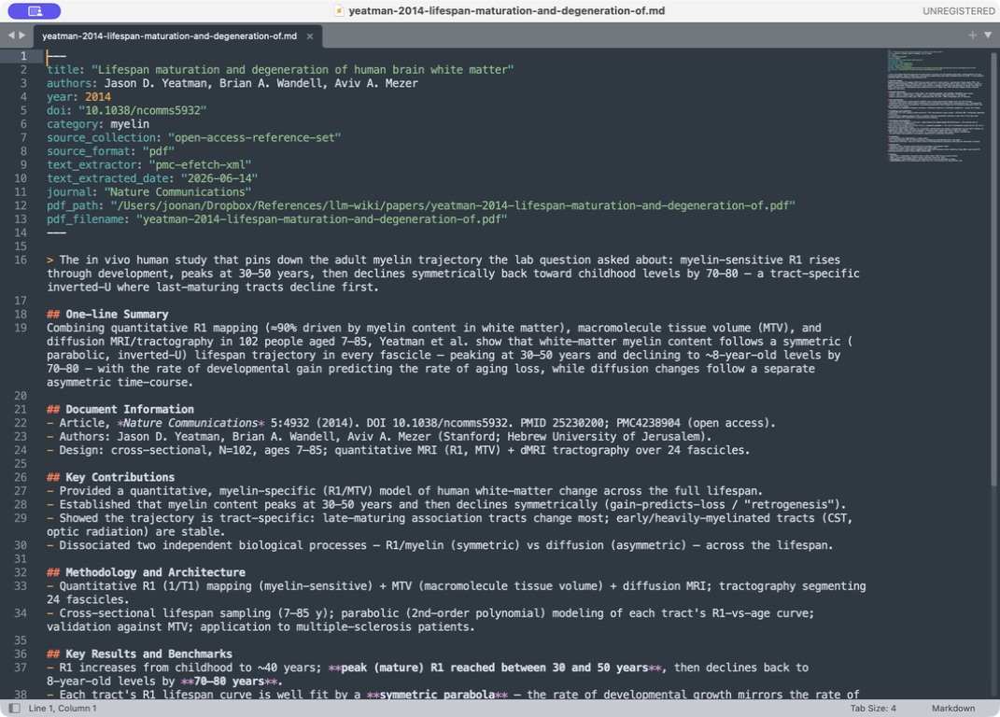
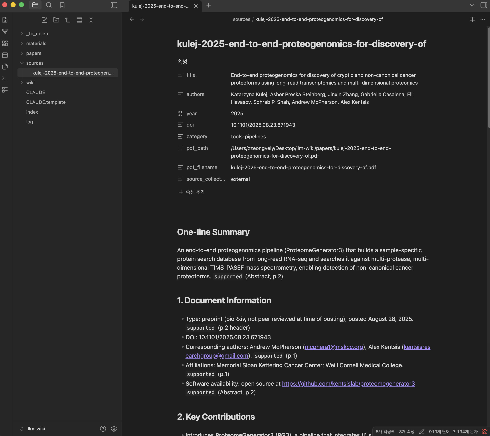
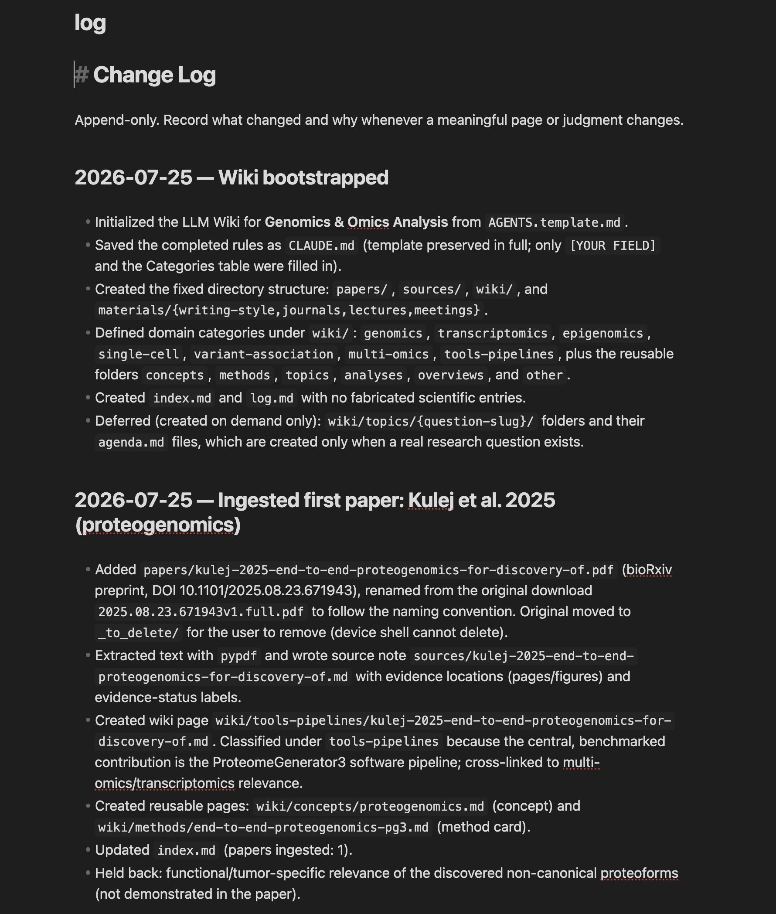

# 4장. 논문 한 편을 LLM-Wiki에 넣는 법

논문을 폴더에 넣고 AI에게 요약을 시키면 파일이 하나 생긴다. 그 파일은 대체로 정확하고 읽기에 무리가 없다. 문제는 석 달 뒤에 생긴다. 비슷한 주제의 논문이 열 편으로 늘었을 때, 이 열 개의 요약 파일은 서로에 대해 아무것도 모른다. 어느 논문이 어느 논문의 방법을 물려받았는지, 두 논문의 결론이 왜 다른지, 새로 들어온 논문이 기존 판단을 바꾸는지가 어디에도 없다. 요약을 만드는 일과 논문을 지식으로 들이는 일은 서로 다른 작업이다. PDF 한 편이 다시 질문할 수 있는 지식으로 변할 때까지, 원문의 정체를 확인하고 독서 기록과 지식 페이지를 구분해 만들고 기존 종합 문서에 연결하는 여섯 단계를 따라간다. 여섯 단계에 붙은 세부 규칙은 설계도에서 나온 것이 드물고 대개 한곳에서 반복해 틀린 뒤에 하나씩 붙었다. 그래서 규칙만 떼어 읽으면 지나치게 깐깐해 보이고 그 규칙이 생기게 만든 사고와 함께 읽으면 최소한으로 보인다.

# 한 편의 ingest가 만드는 것

논문 한 편을 넣는 작업을 ingest라고 부른다. 한 번의 ingest는 같은 논문을 가리키는 세 파일을 만드는데 셋은 서로 다른 일을 한다. PDF는 근거이고 source note는 그 근거를 읽은 기록이며 wiki page는 그 논문이 다른 논문들과 어떻게 이어지는지를 담는 노드다. 이 위키의 설계 원칙 첫 줄에 세 층이 그 순서로 적혀 있다. 고칠 수 없는 PDF에서 요약 문서로, 요약 문서에서 최종 페이지로 내려가는 한 방향이고 반대로 올라가는 흐름은 없다. 셋을 하나로 합치고 싶은 유혹이 생기지만 합치면 각각이 못 하게 되는 일이 있다. PDF는 검색되지 않고 source note는 너무 길어 다른 논문과 나란히 비교하기 어려우며 wiki page는 원문의 세부를 담기에 좁다. 이 책이 근거로 삼은 연구용 위키에는 2026년 8월 기준으로 원문 PDF 16,127건과 source note 15,995건, wiki page 17,591건이 있고 wiki page는 50개 카테고리로 나뉘어 있다. 이 규모에서 세 층이 섞여 있으면 검색이 원문 발췌와 해석을 구분하지 못하고 어떤 문장이 논문의 주장인지 정리자의 판단인지 알 수 없게 된다. 세 파일에 종합 문서 갱신과 변경 기록까지 더하면 한 번의 ingest가 흔적을 남기는 자리는 다섯이다.

```text
paper.pdf
  ├─ 원문 정본            → papers/{stem}.pdf
  ├─ 상세 독서 기록        → sources/{stem}.md
  ├─ 연결된 논문 페이지     → wiki/{category}/{stem}.md
  ├─ 종합 문서 갱신        → overview / concept / question
  └─ 변경 기록과 색인      → logs/ + index
```

# Step 0. PDF의 정체성과 완전성 확인

가장 먼저 하는 일은 이 파일이 무엇인지 확인하는 것이다. 당연해 보이는 단계이고 그래서 가장 자주 건너뛰는 단계이기도 한데, 여기서 틀리면 뒤의 모든 작업이 잘못된 대상 위에 쌓인다. 잘못 들어온 논문은 조용히 자리를 잡는다. 요약이 만들어지고 카테고리가 정해지고 종합 문서에 링크가 걸린 뒤에야 이 파일이 애초에 논문이 아니었다는 것을 알게 되면 되돌릴 곳이 다섯 군데다. 첫 페이지에서 제목, 저자, 연도, DOI, 문서 유형을 확인한다. 여기서 걸러야 하는 것이 정정 공고와 철회 공고다. Correction, erratum, retraction notice는 대체로 한두 쪽이고 서지 정보의 형식이 논문과 비슷해서 자동 처리에서 잘 구분되지 않는다. 정정 공고를 일반 논문으로 넣으면 제목만 그럴듯하고 내용이 없는 페이지가 생기고 이후 검색에서 계속 올라와 읽을 문서를 고르는 시간을 잡아먹는다. 운영 중인 위키에서는 이 세 종류를 원문 폴더에도, 독서 기록 폴더에도, 지식 페이지 폴더에도 넣지 않기로 정해 두었고 판정을 매번 사람의 주의력에 맡기지 않으려고 `is_correction_notice()`라는 함수가 제목을 받아 걸러 낸다. 철회 공고는 걸러 내는 것으로 끝나지 않는다. 철회된 원논문이 이미 위키에 있다면 그 논문 페이지에 철회 사실을 반영해야 하고 그 논문을 근거로 삼은 종합 문서까지 되짚어야 한다. 철회 공고가 들어왔다는 것은 기존 지식을 고칠 일이 생겼다는 뜻이다.

이 걸러 내기에서 판별 조건을 어떻게 잡았는지가 규칙 하나를 만드는 방식을 보여 준다. 제목의 correction이라는 단어만으로는 공고를 판별할 수 없다. 유전자 교정을 다루는 논문, 배치 효과 보정을 다루는 논문, 다중 비교 보정을 다루는 논문의 제목에는 그 단어가 정상적으로 들어간다. 단어의 존재만으로 걸러 내면 그 분야의 핵심 논문이 위키에서 통째로 사라지고 사라졌다는 사실은 아무 데도 기록되지 않는다. 그래서 조건을 단어가 놓인 자리로 좁혔다. Correction 바로 뒤에 콜론이 오거나 to가 오는 경우만 공고로 본다. 정정 공고의 제목은 거의 예외 없이 원논문의 제목을 콜론이나 to 뒤에 그대로 달고 나오기 때문이다. 조건을 이렇게 좁히면 걸러지지 않고 통과하는 공고가 생기는데 그 실패는 사람이 첫 페이지를 여는 순간 드러난다. 반대 방향의 실패는 드러나지 않는다. 규칙 하나를 만들 때 두 종류의 오류 가운데 어느 쪽이 눈에 보이는지를 먼저 정하는 편이 낫고 보이지 않는 쪽으로 기울지 않게 조건을 좁힌다.

원문의 완전성도 함께 본다. 브라우저에서 저장한 HTML이나 초록만 담긴 파일을 원문 대신 쓰지 않는다. HTML 캡처는 만들지도 보관하지도 않는다는 규칙이 따로 있는데 캡처는 조판과 쪽 번호와 그림 배치를 잃고 접혀 있던 절을 통째로 빠뜨린 채로도 파일 하나로 성립해 버리기 때문이다. 출판사 페이지를 그대로 인쇄한 파일에는 본문 대신 구독 안내와 로그인 화면만 들어 있는 경우가 있는데 파일 크기와 쪽수만 보면 정상으로 보인다. PDF의 쪽수를 보고, 본문이 실제로 있는지 보고, 다른 논문이 뒤에 이어 붙은 합본은 아닌지 보고, 글자가 깨져 있지 않은지 본다. 정확한 PDF를 끝내 구하지 못하면 그 논문은 ingest하지 않고 미보유 목록에 남긴다. 절반짜리 자료로 만든 페이지는 위키 안에서 온전한 페이지와 겉모습이 같고 구분되지 않는 순간 위키 전체의 신뢰도가 그 페이지 수준으로 내려간다. 이 확인은 30초면 끝난다. 건너뛰면 몇 달 뒤에 이 논문의 정리 내용이 왜 이상한지 추적하는 데 30분이 들고 그때는 이미 그 내용이 종합 문서에 들어가 있다.

마지막으로 같은 논문이 이미 있는지 찾는다. 같은 DOI가 이미 있는데 파일명이 달라 중복으로 들어오는 일이 생각보다 흔하다. 저자 이름의 표기가 다르거나 프리프린트와 출판본이 각각 들어오거나 제목의 부제가 잘려 있는 경우가 대부분이다. DOI로 먼저 찾고 없으면 제목으로 찾는다. 제목으로 찾을 때는 부제를 떼고 앞부분만으로도 한 번 찾아야 하는데 잘린 제목은 전체 제목으로 검색해도 걸리지 않기 때문이다. 중복이 발견되면 새 파일을 버릴지 기존 것을 대체할지 정해야 하는데 프리프린트와 출판본이라면 출판본을 정본으로 삼되 프리프린트에만 있던 내용이 있는지 확인한다. 보충 자료가 프리프린트 쪽에 더 자세한 경우가 있고 심사 과정에서 통째로 빠진 분석이 프리프린트에만 남아 있는 경우도 있다. 정본을 바꾸기로 했다면 기존 stem을 그대로 쓰고 파일만 교체한다.

# Step 1. 원문 보존과 텍스트 추출

확인이 끝나면 정본 PDF를 원자료 폴더에 복사하고 그 뒤로는 고치지 않는다. 주석을 달거나 쪽을 자르거나 병합하지 않는다. 원자료를 고치기 시작하면 그 논문에 대한 어떤 주장도 검증할 수 없게 된다. 파일명은 저자, 연도, 제목 토큰으로 만든 공통 stem을 쓴다. 실제 위키에서는 `theodoris-2023-transfer-learning-network-biology`처럼 붙인다. 이 stem을 PDF와 source note와 wiki page가 함께 쓰기 때문에, 세 파일이 같은 논문을 가리킨다는 것을 파일명만 보고 알 수 있다. 규칙 없이 이름을 붙이면 나중에 세 파일을 맞추는 작업이 사람의 기억에 의존하게 된다. Stem의 첫 토큰인 저자 성을 뽑는 일은 생각보다 자주 틀렸다. 예전에는 그 로직이 여러 스크립트 안에 인라인으로 복사되어 있었고 그 판본은 쉼표로 구분된 저자 목록을 한 사람의 이름으로 읽어 마지막 저자의 성을 돌려주었다. 제1저자의 이름으로 찾을 논문이 교신저자의 이름으로 저장된 파일이 조용히 쌓였다는 뜻이다. 지금은 저자 이름을 뽑는 함수가 `scripts/author_parse.py` 한 곳에만 있고 회귀 검사 41건이 붙어 있다. 같은 판단을 하는 코드가 두 곳에 있으면 한 곳만 고쳐지는 날이 반드시 온다.

PDF와 함께 딸려 오는 보충 자료는 종류를 나눠 다룬다. 심사 파일, 결정 서한, 아무것도 적히지 않은 빈 점검표는 보관하지 않는다. 논문의 내용에 대해 알려 주는 것이 없고 쌓이면 보충 자료 폴더에서 실제로 쓸 파일을 찾기 어려워진다. Nature Reporting Summary는 예외로 두고 보존한다. 앞부분은 체크박스라서 넘겨도 되지만 뒷부분은 저자가 직접 쓴 서술이고 검정력 분석, 표본 제외 사유, 눈가림 여부, 소프트웨어 버전, 코호트의 인구 구성이 본문 어디에도 없이 거기에만 적혀 있는 경우가 많다. 방법을 재현하려 할 때 막히는 지점이 대개 그 다섯 가지다. 어느 파일을 버리고 어느 파일을 남길지는 그 안에 저자가 직접 쓴 문장이 있는지로 정한다. 형식만 보고 정하면 Reporting Summary처럼 겉모습이 점검표인 문서가 함께 버려지고 버렸다는 기록도 남지 않는다.

텍스트 추출은 실패할 수 있고 더 나쁘게는 조용히 틀릴 수 있다. PDF 추출기는 두 단으로 조판된 본문의 줄 순서를 섞고 표의 셀 경계를 잃고 그림 설명을 본문과 붙이고 수식을 지우고 위첨자를 일반 숫자로 만든다. 위첨자가 무너지면 인용 번호가 본문 숫자와 섞여 이후의 인용 분석이 전부 어긋난다. 추출이 성공했다는 메시지는 파일이 만들어졌다는 뜻일 뿐이고 내용이 맞다는 보증은 어디에도 없다. 이 위키에서 실제로 벌어진 일이 그 차이를 보여 준다. 추출 스크립트는 인자를 세 개 받는데 세 번째 인자가 쪽수처럼 보이지만 글자 수 상한이다. 그것을 쪽수로 읽고 작은 값을 넘긴 적이 있고 스크립트는 시킨 대로 그 길이에서 문서를 자른 뒤 성공했다고 보고했다. 잘린 자리가 Methods 중간이었기 때문에 초록과 서론과 결과는 멀쩡히 들어왔고 빠진 것은 표본 수와 필터링 조건과 통계 모형이었다. 읽는 사람 눈에 빈 곳이 보이지 않는 종류의 손실이다. 그래서 중요한 값은 화면과 대조한다. 결론을 좌우하는 수치, 부호의 방향, 표의 비교군, 그림이 말하는 바는 PDF를 직접 열어 확인한다. 어떤 도구로 언제 어떤 인자로 추출했는지도 기록한다. 나중에 이상한 값이 발견되었을 때 추출 단계의 문제인지 정리 단계의 문제인지 구분하려면 이 기록이 필요하다.

# Step 2. Source note 작성

Source note는 원문을 읽은 기록이다. 원문 전체를 읽고 고정된 항목에 맞춰 압축한 문서다.



머리말에는 제목과 저자와 연도와 식별자, 그리고 어느 원문에서 어떤 도구로 뽑았는지가 들어간다. 그 아래 한 문장 요약이 이 논문 전체를 한 문장으로 압축하고 다시 그 아래로 방법과 핵심 결과가 항목별로 나뉜다. 나중에 다시 열었을 때 위에서 아래로 읽어 내려가면 필요한 깊이에서 멈출 수 있는 구조다. 항목을 고정하는 이유는 논문끼리 비교하기 위해서다. 논문마다 다른 형식으로 정리하면 열 편이 쌓였을 때 나란히 놓을 수 없다. 추출한 원문 전체를 여기에 붙이지 않는다. 원문 정본은 PDF이고 추출된 원시 텍스트를 그대로 넣으면 세 가지 문제가 생긴다. 출판사의 저작권 안내와 투고 이력 같은 상용구가 지식으로 검색되고 잘못 읽힌 표가 사실처럼 노출되며 문서가 길어져 검색 결과에서 어느 부분이 관련되는지 알 수 없게 된다. 이 문서를 쓰는 일 자체를 다른 프로그램에 넘기지 않는다는 규칙도 붙어 있다. Ingest 규칙과 스크립트는 외부 모델의 CLI나 API를 호출하지 않고 논문을 해석하고 문장을 쓰는 일은 지금 이 작업을 하고 있는 에이전트 세션 안에 둔다. 로컬 스크립트가 맡는 범위는 추출, 검증, 복구, 로그, 색인 유지로 한정된다. 해석을 다른 프로세스로 넘기면 그 프로세스가 무엇을 보고 그렇게 썼는지가 세션 밖으로 나가고 위키에는 근거를 되짚을 수 없는 문장만 남는다. 항목은 여덟 개이고 순서는 다음과 같다.

```text
One-line Summary
Document Information
Key Contributions
Methodology and Architecture
Key Results and Benchmarks
Limitations and Future Work
Related Work
Glossary
```



Document Information은 연구 대상, 데이터, 설계, 비교 조건처럼 이 논문이 무엇에 관한 것인지를 정하는 정보다. Key Contributions는 기존 지식과 비교해 새로 더해진 주장이다. 저자가 새롭다고 말한 것 가운데 실제로 새로운 것만 적는다. Methodology and Architecture는 표본, 실험, 모델, 분석 단계, 평가 방식이다. Key Results and Benchmarks는 결과의 방향과 크기, 수치, 비교군, 불확실성이다. 방향만 적고 크기를 빼면 나중에 두 논문을 비교할 수 없다. Limitations and Future Work에는 저자가 인정한 한계와 함께 읽는 사람이 추가로 본 경계를 적는다. 이 둘은 구분해서 적는다. 구분하지 않으면 몇 달 뒤에 그 한계가 저자의 인정인지 읽은 사람의 판단인지 알 수 없고 논문을 인용할 때 저자가 하지 않은 말을 저자의 말로 옮기게 된다. Related Work는 선행 연구와의 관계인데, 여기서 가장 자주 발생하는 오류가 확인하지 않은 관계를 사실처럼 적는 것이다. 이 논문이 저 논문의 방법을 개선했다고 쓰려면 두 논문을 다 읽어야 하고 읽지 않았다면 그렇게 쓰지 않는다. Glossary는 이 논문을 이해하는 데 실제로 필요한 용어만 넣는다. 이 문서가 있어도 수치나 조건이 판단을 좌우하는 대목과 그림이 결론을 만드는 대목에서는 PDF로 돌아가는데 source note는 원문으로 가는 경로이기 때문이다.

# Step 3. 카테고리 분류

카테고리는 이 논문을 나중에 어떤 질문으로 다시 찾을지에 대한 결정이다. 같은 논문이라도 위키의 목적에 따라 다른 곳에 놓이는 것이 자연스럽다. 단일세포 데이터로 유전자 조절을 다룬 논문은 방법 중심 위키에서는 딥러닝 카테고리에, 질환 중심 위키에서는 해당 질환 카테고리에 놓인다. 둘 다 맞다. 1차 분류 축은 위키 전체에서 일관되게 정한다. 방법으로 나눌지, 현상으로 나눌지, 질환이나 대상 생물로 나눌지를 정하고 지킨다. 축이 섞이면 같은 논문이 두 축 모두에 해당해 어디에 둘지 매번 고민하게 된다. 실제 운영에서는 완전히 한 축으로만 유지하기 어렵다. 앞서 언급한 위키의 50개 카테고리에도 질환과 대상을 나누는 주제축과 방법을 나누는 축이 함께 있다. 그렇더라도 새 카테고리를 만들 때마다 어느 축인지 밝혀 두면 나중에 정리할 수 있다.

실제 운영에서 축이 완전히 하나로 유지되는 일은 드물다. 이 책이 근거로 삼은 위키의 50개 카테고리에는 `asd-ndd`와 `gwas`처럼 주제로 나뉜 것과 `genomic-dl`, `single-cell-dl`, `statistics`처럼 방법으로 나뉜 것이 한 층에 섞여 있다. 크기도 고르지 않아서 2,236건이 든 카테고리와 11건이 든 카테고리가 나란히 있다. 흔들림이 생기는 자리는 카테고리 목록 자체가 예고한다. 방법축 카테고리와 주제축 카테고리가 한 층에 있으면, 방법 논문이 특정 질환 자료로 검증을 붙인 순간 두 카테고리에 동시에 해당한다. 그때 어느 쪽으로 보내는지가 세션마다 달라지면 같은 종류의 논문이 두 곳에 흩어지고 나중에 어느 쪽을 찾아야 하는지도 흔들린다. 판단을 고정하는 것은 카테고리마다 적어 둔 포함과 제외 문장이고 그 문장이 없는 카테고리에서 흔들림이 반복된다. 같은 카테고리에서 판단이 세 번 넘게 흔들렸다면 이름을 바꾸거나 쪼갤 후보이며 그 횟수는 폴더를 만드는 날에 알 수 없으므로 로그에 남겨 두어야 보인다.

분류가 애매할 때 던지는 질문은 하나다. 이 논문을 다시 찾을 때 어떤 질문으로 찾을 것인가. 답이 "이 방법을 쓴 논문이 뭐가 있었지"라면 방법 카테고리로 가고 "이 질환에서 뭐가 밝혀졌지"라면 질환 카테고리로 간다. 두 질문이 다 그럴듯하면 더 자주 던질 질문을 고른다. 여러 카테고리에 파일을 복제하지 않는다. 정본 위치는 하나로 하고 나머지는 링크로 연결한다. 복제하면 한쪽만 고쳐지는 순간 어느 것이 최신인지 알 수 없게 되고 이 문제는 시간이 지날수록 커진다. 카테고리의 크기가 균등할 필요는 없다. 실제 위키에서도 2,236건이 든 카테고리와 11건이 든 카테고리가 같은 층에 있다. 카테고리를 나누는 기준은 그 안의 질문이 같은지 여부다. 한 카테고리 안에서 서로 다른 질문을 하게 되면 그때 나눈다. 분류는 나중에 고칠 수 있지만 미루면 그동안 이 논문은 검색에서 사실상 보이지 않으므로 완벽한 분류를 미리 만들 필요가 없어도 어딘가에는 놓는다.

카테고리를 정하고 나면 그 논문의 wiki page 이름이 결정된다. 이름 규칙은 저자와 연도 뒤에 제목에서 뽑은 5토큰을 붙이는 것이다. 단위는 5토큰이며, 영숫자가 아닌 문자를 지우지 않고 구분자로 세기 때문이다. `self-report`는 한 단어처럼 보이지만 `self`와 `report` 두 토큰으로 센다. 규칙을 이렇게 적어 두어도 실제 파일들은 한 형태로 모이지 않았다. 2026년 7월 17일에 wiki 문서 10,340건의 이름을 규칙이 만들어 낼 형태와 대조해 보니, 불용어를 유지한 형태와 일치한 것이 61.3%, 제거한 형태와 일치한 것이 40.1%였고 둘 다에 해당하는 것이 21.6%, 어느 쪽에도 해당하지 않는 것이 20.2%였다. 정본이라고 부를 형태가 존재하지 않는다는 뜻이다. 여기서 손이 근질거리는 선택지가 하나 있다. 스크립트를 짜서 전부 한 형태로 맞추는 것이다. 그 작업은 하지 않기로 했다. Wiki page의 stem을 바꾸면 그 페이지를 가리키는 모든 위키링크와 색인 항목이 함께 바뀌어야 하고 그 전에 어느 형태로 통일할지부터가 결정 사항인데 61.3% 대 40.1%는 어느 쪽도 다수라고 부르기 어려운 숫자다. 이름은 사람이 파일을 알아보게 하려고 있는 것이고 그 목적은 지금의 두 형태로도 달성되고 있다. 새로 만드는 파일에만 규칙을 적용하고 옛 이름은 그대로 둔다.

# Step 4. Paper wiki page 작성

Paper wiki page가 맡는 일은 연결이다. 이 페이지에는 다섯 가지가 들어간다. 첫째, source note와 PDF로 되돌아갈 수 있는 정보다. 이 페이지에서 출발해 언제든 근거까지 내려갈 수 있어야 한다. 둘째, 주요 주장과 방법을 검색 가능한 언어로 정리한 내용이다. 나중에 이 논문을 찾을 때 쓸 법한 단어가 실제로 페이지 안에 있어야 검색에 걸린다. 셋째, 관련 종합 문서로 가는 링크다. 넷째, 이 논문이 기존 지식을 어떻게 바꾸는지에 대한 판정이다. 다섯째, 이 논문과 직접 관계된 다른 논문들이다. 넷째가 이 페이지의 핵심이고 가장 자주 빠진다. 새 논문이 기존 주장을 강화하는지, 적용 범위를 좁히는지, 반박하는지, 대체하는지, 아니면 아무것도 바꾸지 않는지를 한 문장으로 적는다. 아무것도 바꾸지 않는다는 판정도 정보다. 같은 결과가 다른 조건에서 재현되었다는 뜻일 수 있기 때문이다. 작업 과정에서 생긴 정보는 이 페이지에 넣지 않는다. 어느 배치에서 처리했는지, 어떤 에이전트가 만들었는지, 추출에 몇 초가 걸렸는지는 운영 기록에 속한다. 이런 정보가 페이지에 섞이면 읽는 사람이 매번 걸러 내야 하고 검색에도 걸린다. 항목 골격은 source note의 여덟 항목보다 짧고 다섯 가지는 그 안에 나뉘어 들어간다.

```text
Summary
Key Contributions
Methodology and Architecture
Results
Related Papers
```

Wiki page 사이의 링크는 Obsidian이 읽는 `[[wikilink]]` 형식으로 쓴다. 이 저장소는 Obsidian 호환을 유지하기로 했고 그래서 표준 Markdown과 위키링크만 쓰고 특정 도구에만 있는 문법은 쓰지 않는다. 링크 규약에는 한 줄짜리 조건이 붙어 있다. Vault의 루트는 저장소 루트가 아니고 `wiki/` 폴더다. 그러므로 모든 `[[...]]` 대상은 `wiki/` 안에서의 경로로 쓰고 `wiki/` 접두사를 붙이지 않는다. 이 한 줄이 굳이 규칙 문서에 명문화된 이유는 실제 사고 때문이다. 접두사를 붙이는 편이 저장소 루트에서 볼 때 더 정확해 보인다는 판단으로, 약 5만 개의 위키링크에 `wiki/`를 붙이는 일괄 작업을 돌린 적이 있다. Obsidian은 그 링크들을 `wiki/wiki/...`로 해석했고 존재하지 않는 경로를 열 때마다 빈 유령 페이지를 새로 만들었다. 살아 있는 vault가 망가졌고 작업을 통째로 되돌려야 했다. 여기서 정말 문제가 되는 쪽은 검사다. 링크 검사 스크립트는 두 형태를 모두 유효한 링크로 받아들이므로 접두사가 다시 들어와도 아무것도 지적하지 않는다. 기계가 잡아 주지 않는 규칙이 위키에 몇 개 있고 그런 규칙은 잡히지 않는다는 사실까지 규칙 문서에 적어 두어야 지켜진다.

# Step 5. Synthesis layer에 연결

논문을 넣었는데 기존 종합 문서와 이어지지 않았다면 ingest는 아직 끝나지 않았다. 이 상태에는 이름이 붙어 있다. 종합 층과 연결되지 않은 채 남은 source note와 wiki page 한 쌍을 synthesis-orphan이라고 부른다. 이름을 붙여 둔 이유는 그 상태가 겉으로는 정상이기 때문이다. 파일 두 개가 제자리에 있고 내용도 충실하고 검색에도 걸린다. 무너진 것은 위키가 하려던 일이다. Synthesis-orphan만 쌓인 위키는 질문이 들어올 때마다 관련 있어 보이는 조각을 꺼내 와 그때 답을 조립한다. 조각을 꺼내 답을 만드는 검색 방식과 동작이 같아지고 조각들 사이에서 내린 판단은 세션이 끝나면 사라진다. 논문이 백 편으로 늘어도 답할 수 있는 질문이 늘지 않는 상태가 여기서 나온다. 최소 완료 조건 네 가지는 그래서 문서에 명문화되어 있다. 가장 관련된 overview나 concept 페이지와 양방향 링크를 만든다. 한쪽에서만 가리키면 반대 방향에서 찾을 수 없다. 그 종합 페이지의 본문에 이 논문이 기존 지식에서 차지하는 위치를 한 문장 이상 반영한다. 링크만 추가하고 본문을 고치지 않으면 종합 문서는 목록이 되어 버린다. 앞 절에서 말한 판정 가운데 하나를 적어 기존 주장이 강화되는지, 좁아지는지, 반박되는지, 대체되는지를 점검한다. 적절한 종합 페이지가 없으면 그 공백을 작업 로그에 기록하고 같은 주제가 반복될 것 같으면 새 종합 페이지를 만든다. 네 번째 조건이 가장 자주 생략되는데 공백을 적어 두지 않으면 그 주제에 종합 문서가 없다는 사실을 아무도 다시 발견하지 못한다.

Ingest에 등급을 두지 않는다. Tier 1, lightweight, routine, provisional 같은 이름으로 논문을 나누고 어떤 등급에는 느슨한 기준을 적용하는 방식을 쓰지 않는다는 뜻이다. 등급을 두면 처음에는 시간을 아끼는 것처럼 보인다. 문제는 등급이 붙은 페이지가 위키 안에서 다른 페이지와 똑같이 생겼다는 데 있다. 6개월 뒤에 그 페이지를 읽는 사람은 이 페이지가 대충 만들어졌다는 표시를 어디에서도 볼 수 없고 위키의 다른 페이지와 같은 무게로 읽는다. 위험은 품질이 낮은 페이지에서 오지 않는다. 품질이 낮다는 사실이 페이지 겉면에 남지 않는 데서 온다. 같은 이유로 placeholder 페이지를 만들지 않는다. Metadata와 초록, 다른 논문의 참고문헌에 적힌 서지 정보, 파일명, 추출된 앞부분 몇 쪽만으로도 검색에 걸리는 페이지를 만들 수 있고 그렇게 만든 페이지는 검색 결과에서 제대로 만든 페이지와 구별되지 않는다. 원문이 완전한 source note와 wiki page 한 쌍을 뒷받침하지 못하면 그 논문은 지식 층에서 빼고 공백으로 기록한다. 없는 것으로 기록된 논문은 나중에 채울 수 있고 있는 것처럼 기록된 논문은 다시 열리지 않는다. 배치 처리에도 같은 원칙이 적용된다. 논문 서른 편을 한꺼번에 넣는 것은 실행 전략이고 그 전략은 작업 로그 안에서만 존재해야 한다. 여러 편을 한 번에 넣을 때 추가로 필요한 절차는 6장에서 다룬다. 독자가 읽는 페이지에 batch 이름이나 날짜별 식별자가 남으면, 그 페이지를 읽는 사람은 논문에 대한 정보와 작업에 대한 정보를 매번 스스로 갈라내야 한다.

모든 논문에 같은 기준을 적용한다는 것과 모든 논문에 같은 시간을 쓴다는 것은 다르다. 기준은 하나이고 그 기준을 넘어 얼마나 더 하는지는 논문에 따라 달라진다. 영향이 큰 논문에는 high-impact ingest mode라고 이름 붙인 처리를 쓴다. 관련 overview의 본문을 새로 쓰고 그 논문이 반복해서 쓰는 개념에 concept 페이지를 만들고 관련된 페이지들 사이에 양방향 링크를 걸고 이 논문 때문에 기존 주장이 어떻게 달라졌는지를 문장으로 남긴다. 분야의 논지 자체를 바꾸는 논문에는 더 느린 방식을 쓰고 그 방식에는 Karpathy mode라는 이름이 붙어 있다. 한 편씩만 처리하고 새 논문을 읽기 전에 그 주제의 기존 종합 문서를 먼저 읽고 읽고 나서 주장이 어디에서 어디로 옮겨 갔는지를 명시한다. 배치로 서른 편을 훑는 속도와 정반대인데, 논지를 바꾸는 논문은 애초에 자주 오지 않는다. 종합 층 자체는 세 종류로 나뉘어 있다. 주제를 통째로 서술하는 overview가 590건, 반복해서 등장하는 개념을 정의하는 concept이 408건, 특정 질문에 답하는 question이 550건이다. 새 논문이 어느 종류에 붙을지는 논문이 정하고 세 종류 모두에 붙는 논문도 있다. 이 조건들이 실제로 지켜지는지는 사람의 성실함에 맡기지 않는다. 카테고리별로 종합 층과 연결된 페이지의 비율과 연결되지 않은 orphan의 수를 세는 감사 스크립트가 있고 수치는 카테고리마다 따로 나온다. 어느 카테고리의 orphan이 유독 많다면 그 주제에 종합 문서가 부족하다는 신호이고 그 신호는 논문을 더 넣어서 해결되지 않는다.




로그에는 무엇을 어디에 만들었고 왜 그 카테고리로 분류했는지가 문장으로 남는다. 위 화면에서는 폴더 구조를 세운 기록과 첫 논문을 넣은 기록이 이어져 있고 두 번째 항목에는 원본 파일을 어떤 이름으로 바꿨는지, 어떤 도구로 추출했는지, 어느 개념 페이지와 method card를 함께 만들었는지가 적혀 있다. 마지막 줄이 특히 중요한데, 논문에서 확인되지 않아 적지 않기로 한 것을 밝혀 두었다. 무엇을 적지 않았는지가 남아 있어야 나중에 비어 있는 이유를 알 수 있다.

# Step 6. 검증, 로그, 색인

먼저 세 파일이 같은 논문을 가리키는지 확인한다. PDF와 source note와 wiki page의 stem이 같은지, 제목과 저자와 연도가 서로 어긋나지 않는지 본다. 다음으로 필수 항목이 비어 있는지 확인한다. 항목 제목만 있고 내용이 없는 자리, 추출 오류가 그대로 들어온 자리, 판정이 빠진 자리를 찾는다. 링크와 카테고리가 실제로 존재하는지도 확인한다. 없는 문서를 가리키는 링크는 나중에 찾기 어렵다. 위키링크의 형태도 이때 눈으로 본다. 검사 스크립트가 접두사 붙은 형태를 통과시키므로 이 확인만은 사람이 대상 경로를 직접 읽는 수밖에 없다. 여기까지가 파일 자체에 대한 검증이고 다음은 이 작업을 기록으로 남기는 일이다.

작업 로그에는 무엇을 왜 추가했는지 남긴다. 이 기록의 가치는 시간이 지나야 드러난다. 근거로 삼은 위키는 2026년 7월에 git을 걷어냈고 그 뒤로는 날짜별 작업 로그가 무엇을 왜 바꿨는지에 대한 유일한 서술 기록이 되었다. 파일 복구는 동기화 서비스의 버전 기록으로 하지만 그 기록은 파일이 어떻게 바뀌었는지만 알려 주고 왜 바꿨는지는 알려 주지 않는다. 로그 파일은 하루에 하나가 아니고 하루와 에이전트와 기계의 조합마다 하나다. 이름은 날짜, 에이전트 이름, 기계 이름을 이어 붙여 만든다. 에이전트 이름은 `claude`, `codex`, `kimi` 셋 중 하나이며 `kimi`는 2026년 8월 1일에 추가되었다. 기계 이름이 파일명에 들어가는 이유는 두 대의 Mac이 Dropbox로 같은 폴더를 공유하기 때문이다. 기계 이름을 빼면 같은 날 두 대에서 돌린 작업이 한 파일에 동시에 쓰이고 동기화는 그 충돌을 충돌 사본으로 처리한다. 기계 이름을 기억으로 적지 않고 `scutil --get ComputerName`을 실행해 확인한다는 조건까지 붙어 있는데 2026년 7월 25일에 같은 날 작업이 두 대에서 돌았고 명령을 실행하고 나서야 어느 쪽인지 구분되었기 때문이다. 세션 안에 있는 에이전트는 자기가 어느 기계 위에서 돌고 있는지 안다고 착각하기 쉽다.

로그 파일의 안쪽에도 형식이 있다. Frontmatter에 날짜, 에이전트, 기계, 모델을 적고 항목은 오래된 것이 위로 가도록 아래에 덧붙인다. 모델 이름을 적는 칸이 따로 있는 것은, 같은 지침을 주어도 모델에 따라 결과가 달라지는 일이 실제로 있기 때문이다. 이 값은 나중에 복원할 방법이 없어서 2026년 7월 25일 이전 파일에는 비어 있다. 항목 제목은 날짜, 작업 종류, topic slug, 제목을 순서대로 이어 붙인 한 줄이다. 작업 종류는 ingest, maintenance, query-to-wiki, semantic-lint, supersede 다섯 가지다. Topic slug가 제목 안에 들어가는 이유는 하나의 작업이 하루에 끝나지 않기 때문이다. 어떤 주제의 논문 스무 편을 넣는 일은 사흘에 걸쳐 두 에이전트가 두 기계에서 진행하게 되고 그렇게 흩어진 로그 파일들을 하나의 작업으로 잇는 것이 slug 하나다. 그래서 새 slug를 만들기 전에 기존 topic 표를 먼저 읽는다. 이미 있는 것과 비슷하지만 미묘하게 다른 slug를 새로 만들면, 하나였던 작업이 조용히 둘로 쪼개지고 어느 쪽도 완결되지 않은 것처럼 보인다. 그 topic 표는 손으로 쓰지 않고 항목 제목들에서 생성한다. 생성이 강제하는 것은 정직함이다. 손으로 쓰는 표는 하지 않은 작업을 적을 수 있고 한 작업을 빠뜨릴 수 있지만 생성된 표는 로그에 없는 작업을 주장할 방법이 없다. 로그 폴더의 최상위에는 일자별 파일과 그 생성된 표만 두고 감사 보고서와 기계별 로그와 동결된 과거 기록은 각각 하위 폴더로 내린다.

```text
1. 자신의 분야에서 이미 읽은 논문 한 편을 골라 여섯 단계를 끝까지 수행한다
2. 끝난 뒤 다섯 가지를 나란히 놓고 본다
   - 원문 PDF
   - Source note
   - Paper wiki page
   - 연결된 종합 문서에서 이번에 바뀐 문장
   - 작업 로그와 색인 항목
```

처음 읽는 논문으로 하면 절차를 익히는 대신 내용을 이해하는 데 시간이 다 간다. 성공 기준은 새 세션을 시작한 에이전트에게 이 논문에 대해 물었을 때, 주장의 근거가 어디에 있고 이 논문이 기존 지식에서 어디에 놓이는지를 설명할 수 있는가다. 파일이 다섯 개 생겼더라도 종합 문서에서 바뀐 문장이 없으면 이 기준을 통과하지 못한다. 연구실을 운영하는 사람에게는 검증 항목이 하나 더 있다. 지식 페이지 층에는 출판된 지식만 담고, 준비 중이거나 심사 중이거나 중단된 연구실 원고는 제목조차 넣지 않는다. DOI가 붙은 출판 논문과 공개된 프리프린트는 남고 경계는 공개 여부 하나로 정한다. 문제는 미공개 원고가 자기 페이지의 형태로만 들어오지 않는다는 데 있다. 실제로 확인된 경로가 여섯이다. Frontmatter의 status 값과 비어 있는 DOI 칸, 이미 출판된 논문의 페이지에 덧붙인 내부 코드명 관련 절, tags 목록에 섞여 들어간 코드명, 코드명을 제목으로 단 overview 페이지, 위키링크 없이 문장 안에서만 언급된 원고, 그리고 그런 페이지들을 가리키는 인바운드 링크다. 여섯 가지 모두 금지되어 있고 여섯을 따로 적어 둔 이유는 하나만 막으면 나머지 다섯으로 새기 때문이다. 진행 중인 원고에 대한 메모는 지식 층 밖의 `agenda/`로 보내고 중단된 원고는 보관하지 않고 지운다. 배치 하나를 닫기 전에 살아 있는 코드명과 manuscript, our paper 같은 표현을 위키 전체에서 검색해 결과가 0건인지 확인한다. 이 검사가 필요한 이유는 위키가 어느 날 공유되거나 논문 초안 작성에 쓰이기 때문이고 그때 새어 나가는 것은 아직 심사 중인 결과다. 배치를 닫는 작업이 하나 더 남는다. 색인은 정책에 맞춰 갱신하는데 카테고리 목록과 검색 색인은 문서에서 다시 만들 수 있는 파생 상태이므로 매번 갱신할 필요는 없다.
