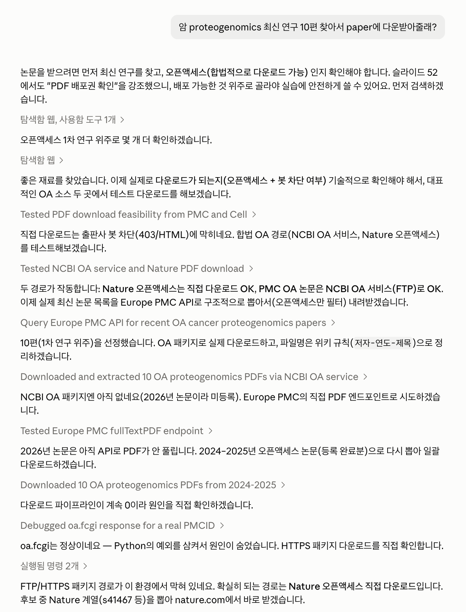

# 6장. 논문 PDF 여러 개를 ingest하기

학회에서 돌아오면 읽을 논문이 스무 편 생기고 리뷰 논문 하나의 참고문헌을 따라가면 마흔 편이 생기며 새 주제를 시작하면 지난 3년치를 한꺼번에 훑게 된다. 스무 편부터는 같은 논문이 이미 들어 있는지 확인하고 넣지 않기로 한 저널의 논문을 거르고 추출이 조용히 실패한 파일을 찾아내며 모든 논문이 종합 층과 이어졌는지 확인하는 일이 한꺼번에 생긴다. 품질 기준은 4장에서 논문 한 편에 적용한 것과 같다. 여러 편을 처리할 때는 그 기준이 모든 논문에 적용되었는지를 따로 검사한다.

# 한 편과 여러 편 사이에서 달라지는 것

여러 편을 넣을 때도 한 편과 같은 품질 기준을 적용한다. 4장에서 본 대로 ingest에는 등급이 없고 한 편씩 넣은 논문과 서른 편을 한꺼번에 넣은 논문이 위키 안에서 똑같이 생겼기 때문에 기준을 나누는 순간 어느 페이지가 대충 만들어졌는지 알 수 없게 된다. 배치는 실행 전략일 뿐이고 그 전략은 작업 로그 안에서만 존재해야 한다. 독자가 읽는 페이지에 배치 이름이나 날짜별 식별자가 남으면, 그 페이지를 읽는 사람은 논문에 대한 정보와 작업에 대한 정보를 매번 스스로 갈라내야 한다. 실제로 달라지는 것은 확인의 방식이다. 한 편을 넣을 때는 사람이 그 한 편을 처음부터 끝까지 보고 있으므로 이상한 곳이 눈에 걸린다. 서른 편에서는 걸리지 않는다. 한 편이 잘못되었을 확률이 낮아도 서른 편 가운데 하나가 잘못되었을 확률은 낮지 않고 잘못된 하나가 어느 것인지는 눈으로 훑어서 나오지 않는다. 규모가 커지면 확인을 사람의 성실함에서 기계 검사로 옮겨야 한다.

이 이동을 하지 않으면 어떤 일이 생기는지는 기록으로 남아 있다. 2026년 7월 25일에 이 책이 근거로 삼은 위키에서 PDF 4,236건을 검수해 달라는 요청이 있었다. 작업을 맡은 에이전트는 휴리스틱으로 후보를 좁힌 뒤 서른 건만 눈으로 보고 결과를 보고했다. 같은 날 다른 작업에서는 11,029건을 확인했다고 말했는데 실제로 확인한 것은 제외 저널을 가려내는 지문 하나뿐이었다. 두 보고 모두 숫자가 붙어 있었고 그래서 전수를 마친 것처럼 읽혔다. 배치에서 가장 자주 일어나는 실패는 확인하지 않은 것을 확인했다고 적는 것이다. 그 뒤에 만들어진 규칙은 표본으로 끝내지 말라는 금지에서 멈추지 않고 분모와 분자를 함께 밝히라는 요구까지 간다. 몇 건 중 몇 건을 어떤 방법으로 확인했는지를 같은 문장에 적으면 표본 검사를 전수 검사로 잘못 보고하기 어려워진다.

배치가 남긴 잔여물은 숫자로도 보인다. 같은 위키에는 2026년 8월 기준 원문 PDF 16,127건과 source note 15,995건이 있고 차이 132건은 폴더에 넣었지만 아직 읽히지 않은 논문이다. 이 차이는 대부분 배치에서 생긴다. 한 편씩 넣을 때는 PDF를 복사하는 일과 읽는 일 사이에 시간이 벌어지지 않지만 서른 편을 복사해 두고 스물여덟 편을 처리한 뒤 두 편에서 막히면 그 두 편이 그대로 남는다. 남은 것을 세지 않으면 다음 배치에서 또 두 편이 남고 몇 달이면 백 편이 된다. 두 층을 나눠 둔 이익이 여기서 나온다. PDF 수와 source note 수를 따로 셀 수 있으므로 남은 것이 몇 건인지가 매번 드러나고 그 차이가 몇 달째 같은 수에 머물러 있다면 넣기만 하고 읽지 않는 습관이 굳은 것이다.

# 이미 가지고 있는 논문에서 시작하기

처음 위키를 만들 때는 이미 모아 둔 논문부터 가져오면 된다. 논문을 오래 읽어 온 사람이라면 수백 편의 PDF가 EndNote, Zotero, Mendeley 같은 문헌관리 프로그램에 들어 있다. 사용자는 그 파일이 컴퓨터의 어느 경로에 저장되어 있는지 모를 수 있다. `references`라는 폴더 이름만 기억하는 경우도 흔하다. 이때 에이전트에게 “내 컴퓨터에서 references라는 폴더를 찾아 그 안의 EndNote 라이브러리와 PDF를 확인해 줘”라고 말하면 된다. 에이전트는 접근이 허용된 범위에서 폴더를 검색하고 문헌관리 프로그램이 만든 하위 폴더까지 내려가 PDF 후보를 모은다. 같은 이름의 폴더가 여러 개 나오면 후보 목록을 보여 주고 사용자가 고르게 한다. 폴더를 찾지 못하거나 현재 권한으로 열 수 없으면 필요한 폴더를 추가하거나 접근을 허용해 달라고 요청한다. 사용자는 자신이 기억하는 폴더 이름과 그 안에 있는 자료의 종류만 말해 주면 된다.

문헌관리 프로그램은 첨부 파일을 숫자나 식별자로 만든 여러 하위 폴더에 나누어 보관한다. 에이전트가 각 프로그램의 내부 구조를 따라 PDF를 찾아가므로 사용자가 숫자 폴더를 하나씩 열어 볼 일은 없다. 먼저 찾은 파일 목록과 전체 건수를 보여 달라고 한다. 같은 논문의 프리프린트와 출판본을 모두 저장했거나 라이브러리를 합치는 과정에서 같은 파일이 두 벌 들어간 경우가 흔하기 때문이다. 각 PDF의 첫 쪽에서 제목, 저자, 연도를 읽으면 어떤 논문이 들어 있는지 확인할 수 있다. 제목이나 DOI가 같은 파일은 한 묶음으로 표시해 달라고 한다. 문헌관리 프로그램의 서지 정보는 프로그램마다 형식이 다르므로 위키에 넣을 정보는 PDF에서 다시 읽는다. 목록을 확인한 뒤 지금 쓰고 있는 주제의 논문부터 골라 첫 배치를 시작한다.

```text
내 컴퓨터에서 `references`라는 폴더를 찾아 달라.
그 안에 있는 EndNote 라이브러리와 하위 폴더를 확인해서
PDF를 전부 찾아 목록으로 만들어 달라.

하위 폴더가 숫자로만 되어 있어도 끝까지 내려가서 찾아 달라.
`references` 폴더를 찾지 못하거나 접근 권한이 필요하면
추측하지 말고 나에게 알려 달라.
같은 이름의 폴더가 여러 개면 후보를 보여 주고 내가 고르게 해 달라.
원본 파일은 옮기거나 이름을 바꾸거나 지우지 말아 달라.

찾은 뒤에 다음을 보여 달라.
- 전체 PDF 건수
- 첫 쪽만 추출해 만든 제목과 저자와 연도 표
- 제목이나 DOI가 같아 중복으로 보이는 묶음

여기까지 보여준 뒤 멈춰 달라. 아직 위키에 넣지 말아 달라.
```

첫 배치를 라이브러리 전체로 잡을 필요는 없다. 목록을 받아 본 뒤에 지금 쓰고 있는 주제의 논문만 골라 시작하는 편이 낫고 나머지는 폴더에 그대로 두었다가 그 주제를 다룰 때 넣는다. 한 번에 전부 넣으면 종합 층 연결이 감당되지 않고 그 결과는 뒤에서 볼 부채로 남는다.

# 배치를 열기 전에 확정하는 목록

배치의 첫 단계에서 대상 수를 확정한다. 무엇을 넣을 것인지 목록을 먼저 만들고 그 수를 적어 둔다. 이 수가 나중에 완료 보고의 분모가 되고 분모가 정해지지 않은 채 시작한 작업은 끝났는지 판단할 방법이 없다. 목록을 만들 때는 각 PDF의 첫 쪽만 추출해 제목, 저자, DOI, 문서 유형을 식별한다. 전문 추출은 거르는 작업이 끝난 뒤에 한다. 문서 유형을 함께 보는 이유는 목록에 논문이 아닌 것이 섞여 들어오기 때문이다. 정정 공지, 철회 공지, 학회 초록집, 표지 파일이 논문 PDF와 같은 폴더에서 내려받아진다. 각 논문을 어느 카테고리에 놓을지와 자료를 어디서 얻었는지도 문서를 쓰기 전에 정한다. 쓰면서 정하면 스무 편에 걸쳐 판단이 조금씩 흔들리고 흔들린 결과는 나중에 한 편씩 열어 봐야 드러난다.

누가 이 작업을 하는지도 정해져 있다. 배치의 크기와 무관하게 논문을 해석하고 source note와 wiki page를 쓰는 일은 지금 대화하고 있는 에이전트가 직접 한다. 배치를 빨리 끝내려고 별도의 모델 프로세스를 여러 개 띄우는 방식은 쓰지 않는다. 규칙 문서는 이 금지를 꽤 구체적으로 적어 두었다. 다른 명령줄 도구를 실행해 모델을 부르지 않고 모델 API를 직접 호출하지 않고 모델 이름이나 계정 인증이나 API key나 자동 승인 플래그를 ingest 스크립트에 넣지 않는다. 로컬 스크립트가 맡는 일은 PDF 추출, 메타데이터 점검, 결정적으로 판정할 수 있는 검증과 복구, 작업 로그, 색인 재구축까지다. 논문을 해석하는 판단은 에이전트가 맡고 반복 검사는 로컬 스크립트가 맡아야 작업 경로를 되짚을 수 있다. 여러 프로세스가 동시에 판단을 내리면 어느 페이지의 어느 문장이 어느 판단에서 나왔는지 되짚을 수 없고 그 위키에서는 틀린 문장 하나를 발견해도 같은 오류가 몇 편에 걸쳐 있는지 알 수 없다.

## 따라해보기

아래 블록은 AI 도구의 채팅창에 그대로 붙여 넣는 프롬프트다. 예시의 `references`를 자신이 기억하는 폴더 이름으로 바꿔 붙여 넣는다.

```text
내 컴퓨터에서 `references`라는 폴더를 찾아 달라.
그 안에 있는 PDF를 위키에 넣을 후보로 정리해 달라.
폴더를 찾지 못하거나 접근 권한이 필요하면 추측하지 말고 알려 달라.

시작하기 전에 다음 순서로 진행해 달라.
1. 대상 PDF의 총 건수를 먼저 세어 보고해 달라.
2. 각 PDF의 첫 쪽만 추출해 제목, 저자, DOI, 문서 유형을 표로 보여 달라.
3. DOI를 기준으로 위키에 이미 있는 논문을 표시해 달라.
4. 정정 공지, 철회 공지, 제외하기로 한 저널의 논문을 표시해 달라.

여기까지 보여준 뒤 멈추고 내 확인을 기다려 달라.
확인한 뒤에 전문 추출과 문서 작성을 시작한다.

작업이 끝나면 대상 N건 중 완료, 제외, 미검사가 각각 몇 건인지
합이 N이 되도록 보고해 달라. 추출에 실패했거나 텍스트가 비었거나
시간이 초과된 것은 미검사로 세어 달라.
```




*Batch를 시작하기 전에 PDF 열 편의 신원, 중복, 제외 후보를 먼저 확인한다. 이 확인이 끝난 뒤에 전문 추출과 문서 작성을 진행한다.*

프롬프트에 중간 확인을 넣으면 사람이 중복과 제외 대상을 직접 볼 수 있다. 이 판단이 틀리면 걸러 낸 논문은 위키에 들어오지 않은 채 사라지고 걸러 내지 못한 논문은 잘못된 근거로 남는다. 전문 추출이 시작된 뒤에는 되돌리는 값이 커지므로 확인은 그 앞에 둔다.

# 중복과 제외 대상을 거르는 두 겹의 검사

중복 검사는 DOI를 기준으로 하고 범위는 위키 전체다. 파일명으로 검사하면 같은 논문이 다른 이름으로 두 번 들어오는 것을 놓치고 제목으로 검사하면 부제나 대소문자 차이에서 어긋난다. 검사 대상은 원문을 읽은 기록과 논문 페이지 양쪽이다. 한쪽에만 있는 상태가 실제로 생기고 그 상태는 앞 절에서 본 132건의 차이와 같은 종류다. 제외 대상을 거르는 일은 두 겹으로 되어 있다. 첫 겹은 제목과 DOI를 보는 기계 검사다. 정정 공지와 철회 공지는 제목이 정해진 문구로 시작하므로 제목만 보고 걸러진다. 넣지 않기로 한 저널은 DOI 접두어로 걸러진다.

첫 검사만으로 놓치는 경우가 있다. DOI는 그 파일이 어디서 왔는지를 말하고 논문이 결국 어디에 실렸는지를 말하지 않기 때문이다. 프리프린트 서버의 DOI를 달고 들어온 논문은 그 프리프린트가 나중에 제외하기로 한 저널에 실렸더라도 DOI 검사를 그대로 통과한다. 2026년 7월 25일에 실제로 그 경로로 한 건이 ingest 직전까지 갔다. 그 파일에서 유일한 단서는 본문 감사의 글에 적힌 한 줄이었고 저자가 자기 투고를 두고 특정 출판사의 지침과 정책을 따랐다고 밝힌 문장이었다. 그래서 두 번째 겹으로 본문을 읽는 검사를 둔다. 이 검사는 문서를 두 구역으로 나눠 본다. 앞 두 쪽에 찍힌 출판사 브랜딩과, 문서 어디에 있든 저자가 자기 투고에 대해 쓴 문구다. 두 구역은 참고문헌에 그 출판사의 논문이 인용되어 있다는 이유만으로는 걸리지 않도록 고른 것이다.

두 번째 겹에도 한계가 있고 그 한계는 적어 두어야 한다. 프리프린트 PDF 가운데 상당수는 출판사 템플릿도 투고 문구도 없는 순수 원고여서 그 논문이 어느 저널로 갈지에 대한 흔적이 파일 안에 없다. 그런 파일은 본문 검사로도 잡히지 않고 확실히 하려면 프리프린트의 DOI로 출판된 판본을 조회해야 한다. 조회는 바깥 네트워크에 나가는 동작이므로 사람이 지시했을 때만 한다. 규칙 문서에는 이 세 층의 검사로도 놓칠 수 있는 경우를 적어 검사 결과의 한계를 밝힌다. 배치를 닫기 직전에는 두 겹의 검사를 다시 돌려 매치가 0줄인지 확인한다. 매치가 나오면 해당 문서와 원문과 논문 페이지를 지우고 그것을 가리키던 링크를 정리한 뒤 다시 검사한다. 통과한 배치와 검사하지 않은 배치는 로그에서 구분되어야 하고 검사를 돌리지 않았다면 돌리지 않았다고 적는다.

# 조용히 실패하는 추출

추출은 실패해도 실패처럼 보이지 않는다. 같은 위키에서 실제로 있었던 일 하나가 이 형태였다. 텍스트 추출기가 가진 글자 수 상한을 쪽수 제한으로 착각한 채 논문을 넣었더니 본문이 Methods 중간에서 잘렸는데 추출은 성공으로 보고되었다. 잘린 뒤쪽에 있던 내용은 그 뒤의 모든 작업에서 없는 것으로 다뤄졌다. 한 편을 넣을 때는 사람이 그 문서를 읽다가 결론 부분이 없다는 것을 알아차리지만 스무 편에서는 알아차리지 못한다. 기호가 사라지거나 다른 글자로 바뀌는 문제도 있다. 출판사가 기호를 유니코드 매핑이 없는 서브셋 폰트에 심으면 추출기 두 종류 모두 원래 글자를 복원하지 못하고 글자가 그냥 빠지는 경우와 다른 글자로 바뀌는 경우가 있으며 뒤쪽이 더 위험하다. 빠진 글자는 문장이 이상해져서 보이지만 바뀐 글자는 그럴듯한 문장으로 남는다.

숫자에서도 같은 일이 일어난다. 추출기 하나에는 음수 부호를 떨어뜨리는 버그가 있어서 음의 상관계수가 양수로 바뀌어 나온다. 지수 표기가 깨져 자릿수가 달라지는 경우도 있다. 통계치를 원문 그대로 인용할 때 다른 추출기로 교차 확인하라는 규칙이 여기서 나왔다. 이런 실패를 배치에서 다루는 방식은 하나다. 추출에 실패했거나 결과가 비었거나 시간이 초과된 파일은 통과로 세지 않고 미검사로 센다. 미검사 건수를 0으로 만들고 싶은 유혹이 배치의 마지막에 반드시 생기는데 미검사로 적힌 항목은 나중에 다시 열리고 통과로 적힌 항목은 다시 열리지 않는다. 셸에서 파일 경로를 받는 반복문을 쓸 때 변수 이름을 `path`로 두지 않는 것도 배치에서만 드러나는 함정이다. 이 이름은 시스템의 실행 경로와 묶여 있어서 한 줄로도 기본 명령이 사라지고 그러면 그 뒤의 파일들이 처리되지 않은 채로 반복문만 돌아간다.

# 배치에서도 건너뛰지 않는 종합 연결

배치에서 가장 먼저 생략되는 것이 종합 층 연결이다. 스무 편의 원문을 읽고 스무 쌍의 문서를 쓰고 나면 작업이 끝난 것처럼 느껴지고 각 페이지를 기존 종합 문서와 잇는 일은 스무 번 더 해야 하는 일로 남는다. 여기서 멈추면 4장이 이름 붙인 상태가 스무 개 생긴다. 종합 층과 연결되지 않은 원문 기록과 논문 페이지 한 쌍은 겉으로 정상이고 검색에도 걸리지만 위키가 하려던 일은 무너져 있다. 배치의 최소 완료 조건은 한 편씩 넣을 때와 같다. 각 논문 페이지에서 가장 관련된 개관이나 개념 페이지로 양방향 링크를 걸고 그 종합 페이지의 본문에 이 논문이 어디에 놓이는지를 한 문장 이상 반영하고 기존 주장이 강화되는지 좁아지는지 반박되는지 대체되는지를 판정한다. 적절한 종합 페이지가 없으면 그 공백을 작업 로그에 적는다.

배치 직후에는 카테고리별 종합 연결 비율과 연결되지 않은 페이지 수를 세는 감사를 돌린다. 새로 생긴 연결 없는 페이지가 있거나 종합 페이지 본문이 갱신되지 않았으면 그 배치를 완료로 처리하지 않는다. 감사 결과가 카테고리마다 따로 나오므로 어느 주제에서 연결이 밀렸는지도 함께 보인다. 배치에서 하지 않는 것도 정해 두었다. 결론이 그림에 담긴 논문은 핵심 그림을 이미지로 떠서 직접 보는 처리를 쓰는데 이것은 논지를 바꾸는 논문에만 적용하고 일상적인 배치에서는 하지 않는다. 서른 편을 훑는 속도와 한 편을 느리게 읽는 방식을 같은 작업 안에 섞으면 둘 다 어중간해진다. 배치에서 그 논문이 그런 종류라는 것이 드러나면, 그 한 편을 배치에서 빼내 따로 처리한다.

실제 배치는 확보한 목록에서 자격을 갖춘 논문을 세어 그 수를 분모로 고정하고 그 분모를 끝까지 끌고 간다. 2026년 7월에 돌린 두 배치가 각각 서른두 편과 백예순세 편이었고 둘 다 종합 연결을 100퍼센트로 마쳤다. 백예순세 편 배치에서는 이백 건짜리 후보 목록을 얼려 두고 그중 본문 PDF 자격을 갖춘 163건을 분모로 잡았으며 처리 결과는 새로 들인 162편과 이미 있던 1편으로 나뉘고 미검사와 실패가 0건이었다. 이 크기는 주제가 집중되어 있었기 때문에 가능했다. 163편 중 111편이 한 카테고리에 속했고 대부분이 같은 개관 페이지에 붙었으므로 종합 층에서 연 문서 수는 논문 수보다 훨씬 적었다. 같은 배치에서 코호트 안의 연결 없는 페이지는 0건이었고 코퍼스 전체로도 12,373건 중 12,362건이 연결되어 있었다. 남은 11건은 이 배치와 무관한 이전 것이었다. 분모를 고정하고 종합 연결과 감사를 배치의 종료 조건에 넣으면 배치 크기는 주제가 얼마나 모여 있는지에 따라 정해진다.

# 분모와 분자를 함께 적는 완료 보고

배치의 마지막 산출물은 완료, 제외, 미검사 수를 담은 보고다. 대상 N건 가운데 완료가 몇 건이고 제외가 몇 건이고 미검사가 몇 건인지를 적고 세 수의 합이 N이 되는지 확인한다. 합이 맞지 않으면 어딘가에서 논문 몇 편이 어느 카테고리에도 들어가지 못한 채 사라진 것이고 그 사실은 합을 세어 볼 때만 드러난다. 제외한 건은 제외한 이유를 함께 적는다. 정정 공지여서 뺀 것과 제외 저널이어서 뺀 것과 이미 위키에 있어서 뺀 것은 나중에 다시 볼 때 성격이 다르다. 미검사로 남은 건은 왜 미검사인지를 적는다. 추출이 실패한 것과 원문을 구하지 못한 것과 시간이 모자란 것은 다음에 할 일이 서로 다르기 때문이다. 이 보고는 그날의 작업 로그에 덧붙인다. 로그가 아닌 곳에 적으면 다음 세션의 에이전트가 그 배치의 결과를 읽지 못하고 읽지 못하면 미검사로 남은 건들은 아무도 다시 열지 않는다.

# 배치를 닫고 색인을 다시 만드는 순서

배치 중간에 검색 색인을 다시 만들지 않는다. 논문을 한 편 넣을 때마다 전체 색인을 다시 세우는 것은 낭비이고 재구축이 진행 중인 상태에서 검색이 들어오면 일부 문서를 놓친 결과가 나온다. 기본 검색의 신선도는 기계마다 도는 새벽 예약 작업에 맡긴다. 방금 넣은 논문을 곧바로 검색해야 할 때만 배치를 완전히 닫은 뒤에 사람이 직접 돌린다. 닫는 순서는 정해져 있다. 먼저 제외 대상 검사를 다시 돌려 매치가 0줄인지 확인하고 다음으로 종합 연결 감사를 돌려 새 연결 없는 페이지가 없는지 확인하고 그다음에 완료 보고를 작업 로그에 덧붙이고 마지막으로 카테고리별 문서 목록과 로그 색인을 다시 만든다. 순서를 뒤집어 색인부터 만들면 지워야 할 페이지가 색인에 들어간 채로 남는다. 의미 검색 쪽 색인은 사람이 명시적으로 요청했을 때만 갱신한다.

색인과 목록은 문서에서 다시 만들 수 있는 파생 상태이므로 정본과 다르게 다룬다. 파생 상태가 낡았을 때 고칠 것은 파생 상태이고 정본이 틀렸을 때 고칠 것은 정본이다. 둘을 혼동하면 검색 결과가 이상할 때마다 문서를 고치게 되고 문서는 멀쩡한데 색인만 낡은 경우가 대부분이므로 고칠 필요가 없던 문장이 고쳐진다. 배치 뒤에 검색이 이상하면 먼저 색인의 생성 시각을 본다. 이 구분과 재구축 시점은 9장에서 검색을 다루면서 다시 나온다.

# 배치가 위키의 구조로 굳는 현상

배치를 돌리고 나서 따로 검수해야 하는 이유가 하나 더 있다. 같은 배치에서 들어온 논문들끼리만 서로 연결되어 한 덩어리를 이루는 일이 생긴다. 종합 층에 연결하라는 조건은 지켜졌고 감사도 통과하는데 열어 보면 그 논문들이 가리키는 것이 대부분 같은 날 함께 들어온 논문이다. 원인은 단순하다. 스무 편을 나란히 놓고 작업하면 그 스무 편 사이의 관계가 가장 먼저 눈에 들어오고 위키에 이미 있던 수백 편과의 관계는 찾으려면 검색을 해야 한다. 쉬운 쪽으로 연결이 몰린다. 그렇게 만들어진 덩어리는 주제를 반영하지 않고 그날의 작업 단위를 반영한다. 몇 달 뒤에 그 주제로 질문을 던지면 이 덩어리만 통째로 올라오고 같은 주제를 다루는 예전 논문들은 따라오지 않는다.

같은 종류의 흔적이 문장에도 남는다. 배치 이름이나 날짜별 식별자가 페이지 본문에 적히는 경우, 여러 페이지에 같은 문장이 복사되어 들어간 경우, 그리고 그날 함께 처리한 논문들을 묶어 부르는 표현이 종합 문서에 들어간 경우가 여기 해당한다. 세 가지 모두 작업 사정에 속하므로 논문 정보에서는 뺀다. 검수는 배치가 끝난 뒤 조금 시간을 두고 하는 편이 낫다. 작업 직후에는 그 스무 편이 한 덩어리로 보이는 것이 자연스럽게 느껴지고 며칠 지나 다시 보면 그 묶음이 임의적이라는 것이 드러난다.

## 따라해보기

아래 블록은 AI 도구의 채팅창에 그대로 붙여 넣는 프롬프트다. 배치 검수는 다음 요청으로 시작한다.

```text
지난번 배치로 들어온 논문 페이지들을 검수해 달라.
대상: <그 배치의 논문 목록이나 작업 로그의 날짜>

다음을 확인해서 표로 보여 달라.
1. 각 페이지가 링크하는 문서 가운데 같은 배치에서 들어온 것과
   그 전부터 위키에 있던 것이 각각 몇 개인지
2. 같은 배치 안에서만 연결된 페이지가 있는지
3. 여러 페이지에 같은 문장이 반복해서 들어갔는지
4. 페이지 본문에 배치나 날짜나 작업 단위를 가리키는 표현이 있는지

2번에 해당하는 페이지는 위키에서 관련된 예전 문서를 검색해
연결 후보를 제안해 달라. 링크를 바로 걸지 말고 후보만 보여 달라.
```

마지막 줄을 넣는 이유는 연결이 판단이기 때문이다. 검색으로 올라온 문서가 실제로 관련이 있는지, 그리고 그 관계가 강화인지 반박인지는 두 문서를 읽어야 정해진다. 후보를 자동으로 걸어 두면 링크는 늘어나는데 그 링크가 무엇을 뜻하는지는 아무 데도 적히지 않는다. 4번에서 나온 표현은 지운다. 배치는 실행 전략이고 실행 전략은 작업 로그가 소유한다.

# 배치가 남기는 부채

배치를 돌리면 세 가지 부채가 남는다. 첫째는 넣었지만 읽지 않은 PDF다. 앞에서 본 132건이 이것이고 이 수는 배치를 돌릴 때마다 조금씩 는다. 둘째는 만들었지만 잇지 않은 페이지다. 종합 연결을 미룬 배치가 반복되면 연결 없는 페이지가 카테고리마다 쌓이고 어느 카테고리의 그 수가 유독 크다면 그 주제에 종합 문서가 부족하다는 신호다. 이 신호는 논문을 더 넣어서 해결되지 않고 종합 문서를 쓰는 일로만 해결된다. 셋째는 미검사로 남긴 건이다. 앞의 둘과 달리 이것은 정직하게 적어 둔 부채여서 다음 배치의 목록 맨 앞에 놓을 수 있다.

배치 크기의 상한은 종합 연결까지 끝낼 수 있는 논문 수로 정한다. 원문을 읽고 두 문서를 쓰는 일은 편수에 비례해 늘어나지만 종합 층에 반영하는 일은 그렇지 않다. 스무 편이 서로 다른 주제라면 스무 개의 종합 페이지를 열어 각각 한 문장씩 고쳐야 하고 그 스무 번은 논문을 읽는 일보다 지치는 작업이다. 한 배치를 한 주제로 묶으면 이 일이 줄어든다. 같은 개관 페이지에 붙을 논문들을 함께 넣으면 종합 문서 한 편을 열어 여러 논문을 한 번에 반영할 수 있고 그 과정에서 논문들 사이의 관계도 함께 적히기 때문이다. 주제를 섞은 배치는 처리 속도가 같아 보여도 종합 층에서 훨씬 비싸다.

실제로 쓰는 것은 주제별 묶기다. 백예순세 편 배치는 전이인자와 반복서열이라는 한 주제의 참조 목록에서 나왔고 그 결과 대부분의 논문이 같은 개관 페이지 하나에 연결되었다. 이렇게 묶으면 종합 문서에 반복서열의 교체 속도와 숙주의 억제와 조절 요소로의 전용과 유전체 구조와 생식세포에서의 통제라는 축이 생기고 각 논문이 그중 어느 축을 강화하거나 좁히는지가 적힌다. 같은 배치에서 기존 주장을 반박하거나 대체한 논문은 없었고 강화와 축소만 있었는데 이 판정 자체가 백 편을 한 주제로 모았기 때문에 가능했다. 시간순이나 학회순으로 묶으면 이 판정을 할 수 없다. 같은 달에 나왔다는 사실은 두 논문 사이에 아무 관계도 만들지 않으므로 종합 층에서는 논문마다 다른 문서를 열게 되고 그 작업은 편수에 비례해 늘어난다. 학회순 묶음이 유용한 경우는 그 학회를 훑는 것 자체가 목적일 때이고 그때도 종합 연결은 주제별로 다시 나눠서 한다.
