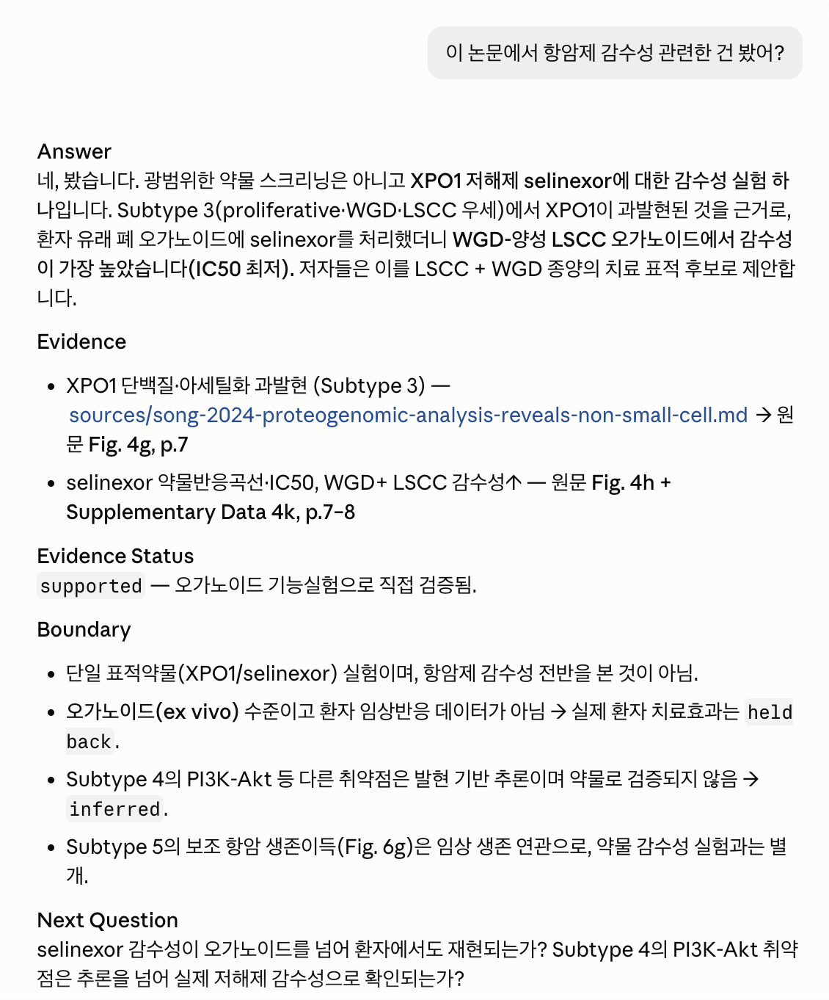
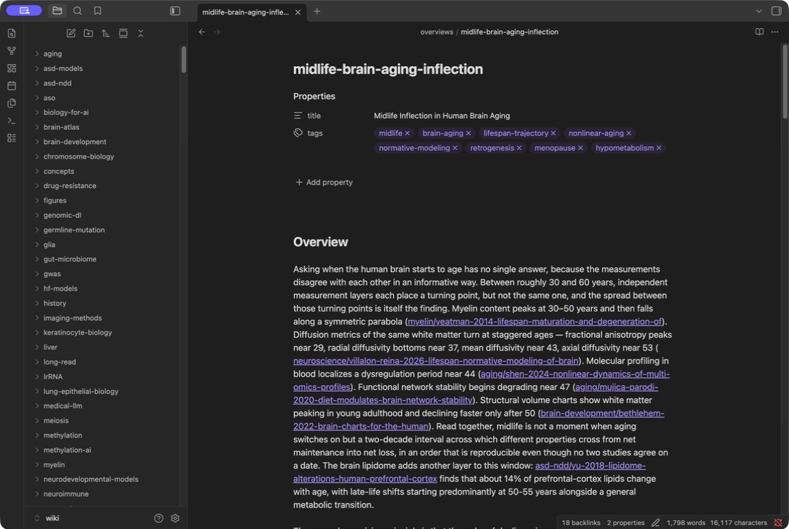

# 9장. 질문이 지식으로 축적되는 법

검색이 하는 일과 하지 않는 일을 나누고, 후보 문서에서 실제 근거로 내려가는 순서를 정하고, 여러 논문을 비교해 얻은 판단을 다시 위키로 되돌리는 지점까지 간다. 4장이 자료를 들여오는 방향이었다면 여기서는 들여온 자료를 꺼내 쓰는 방향으로 같은 순환이 돈다. 대학원 수업에서 단일세포 데이터를 다루는 주에 학생이 이런 질문을 했다고 하자. 요즘 나온 세포 foundation model들이 실제로 쓸 만한가요. 질문은 한 문장이지만 답하려면 최소 다섯 편의 논문을 나란히 놓아야 하고, 각 논문이 무엇을 근거로 자기가 쓸 만하다고 말하는지를 비교해야 한다. 논문 다섯 편이 이미 위키에 들어 있다면 출발점은 나쁘지 않다. 그런데 검색창에 세 단어를 넣으면 스무 개의 결과가 나오고, 그 목록은 무엇을 먼저 읽어야 하는지도, 그중 어느 것이 질문한 관계를 실제로 다루는지도 알려 주지 않는다. 목록에서 답까지 가는 거리를 좁히는 일이 실제 작업이다.

# 질문을 받으면 LLM-Wiki 안에서 일어나는 일

질문 하나가 위키를 통과하는 경로에는 여섯 개의 지점이 있고, 각 지점에서 사람이 판단해야 할 것이 다르다.

```text
사용자 질문
   ↓
완전한 연구 질문으로 정리
   ↓
BM25가 관련 wiki page 후보를 순위화
   ↓
LLM이 후보 page를 읽고 관계를 판정
   ↓
필요하면 source note와 original PDF로 내려감
   ↓
근거가 있는 답변과 인용 가능한 경로 생성
   ↓
재사용 가치가 있으면 wiki 또는 agenda에 저장
```

경로에서 가장 오해받는 자리가 세 번째다. 검색이 하는 일은 만 건이 넘는 문서 중에서 읽어 볼 만한 스무 건을 골라 주는 것이고, 그다음부터는 문서를 실제로 읽어야 한다. 순위표의 1위가 답이라고 생각하면 검색을 잘못 쓰고 있는 것이다. 후보를 좁히는 일과 근거를 만드는 일은 서로 다른 작업이고, 앞의 일은 기계가 잘하고 뒤의 일은 아직 사람의 확인이 필요하다. 질문마다 여섯 지점을 내려가는 깊이도 다르다. 어떤 방법을 쓴 논문이 위키에 있는지 확인하는 질문은 세 번째 지점에서 사실상 끝나고, 그 논문이 무엇을 주장했는지 묻는 질문은 네 번째에서 끝난다. 결과의 크기가 실제로 다른지, 두 논문의 결론이 왜 어긋나는지를 묻는 질문만 다섯 번째까지 내려가고, 마지막 지점까지 가는 것은 그중에서도 다시 쓸 판단이 나온 경우뿐이다. 질문을 받았을 때 어디까지 내려갈 작업인지를 먼저 가늠하면 시간 배분이 달라진다. 사실 확인 하나에 원문 세 편을 여는 일과 비교 질문을 검색 결과 목록으로 끝내는 일은 정반대 방향의 같은 실수다.

출발점에 들어오는 말은 대개 불완전하고, 그대로 검색에 넣으면 엉뚱한 후보가 올라온다. 도착점에서 답이 만들어지면 대화가 끝난 것처럼 보이지만, 저장하지 않으면 그 답을 만드는 데 읽은 다섯 문서를 다음번에도 똑같이 읽어야 한다. 4장의 여섯 단계가 자료를 들이는 쪽에서 위키를 바꿨다면, 질문 쪽에서도 위키가 바뀌어야 축적이 일어난다. 여섯 지점을 지나는 규칙은 습관으로 남겨 두지 않고 저장소의 지침 문서에 문장으로 적어 두었다. 답은 위키와 source note에 있는 논문만을 근거로 만든다. 웹 검색은 사용자가 명시적으로 요청할 때만 쓴다. 정리가 불충분하면 원본 PDF를 다시 읽어 보충한다. 해당 논문이 아예 없으면 없다고 말하고 PDF를 요청한다. 검색 정책 절에는 문장이 하나 더 붙어 있는데, 검색 점수는 후보를 가리는 데까지만 쓰고 질문한 관계가 뒷받침되는지는 페이지를 읽어서 판정한다는 규정이다. 규정으로 적어야 했다는 것은 적어 두지 않으면 그렇게 하지 않게 된다는 뜻이다. 묶어 두지 않으면 답의 절반이 위키에서 오고 절반이 모델의 사전 지식에서 오게 되고, 나중에 그 답을 되짚을 때 어느 쪽이 어디에서 왔는지 구분할 수 없다. 위키 안에서만 답하도록 묶어 두면 답의 품질이 위키의 상태를 그대로 반영하고, 답이 부실하다는 것은 위키에 무엇이 빠졌다는 신호가 된다.

# LLM-Wiki에 질문했을 때 위키 파일을 검색하는 방법

검색이 다루는 대상은 폴더 안의 Markdown 문서 전체다. 논문 페이지와 종합 문서와 원문을 읽은 기록이 모두 여기 들어가고, 문서가 만 건을 넘는 위키에서 질문과 관련된 스무 건을 골라내는 일이 검색이 맡는 몫이다. 고르는 경로는 두 갈래다. 하나는 목차 문서와 카테고리별 색인을 따라 내려가는 경로이고, 다른 하나는 질문에 들어 있는 단어로 문서를 뒤지는 경로다. 앞의 것은 어느 카테고리에 있을지 알 때 빠르고, 뒤의 것은 카테고리를 가로지르는 질문에서 쓸모가 있다. 두 경로가 모두 필요한 이유는 위키가 커지면서 카테고리 하나에도 문서가 수백 건씩 쌓이기 때문이다. 단어로 뒤지는 쪽에는 어휘 검색이라고 부르는 계열의 방법을 쓰고, 이 책이 근거로 삼은 위키는 그중 BM25를 쓴다. 검색기의 이름보다 중요한 것은 그 방법이 무엇을 근거로 순위를 매기는지이고, 그것을 알면 결과가 이상할 때 무엇을 고쳐야 할지가 정해진다.

BM25는 질문에 등장하는 단어가 각 문서에서 얼마나 구별력 있게 나타나는지를 계산해 문서를 순위화하는 방식이다. 어떤 단어가 어디에 몇 번 나오는지를 세는 방식이므로 어휘 검색으로 분류된다. 계산 자체는 세 가지 직관으로 설명되고, 세 직관을 알면 검색 결과가 왜 그렇게 나왔는지 대부분 설명할 수 있다. 수식과 조정 파라미터는 부록 B에서 다룬다. 첫째는 희귀도다. 위키 전체에 흔한 단어는 어느 문서를 고를지 알려 주지 못한다. 단일세포 연구 위키에서 cell이라는 단어는 거의 모든 문서에 들어 있으므로 후보를 하나도 좁히지 못한다. 반대로 chromatin accessibility처럼 소수의 문서에만 등장하는 표현은 그 단어 하나로 후보를 수십 건까지 줄인다. 흔한 단어만으로 이루어진 질문은 검색기를 무력하게 만든다.

둘째는 빈도 포화다. 어떤 문서에 질문의 단어가 스무 번 나와도 두 번 나온 문서보다 열 배 관련 있지는 않다. 처음 몇 번의 등장이 큰 정보를 주고, 그 뒤로는 점수가 완만하게만 올라간다. 점수가 포화하지 않으면 같은 표현을 반복하는 긴 문서가 순위를 독차지하게 된다. 실제 위키에서 그런 문서는 대체로 원문 추출이 그대로 들어간 파일이다. 셋째는 문서 길이 보정이다. 긴 문서는 우연히 어떤 단어를 포함할 확률이 높으므로, 보정하지 않으면 길이만으로 유리해진다. 논문 한 편을 통째로 담은 문서와 개념 하나를 반쪽에 정리한 문서가 같은 단어를 한 번씩 담고 있다면, 짧은 쪽이 그 단어를 더 중심적으로 다루고 있을 가능성이 높다. 길이 보정은 짧고 밀도 높은 문서가 밀려나지 않게 한다. 4장에서 논문 wiki page를 source note와 분리하라고 한 이유 하나가 여기에 있다. 두 층이 한 파일에 섞여 있으면 문서가 길어지고, 그 길이가 검색에서 손해로 돌아온다.

세 직관을 합치면 검색에 잘 걸리는 문서의 조건이 나온다. 나중에 그 문서를 찾을 때 쓸 법한 표현이 제목, 표제, 카테고리 이름, 본문에 실제로 들어 있어야 한다. 사람이 읽기에 아무리 좋은 문서라도 질문에 쓰일 단어가 없으면 후보에 오르지 않는다. BM25 점수는 질문과 문서의 어휘적 관련성이다. 점수가 높다는 것은 그 문서가 질문의 단어들을 잘 담고 있다는 뜻이고, 표본 크기와 설계의 견고함과 결론의 재현 여부는 점수에 들어가지 않는다. 표본 여섯 개짜리 예비 연구가 표본 50만 명짜리 연구보다 상위에 올라오는 일은 흔하고, 리뷰 논문은 어휘가 풍부해서 거의 모든 질문에 상위로 올라온다. 정정 공고나 출판사 상용구가 걸려 올라오는 일도 있다. 순위표를 근거의 서열로 읽는 순간, 검색기가 하지 않은 판단을 검색기가 한 것으로 착각하게 된다.

단어를 세는 방식이 낡아 보일 수 있는데도 자기 위키의 첫 검색기로 쓸 만한 이유가 셋 있다. 결과가 결정적이라는 것이 첫째다. 같은 질문과 같은 문서 집합이면 언제나 같은 순위가 나오므로, 어제와 오늘의 답이 다르면 위키가 바뀐 것이다. 왜 이 문서가 올라왔는지 설명할 수 있다는 것이 둘째다. 질문의 어느 단어가 어느 문서에서 몇 번 나왔기 때문이라고 되짚을 수 있으므로, 이상한 결과가 나왔을 때 원인을 찾을 수 있다. 셋째는 비용이다. 문서에서 인덱스를 다시 만드는 일이 가볍기 때문에 예약된 시각에 통째로 새로 만들어도 부담이 없고, 인덱스를 소중히 다룰 이유가 없어진다. BM25가 못 하는 일도 분명하다. 단어의 의미를 모르므로 동의어를 잇지 못하고, 표현이 다르면 같은 개념을 다룬 문서를 놓친다. 그래서 이 방식만으로 위키를 다 뒤졌다고 말할 수 없고, 근거로 삼은 위키는 목차 문서와 카테고리별 색인 문서가 맡는 결정적 탐색 경로를 따로 두었다.

# 완전한 질문으로 검색하는 이유

검색창에 세 단어를 던지는 습관은 웹 검색에서 왔다. 웹에서는 대상이 넓고 문서가 무한하므로 좁은 검색어가 유리하지만, 자기 위키에서는 반대다. Geneformer, scGPT, benchmark라는 세 단어를 넣으면 세 단어가 함께 등장하는 문서가 올라오는데, 그 문서들이 무엇을 비교했고 어느 방향의 결론을 냈는지는 목록에 나타나지 않는다. 세 단어를 던질 때 사라지는 것은 네 가지다. 무엇을 대상으로 하는지, 무엇과 무엇을 비교하는지, 어느 방향의 관계를 묻는지, 그리고 그 관계가 어떤 조건에서 성립하는지가 검색어에서 지워진다. 같은 궁금증을 완전한 질문으로 바꾸면 이렇게 된다. 같은 단일세포 데이터에서 Geneformer와 scGPT를 비교할 때, 두 논문은 각각 어떤 과제와 어떤 지표로 성능을 주장했고, 두 주장이 같은 축 위에 있는가. 문장이 길어진 만큼 검색 토큰도 늘어나서 후보의 폭이 넓어지는 이익이 있지만, 더 큰 이익은 읽기 기준이 생긴다는 데 있다. 후보 문서를 열었을 때 무엇을 확인해야 하는지가 질문 안에 이미 들어 있으므로, 관련 있어 보이는 문단에서 멈추지 않고 과제와 지표와 축을 찾게 된다. 완전한 질문이 없으면 어떤 문서를 읽어도 관련 있어 보이고, 처음 읽은 문서의 논조가 그대로 답이 된다. 질문을 완전하게 만드는 절차는 네 자리를 채우는 일로 정리된다. 대상을 정하고, 비교 상대를 정하고, 관계의 방향을 정하고, 성립 조건을 정한다. 네 자리 중 채울 수 없는 것이 있다면 그것 자체가 정보다. 비교 상대를 정할 수 없다면 아직 무엇과 견주고 싶은지 모른다는 뜻이고, 그 상태에서 검색하면 무엇이 나와도 만족스럽지 않다. 질문을 다듬는 데 쓰는 2분이 문서 다섯 개를 잘못 읽는 20분을 막는다. 완전한 질문은 논문을 다루는 위키 바깥에서도 같은 일을 한다. 지난 학기 강의 자료가 쌓인 폴더에 발표 준비라고만 검색하면 모든 파일이 걸리고, 어떤 설명 순서를 썼는지 묻고 싶었다는 원래 관심은 목록 어디에도 나타나지 않는다. 같은 폴더에 대해 학부 3학년 수업에서 통계적 검정력을 설명할 때 어떤 예시를 먼저 놓았고 그 순서를 왜 바꿨는지를 묻는다면, 강의안과 수업 후 메모가 함께 후보로 올라오고 무엇을 확인해야 하는지도 정해진다. 대상과 조건과 관계를 문장에 남기는 습관은 자료의 종류와 무관하게 작동한다. 위키의 크기가 작을 때는 차이가 작지만, 문서가 몇백 건을 넘어가면 검색어의 완전성이 곧 검색의 성패가 된다.

한국어로 작업하고 영어로 정리된 위키를 쓰는 경우에는 한 단계가 더 붙는다. 근거로 삼은 위키는 내용의 언어를 영어로 두고 대화는 한국어나 영어로 한다. 한국어 질문을 그대로 넣으면 매칭할 토큰이 거의 없어 검색이 사실상 작동하지 않는다. 그래서 검색 정책의 기본 읽기 경로 자체가 완전한 영어 질문을 검색 도구에 넘기는 것으로 규정되어 있고, 한국어 질문이 들어오면 원문을 그대로 둔 채 완전한 영어 재작성을 별도 인자로 함께 넘기게 되어 있다. 규정에는 문장이 하나 더 붙어 있다. 세 단어로 줄인 것은 재작성으로 인정하지 않는다. 그런 문장이 운영 지침에 들어갔다는 것은, 완전한 문장으로 다시 쓰라고 해 놓아도 명사 세 개가 돌아오는 일이 반복되었다는 뜻이다. 줄여도 결과가 스무 건은 나오기 때문에 잘못되었다는 신호가 즉시 오지 않는다. 원문을 남기는 이유는 번역이 질문을 조용히 바꾸기 때문이다. 성능이라는 한국어 단어를 accuracy로 옮기는 순간 학습 비용과 추론 속도에 대한 관심이 질문에서 빠지는데, 원문이 남아 있으면 답을 받은 뒤에 그 누락을 알아챌 수 있다.

1. 궁금한 것을 평소처럼 한 줄로 적는다
2. 대상, 비교 상대, 관계의 방향, 성립 조건 네 자리를 채워 완전한 질문으로 고쳐 쓴다
3. 한국어로 적었다면 원문을 지우지 않고 완전한 영어 질문을 아래에 함께 만든다
4. 명사 세 개를 나열한 것은 영어 질문으로 치지 않는다



# 검색 후보에서 근거로

BM25 상위 결과를 그대로 답으로 쓰지 않는다는 원칙은 다섯 단계의 절차로 구체화된다. 단계를 건너뛰면 답은 여전히 그럴듯하게 나오지만, 근거를 되짚을 수 없는 답이 된다.

1. 후보로 올라온 논문 page, overview, concept page를 읽는다. 검색 결과에 딸려 나오는 발췌 몇 줄로 대신하지 않고 문서를 연다.
2. 질문한 관계가 실제로 본문에 명시되어 있는지 확인한다. 서로 다른 두 문서에 각각 있는 두 사실을 이어 붙인 것은 명시로 치지 않는다.
3. 수치나 경계 조건이 답을 좌우하면 source note를 읽는다. 정리 문서는 방향은 담지만 크기와 조건을 다 담지 않는다.
4. Source note가 부족하거나 그림과 표가 결론을 만드는 대목이면 원문 PDF를 다시 읽는다.
5. 위키에 근거가 없으면 없다고 답한다. 외부 지식이나 모델의 사전 지식으로 빈틈을 메우지 않는다.

두 번째 단계에서 가장 많은 오류가 걸러진다. 어떤 논문이 A를 보였고 다른 논문이 B를 보였을 때, A가 B의 원인이라는 문장은 어느 논문에도 없을 수 있다. 두 사실 사이의 연결을 만든 것이 논문인지 지금 답을 만드는 쪽인지 구분하지 않으면, 아무도 주장한 적 없는 문장이 근거 있는 문장처럼 답에 들어간다. 그래서 검색 정책은 관계가 명시되어 있지 않으면 판단을 보류하라고 규정한다. 답을 쓸 때 문장마다 어느 문서의 어느 대목에서 왔는지 붙일 수 있는지를 확인하면 이 오류는 대부분 드러난다. 붙일 수 없는 문장은 추정이므로 추정이라고 표시한다. 검색으로 올라온 후보 목록과 답에 실제로 근거로 쓴 문서 목록도 따로 적는다. 두 목록은 거의 언제나 다르고, 상위 열 건 중 셋만 관련이 있고 그중 하나는 아래층까지 내려가야 했다면 그 기록이 다음번에 같은 주제를 다룰 때 어디서부터 읽어야 하는지를 알려 준다. 두 목록이 완전히 같다면 후보를 읽지 않고 순위를 그대로 옮긴 것이므로, 기록을 남기는 일 자체가 절차를 지켰는지 검사하는 장치가 된다. 스크립트로는 검사할 수 없는 종류의 규칙이어서 그렇다. 위키의 링크 규약에서도 같은 일을 겪었는데, 검사 스크립트가 두 형태를 모두 통과시키는 바람에 잘못된 형태가 다시 들어와도 아무 경고가 뜨지 않았다.

1. 완전한 질문으로 검색해 후보 목록을 받고 상위 열 건의 제목을 그대로 옮겨 적는다
2. 후보를 실제로 읽고 답에 근거로 쓴 문서만 따로 표시한다
3. 어느 문서에서 source note까지 내려갔고 어느 문서에서 원문까지 내려갔는지 적는다
4. 답을 쓰고 문장마다 어느 문서에서 왔는지 붙일 수 있는지 확인한다
5. 붙일 수 없는 문장은 추정이라고 표시하거나 지운다

세 번째와 네 번째 단계는 언제 내려갈지가 관건이다. 매번 PDF까지 내려가면 위키를 만든 의미가 없고, 한 번도 내려가지 않으면 정리 과정에서 생긴 오류를 영영 발견하지 못한다. 기준은 답의 성격에 있다. 어떤 방법이 존재하는지, 어떤 계보에 속하는지 같은 질문은 wiki page 층에서 끝난다. 두 결과의 크기가 실제로 다른지, 어떤 조건에서만 성립하는지, 그림이 보여 주는 것이 본문의 주장과 같은지를 묻는 질문은 아래층으로 내려가야 한다. 다섯 번째 단계가 가장 지키기 어렵다. 언어 모델은 빈자리를 채우는 데 능하고, 없다고 말하는 것보다 그럴듯한 문단을 만드는 쪽이 훨씬 쉽다. 없다는 답이 모이면 그 목록이 다음에 무엇을 위키에 들여야 하는지를 알려 주는 가장 정확한 자료가 된다. 위키가 무엇을 답하지 못하는지 아는 사람만이 위키를 계획적으로 키울 수 있고, 빈틈이 매번 그럴듯한 문단으로 메워지면 그 목록은 영원히 만들어지지 않는다.

상위 열 건에 없으면 위키에 없다고 결론짓는 것도 같은 종류의 성급함이다. 2026년 7월 25일에 PDF 4,236건을 검수해 달라는 요청을 받고, 휴리스틱으로 고른 30건만 눈으로 본 뒤 결과를 보고한 일이 있었다. 같은 날 11,029건을 확인했다고 말했는데 실제로 확인한 것은 제외 저널 지문 한 가지뿐이었다. 표본으로 전수를 대신했고, 보고서에는 표본이었다는 사실이 남지 않았다. 지금 지침에 있는 규칙은 그 뒤에 생겼다. 전수 요청은 전수로 끝내고, 시작할 때 대상 수를 확정하고, 끝낼 때 분모와 분자를 숫자로 밝힌다. 추출 실패와 시간 초과로 판정하지 못한 파일은 이상 없음으로 묶지 않고 미검사로 따로 센다. 검색 결과 상위 몇 건만 읽고 답을 만드는 것은 같은 실패의 축소판이다. 순위를 어디에서 자를지는 사람이 정하는 것이므로, 어떤 방법을 쓴 논문을 모두 찾아야 하는 질문에서는 카테고리 색인으로 다시 훑는다.

없다고 답하게 만드는 규칙은 하나뿐이고 짧다. 위키에 그 주제의 논문이 아예 없으면 없다고 말하고 PDF를 요청한다. 이 한 줄만으로는 지켜지지 않았고, 실제로 습관을 바꾼 것은 그 옆에 붙은 금지였다. 답을 만들 때 웹 검색을 쓰지 않는다는 규칙을 지침에 박아 두었고, 스킬이 요구하더라도 쓰지 않으며 사용자가 명시적으로 요청할 때만 연다. 검색이 열려 있으면 위키의 빈틈이 빈틈으로 남지 않는다. 밖에서 가져온 문장이 위키에서 나온 문장과 같은 형식으로 섞여 들어오고, 몇 달 뒤에는 어느 문장이 이 위키가 실제로 담고 있는 것인지 구분할 수 없다. 위키 내용이 모자랄 때 허용한 보충 경로는 그 논문의 원문 PDF를 다시 읽는 것 하나이고, 개관 페이지를 쓸 때도 출처는 위키 안의 논문으로 제한한다. 없다는 답이 늘어나는 것을 문제로 보지 않는 것도 함께 정해야 했다. 그 목록이 다음에 무엇을 들여야 하는지를 알려 주는 자료이므로, 없다는 답이 줄었다는 사실 자체는 위키가 좋아졌다는 근거가 되지 못한다.

# 여러 논문을 연결하는 Deep Synthesis

여러 논문에 걸친 질문에 답할 때 가장 흔한 실패는 논문별 요약을 순서대로 이어 붙이는 것이다. 다섯 편의 요약을 나란히 놓으면 분량은 다섯 배가 되지만 질문에 대한 답은 하나도 만들어지지 않는다. 요약은 논문 안에서 끝나고, 질문이 묻는 것은 논문 사이에 있다. Deep Synthesis는 각 논문의 설계와 결과와 경계를 꺼내어 서로 겹쳐 놓는 작업이고, 겹쳐 놓을 축을 정하는 것이 작업의 절반이다. 축은 일곱 개로 정리된다. 연구 대상과 조건이 같은지, 같은 개념을 서로 다른 측정으로 정의했는지, 결과의 방향과 크기가 일치하는지, 주장의 수준이 관찰인지 예측인지 섭동 실험인지 임상 연관인지, 서로 다른 결과가 실제 모순인지 아니면 집단과 시점과 측정 방식의 차이인지, 새 논문이 기존 주장을 강화하는지 좁히는지 반박하는지 대체하는지, 그리고 아직 답하지 못한 경계 조건과 다음 질문이 무엇인지다. 일곱 축을 모두 채울 필요는 없다. 질문에 따라 셋이나 넷만 살아 있고 나머지는 해당 사항 없음으로 남는 것이 정상이다.

1. 일곱 개 축 가운데 이번 질문에서 살아 있는 축만 골라 표로 채운다
2. 답이 나오지 않은 축은 빈칸으로 두지 말고 확인 불가라고 적는다

단일세포 foundation model 세 편은 같은 목표를 두고 있지만 신뢰를 만드는 방식이 서로 다르다. 전이 학습으로 네트워크 생물학의 예측이 가능하다는 결과(Theodoris 외, 2023)는 모델이 지목한 것을 실험적으로 이미 알려진 사실과 대조해 신뢰를 얻는다. 판정 기준이 모델 바깥에 있고, 그 기준이 되는 지식이 얼마나 갖춰진 영역인지에 결과가 달려 있다. 이듬해 나온 단일세포 다중오믹스 foundation model(Cui 외, 2024)은 다르게 움직인다. 여러 과제에서 기존 방법들과 나란히 놓고 이겼는지를 보이는 방식이므로, 판정 기준이 비교 대상으로 고른 방법의 집합에 달려 있다. 비교군을 다르게 고르면 결론도 달라질 수 있다는 뜻이다. 세 번째 논문은 또 다른 방식을 쓴다. 대규모 학습 모델을 제안한 연구(Hao 외, 2024)는 자기 모델을 단독으로 평가하기보다 기존 분석 파이프라인 안에 부품처럼 끼워 넣고 그 파이프라인의 성능이 올라가는지를 보인다. 판정 기준이 그 파이프라인의 원래 성능이므로, 어떤 파이프라인에 끼웠느냐가 결과의 크기를 좌우한다. 세 논문을 이렇게 놓고 나면 처음 질문이 왜 답하기 어려웠는지가 보인다. 어느 모델이 더 좋은가라는 질문은 세 논문의 성능 수치가 같은 축 위에 있다고 전제하는데, 축이 서로 다르다. 축이 다르다는 것을 발견하는 일이 종합이고, 그 발견은 요약을 아무리 많이 이어 붙여도 나오지 않는다.

주장의 수준을 묻는 축은 비교표를 만들기 전에 반드시 채워야 한다. 어떤 결과가 관찰인지, 예측인지, 섭동 실험으로 확인한 것인지, 임상 결과와 연관 지은 것인지에 따라 같은 문장이 뜻하는 바가 달라지기 때문이다. 세포 상태를 잘 구분한다는 결과와 어떤 유전자를 건드리면 세포 상태가 바뀐다는 결과는 문장 길이가 비슷해도 요구하는 근거의 양이 다르다. 앞의 결과는 모형이 자료의 구조를 잡았다는 뜻이고, 뒤의 결과는 인과를 요구한다. 비교표의 각 칸에 수준을 함께 적어 두면 나중에 그 표를 인용하는 사람이 과장하지 않게 된다. 대상 축은 더 단순한 방식으로 비교를 막기도 한다. 같은 주제로 함께 읽은 나머지 두 편은 DNA 서열을 입력으로 쓴다(Boshar 외, 2025; Avsec 외, 2026). 다섯 편을 한 표에 넣고 성능을 나란히 적고 싶어지지만, 입력이 다르고 예측 대상이 다르므로 같은 열에 놓을 수 없다. 비교할 수 없다는 판정도 종합의 결과이고, 종합 문서에 그렇게 적어 두면 다음번에 같은 표를 만들려는 시도를 막는다. 비교 불가라고 적힌 한 문장이 잘못 만든 표 하나보다 오래 쓰인다. 세 모델의 학습 자료가 서로 얼마나 겹치는지처럼 논문 wiki page만으로 답할 수 없고 source note로도 부족한 축은, 지우지 않고 열린 질문으로 남기는 것이 다음 작업을 만든다.

논문마다 종합에 들이는 힘을 같게 두지는 않는다. 영향이 큰 논문에는 더 무거운 처리를 규정해 두었다. 관련 overview의 본문을 실제로 갱신하고, 여러 논문에 반복해 나타나는 개념에는 concept 페이지를 만들고, 관련 페이지 사이에 양방향 링크를 걸고, 그 논문이 기존 주장을 어떻게 바꾸는지를 문장으로 밝힌다. 분야의 논지 자체를 움직이는 논문에는 더 느린 방식을 쓴다. 여러 편을 묶어 처리하지 않고 한 편씩 처리하며, 새 논문을 읽기 전에 기존 종합 페이지를 먼저 읽고, 읽은 뒤에 주장이 어느 방향으로 움직였는지를 적는다. 두 방식을 가르는 기준은 그 논문이 위키의 다른 문장을 몇 개나 고치게 만드는가다. 종합의 결과물은 세 형태로 나온다. 이미 있는 overview의 본문을 고치는 것이 첫째이고, 여러 질문에서 반복해 나타나는 개념이나 기전을 concept page로 만드는 것이 둘째이며, 아직 근거가 얇은 열린 문제를 question page로 남기는 것이 셋째다.

같은 축으로 여러 편을 재고 나서야 보이는 것이 있다. 위키에 남아 있는 다섯 편의 구조 분석을 나란히 놓으면 foundation model 논문들이 신뢰를 얻는 방식이 서로 다르다는 것이 드러난다. Geneformer는 예측을 외부의 독립적인 대규모 연구 결과와 맞춰 보이는 방식으로 신뢰를 얻는다. 반면 scGPT와 NTv3와 AlphaGenome은 같은 일을 하는 기존 모델들과 정면으로 겨루어 이겼다는 것으로 신뢰를 얻는다. 네 번째로 분석한 scFoundation은 둘 중 어느 쪽도 쓰지 않고, 자기 표현을 기존 파이프라인에 끼워 넣어 그 파이프라인 자체보다 나아졌음을 보인다. 이 세 번째 방식은 앞의 세 편을 읽을 때 축 목록에 없던 것이고 네 편째에 이르러 처음 이름이 붙었다. 축을 고정해 두었기 때문에 새 방식이 나타났을 때 그것이 새 방식이라는 것을 알아볼 수 있었다. 이 차이를 어느 수위로 말할 수 있는지는 분명히 해 둘 필요가 있다. 다섯 편으로 보인 것은 이 다섯 편이 각각 무엇에 기대어 설득하는가이고, foundation model 일반이 어느 방식으로 수렴하고 있다는 주장은 다섯 편으로 세워지지 않는다.




이 문서는 질문 하나를 제목으로 달고 그 아래에 현재 판단과 연구 사이의 차이와 남은 불확실성을 나눠 적는다. 여러 논문의 결론이 겹치는 부분과 갈리는 부분을 함께 적어 두는 것이 핵심인데, 겹치는 부분만 적으면 그 질문이 이미 답해진 것처럼 보이기 때문이다. 남은 불확실성 칸을 보면 다음에 읽을 논문을 정할 수 있다.

# 답을 위키로 되돌리기

위키의 설계 원칙에는 질의에 대한 답을 overviews 페이지로 저장하는 것이 지식이 복리로 붙는 방식이라고 적혀 있다. 그 문장이 원칙 문서에 들어가 있다는 자리가 중요하다. 저장은 질문 처리의 마지막 단계로 규정되어 있고, 여유가 있을 때 하는 정리 작업으로 두면 대개 하지 않게 된다. 그렇다고 모든 답을 저장하지는 않는다. 저장을 남발하면 검색 후보만 늘고 어느 문서가 현재의 판단인지 알 수 없게 되므로, 되돌릴 것을 고르는 기준이 필요하다. 네 가지 중 하나를 만족할 때 저장한다. 여러 문서를 비교해 다시 사용할 수 있는 판단을 만들었을 때, 기존 overview나 concept를 실제로 고칠 만한 새로운 관계가 생겼을 때, 독립된 연구 질문과 잠정적인 답이 만들어졌을 때, 그리고 프로젝트가 실행할 분석이나 의사결정이나 인수인계가 생겼을 때다. 조건에 걸리지 않는 답, 예컨대 문서 하나를 읽고 옮긴 사실 확인이나 이미 있는 문서를 다른 말로 쓴 것은 저장하지 않는다. 무엇을 저장하든 세 가지를 함께 붙인다. 어느 page와 어느 source note와 어느 원문에서 왔는지의 경로, 이 판단이 기존 지식을 강화하는지 좁히는지 반박하는지 대체하는지의 판정, 그리고 이 판단이 뒤집힐 조건이다. 세 번째가 가장 자주 빠지고 가장 오래 쓰인다. 표본이 더 큰 연구가 나오면, 다른 조직에서 재현되지 않으면, 측정 방식이 바뀌면 이 판단은 다시 봐야 한다고 적어 두면, 반년 뒤에 새 논문을 넣는 사람이 무엇을 확인해야 하는지 알게 된다. 저장 위치는 문서의 성격으로 정한다.

| 결과 | 저장 위치 |
|---|---|
| 분야의 현재 지식 종합 | `wiki/overviews/` |
| 안정된 개념, 방법, 기전 | `wiki/concepts/` |
| 근거가 아직 얇은 열린 질문 | `wiki/questions/` |
| 프로젝트 실행안, 원고 전략, 비공개 작업 | `agenda/{context}/` |

마지막 줄의 구분이 실무에서 자주 흐려진다. 아직 공개되지 않은 데이터에 대한 판단, 특정 원고의 전략, 심사와 관련된 내용은 작업 폴더에 둔다. 위키는 나중에 공유하거나 인용할 수 있는 층이고, 작업 폴더는 맥락 안에서만 유효한 층이기 때문이다. 두 층을 섞으면 위키를 공유할 때마다 무엇을 빼야 하는지 골라내야 하고, 그 작업은 매번 실수를 부른다. 위키 안에서 세 곳 중 어디로 갈지는 그 판단이 얼마나 안정적인지로 갈린다. Overview는 어떤 주제에 대해 지금까지 알려진 것을 모아 둔 문서이므로, 새 논문이 들어올 때마다 본문이 조금씩 고쳐지는 것이 정상이다. Concept은 여러 질문에서 반복해 나타나는 개념이나 방법이나 기전을 다루므로 자주 바뀌지 않고, 바뀔 때는 정의나 적용 범위가 달라진 것이어서 파급이 크다. Question은 아직 답이 없다는 사실 자체를 기록하는 문서이므로, 근거가 쌓이면 overview로 흡수되거나 concept으로 승격되고 그때 사라진다. 근거로 삼은 위키에서 세 층의 크기는 overview 590건, concept 408건, question 550건으로 비슷하다. 답하지 못한 것을 기록하는 문서가 종합 문서와 거의 같은 수라는 것은, 위키가 아는 것만큼 모르는 것도 적고 있다는 뜻이다.

1. 재사용할 수 있는 비교가 나왔으면 overview, concept, question 중 한 곳에 저장한다
2. 근거 경로와 판정과 뒤집힐 조건을 함께 적는다

저장의 형태에서는 새 문서를 만드는 것보다 기존 문서의 본문을 고치는 쪽이 먼저다. 새 문서를 만들면 손쉽게 결과물이 생긴 것처럼 보이지만, 아무것과도 연결되지 않은 문서가 하나 늘어난 것일 수 있다. 근거로 삼은 위키에는 카테고리별로 종합 문서와의 연결 비율과 고립된 페이지 수를 집계하는 감사 스크립트가 있는데, 저장을 새 문서 만들기로만 처리하면 그 수치가 그대로 나빠진다. 기존 overview의 한 문단을 고치고 새로 읽은 논문 page와 양방향으로 잇는 편이 문서 하나를 새로 만드는 것보다 대개 이익이 크다. 고칠 곳을 찾는 일이 새로 쓰는 일보다 오래 걸린다는 점이 이 순서를 지키기 어렵게 만든다. 어느 overview가 이 판단을 담아야 하는지 알려면 그 overview를 먼저 읽어야 하고, 읽고 나면 고칠 자리가 한 곳이 아닌 경우도 있다. 새 문서를 만드는 데는 그 읽기가 필요 없다. 절차가 규정으로 적혀 있는 이유가 여기에 있다.

# Index를 최신으로 유지하는 법

검색 인덱스는 정본에서 만들어 낸 파생 상태다. 정본은 언제나 Markdown 문서이고, 인덱스는 문서에서 다시 만들 수 있다. 둘을 나누는 것이 중요한 이유는 인덱스를 다루는 방식이 정본과 완전히 달라야 하기 때문이다. 인덱스는 백업하지 않고, 손실되면 다시 만들며, 여러 대의 컴퓨터가 각자 만들어 쓴다. 근거로 삼은 환경에서 각 Mac은 검색 런타임, 색인 버전, 빌드 잠금 파일, 마지막 성공 기록을 모두 자기 홈 폴더 아래에 따로 둔다. 살아 있는 색인과 잠금 파일을 동기화 폴더에 두는 것은 금지되어 있고, 3장에서 본 사고와 같은 이유다. 버전 관리 도구의 내부 상태 파일이 동기화 충돌 사본으로 꼬여 정상 파일 980건이 삭제로 표시되었던 그 사고에서, 문제를 만든 것은 자주 통째로 바뀌는 이진 파일이 두 기계에서 동시에 쓰인다는 조건이었다. 색인과 잠금 파일은 그 조건을 그대로 만족한다. 동기화 폴더에는 사람이 읽는 문서만 두고, 그 문서에서 만들어진 것은 기계마다 자기 자리에 둔다.

작은 위키에서는 인덱스가 필요 없다. 문서가 수십 건일 때는 목차 문서 하나로 어디에 무엇이 있는지 다 보인다. 근거로 삼은 위키처럼 wiki page가 17,591건이고 카테고리가 50개가 되면 사정이 달라진다. 목차 문서에 모든 문서를 나열하면 목차 자체를 읽을 수 없고, 카테고리 이름만 나열하면 카테고리 안에서 다시 헤매게 된다. 그래서 탐색 경로를 둘로 나눈다. 목차 문서와 카테고리별 색인 문서가 구조를 따라 내려가는 결정적 경로를 맡고, 어휘 색인이 질문의 단어와 맞는 후보를 끌어올리는 역할을 맡는다. 의미 검색기를 붙여 본 뒤에도 기본 경로로 삼지 않고 선택적 대체 경로로만 남겨 둔 데에는 이유가 있다. 어휘 색인은 동기화된 Markdown 문서에서 직접 만들어지므로 중간에 어떤 서비스도 끼지 않고, 결과가 결정적이어서 어제와 오늘의 차이를 문서의 변화로 설명할 수 있다. 의미 검색기를 기본 경로에 놓으면 그 도구가 멈추거나 모델이 바뀔 때 위키 전체가 검색되지 않는 상태가 되는데, 기본 경로를 상위 의존 없이 홀로 서게 두면 그런 일이 생기지 않는다. 두 경로는 서로를 검사한다. 검색으로 나온 후보가 카테고리 색인에서 보이지 않으면 분류가 빠진 것이고, 카테고리 색인에 있는데 검색에 안 걸리면 문서의 표현이 질문의 언어와 어긋난 것이다.

인덱스를 유지하는 데 필요한 것은 네 종류의 도구다. 문서 전체에서 인덱스를 만드는 것, 만들어진 인덱스에서 검색하는 것, 정해진 시각에 자동으로 다시 만드는 것, 그리고 카테고리별 색인 문서를 다시 생성하는 것이다. 근거로 삼은 위키에는 네 가지가 모두 스크립트로 있고, 이름과 실행 방법은 자주 바뀌므로 부록 B에 둔다. 도구를 무엇으로 쓰느냐보다 언제 돌리느냐가 실제 운영을 가른다. 정기 갱신은 매일 새벽 2시에 예약 작업으로 돈다. 사람이 일하지 않는 시간이고, 기계마다 색인과 잠금을 자기 홈 아래에 두었기 때문에 두 대에 같은 예약을 걸어도 서로 간섭하지 않는다. 논문을 들인 직후에 색인을 자동으로 다시 만드는 장치는 두지 않았다. 논문 한 편을 넣을 때마다 전체 인덱스를 다시 만드는 것은 낭비이고, 자동 재구축을 들이기 절차에 붙이면 논문을 넣는 일이 색인 상태에 의존하게 된다. 방금 넣은 문서를 바로 검색해야 할 때, 대량으로 논문을 들인 직후, 카테고리를 재구성한 직후에만 사람이 직접 돌린다.

1. 새 문서를 저장한 뒤 인덱스를 직접 다시 만든다
2. 처음 던졌던 완전한 질문으로 다시 검색한다

재검색에서 새로 만든 문서가 상위에 올라오고 그 문서 하나로 처음에 읽은 다섯 문서를 대신할 수 있으면, 다음 세션의 에이전트는 같은 질문에 절반의 시간으로 답한다. 다시 만들 때는 현재 문서를 직접 읽어 새 버전을 통째로 만들고, 문서 수와 내용이 온전한지 확인한 다음에 검색이 바라보는 자리를 그 버전으로 한 번에 바꾼다. 이전 버전은 지우지 않고 남겨 두어, 새 버전에 문제가 있으면 되돌릴 수 있게 한다. 만들면서 기존 인덱스를 조금씩 고치면 도중에 끊겼을 때 일부 문서가 빠진 채로 검색이 계속 동작하는데, 조용히 일부를 놓치는 검색이 아예 실패하는 검색보다 훨씬 위험하다. 검색 결과가 이상할 때 처음 의심할 것도 인덱스다. 어제 넣은 논문이 검색에 나오지 않으면 대개 인덱스가 낡은 것이다. 위키에 그 논문이 없다고 결론을 내리기 전에 인덱스의 생성 시각을 먼저 본다. 순서를 반대로 하면 있는 논문을 다시 들이거나, 있는 근거를 없다고 답하게 된다. 파생 상태를 정본과 혼동하면 정본을 고쳐야 할 문제와 다시 만들면 되는 문제가 구분되지 않는다.
