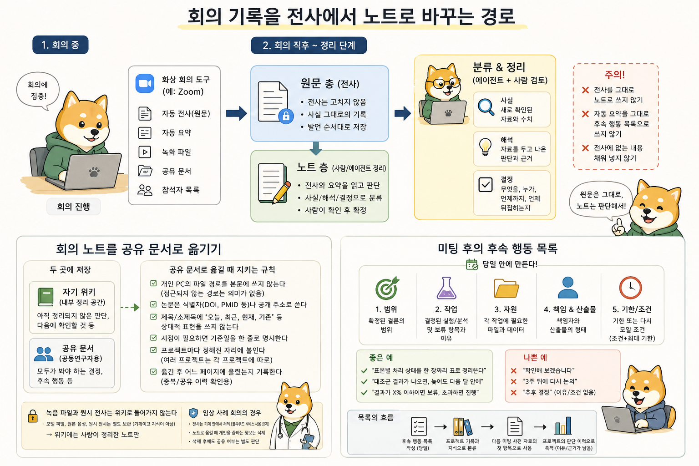

# 18장. 공동 연구 미팅을 준비하는 법

미팅에서는 서로 다른 배경과 정보를 가진 사람들이 같은 질문과 같은 근거를 놓고 판단해 다음 행동을 정한다. 결정을 남기는 힘은 미팅 전에 공유된 문서에서 나온다. 사전 자료 한 장은 30분의 배경 설명을 10분의 결정으로 바꾸고 그 한 장을 만드는 책임은 자료를 들고 들어가는 사람에게 있다. 어떤 대학원생이 석 달치 분석 결과를 들고 미팅에 들어간다. 슬라이드는 스무 장이 넘고 각 장에는 실제로 수행한 작업이 시간순으로 들어 있다. 데이터를 어떻게 받았고 어떤 필터를 걸었고 중간에 파이프라인을 한 번 바꿨고 그래서 다시 돌렸다는 이야기가 앞의 열 장을 채운다. 한 시간짜리 미팅에서 절반이 그 열 장에 쓰이고 정작 판단이 필요한 뒤쪽 결과는 넘기듯 지나간다. 미팅은 "다음에 한 번 더 보자"로 끝나고 참석자들은 서로 다른 것을 기억한 채 방을 나선다. 학생은 성실했고 결과도 있었다. 없었던 것은 무엇을 결정해 달라는 문장 하나와, 그 결정에 필요한 근거만 골라 놓은 종이 한 장이었다.

# 미팅의 기능

말로만 하는 설명은 듣는 사람에게 두 가지 일을 동시에 시킨다. 하나는 내용을 이해하는 일이고 다른 하나는 발표자의 머릿속 구조를 추측하는 일이다. 뒤의 일이 앞의 일보다 훨씬 힘들다. 어떤 결과가 어떤 질문에 대한 답인지, 지금 보고 있는 그림이 앞의 그림을 보강하는 것인지 반박하는 것인지, 이 수치가 확정된 것인지 아직 검토 중인 것인지를 청자는 발표를 따라가면서 스스로 조립해야 한다. 조립에 쓰이는 인지 자원은 판단에 쓸 수 있었던 자원이고 그래서 설명이 길수록 결정은 얕아진다. 참석자들이 같은 배경 지식을 갖고 있지 않다는 점이 문제를 키운다. 실험을 하는 사람, 계산을 하는 사람, 임상 자료를 보는 사람이 한자리에 있으면 각자가 당연하다고 여기는 것이 다르다. 한쪽에는 설명할 필요가 없는 전처리 단계가 다른 쪽에는 결과를 좌우하는 미지의 상자다. 발표자가 자기 기준으로 "이건 다들 아실 테니 넘어가겠습니다"라고 말하는 순간, 모르는 사람은 질문할 기회를 잃고 남은 시간 내내 반쯤 이해한 채로 앉아 있게 된다. 배경이 다른 사람들을 같은 출발점에 세우는 일은 미팅장에서 즉흥으로 되지 않는다. 수행한 일을 전부 보여주는 방식과 결정에 필요한 근거만 배열하는 방식은 결과물의 모양이 다르다. 앞의 방식은 시간순으로 흐르고 마지막에 결론이 나오며 중간에 끊기면 아무것도 남지 않는다. 뒤의 방식은 결론의 범위를 먼저 놓고 그것을 지지하는 근거를 붙이며 중간에 끊겨도 앞부분만으로 판단이 가능하다. 실제 미팅은 거의 언제나 중간에 끊긴다. 예정보다 늦게 시작하고 앞의 논의가 길어지고 참석자 한 명이 먼저 나가야 한다.

| 축 | 진행 보고형 | 결정 요청형 |
|---|---|---|
| 배열 순서 | 작업 시간순 | 결론과 그 근거 순 |
| 앞부분에 오는 것 | 데이터 수집과 처리 과정 | 결정 항목과 현재 판단 |
| 중간에 끊겼을 때 | 결론에 도달하지 못함 | 이미 판단 가능 |
| 청자가 하는 일 | 구조를 추측하며 따라가기 | 제시된 선택지 검토 |
| 남는 것 | 진행 상황에 대한 인상 | 결정과 다음 작업 |

세 종류의 미팅에 같은 원칙이 적용되지만 강조점은 다르다. 내부 연구실 미팅에서는 배경이 이미 공유되어 있으므로 사전 자료가 짧아도 되지만 대신 무엇을 결정받으려는지가 더 분명해야 한다. 지도교수가 이미 아는 내용을 다시 설명하면 남는 시간이 사라진다. 공동연구 미팅에서는 배경 공유가 절반의 일이고 상대 분야의 용어와 이쪽 분야의 용어가 같은 대상을 다르게 부르는 지점을 미리 맞춰야 한다. 외부 발표에서는 결정 요청이 없는 대신 결론의 범위를 어디까지 말할 수 있는지가 더 엄격해지고 확정되지 않은 것을 확정된 것처럼 말하지 않는 규율이 그때 평판을 만든다.

# 미팅 전에 정하는 결정 항목

미팅 일정을 잡기 전에 여섯 문장을 쓴다. 이번 미팅이 끝날 때 결정되어 있어야 하는 것은 무엇인가. 상대가 그 결정을 하려면 어떤 배경과 자료가 필요한가. 지금 확정된 사실은 무엇인가. 아직 확인되지 않았거나 서로 다르게 이해하고 있는 것은 무엇인가. 상대의 전문성이 꼭 필요한 질문은 무엇인가. 결정이 나면 바로 시작할 다음 작업은 무엇인가. 각각 한 문장이면 충분하고 한 문장으로 쓸 수 없다면 아직 미팅을 잡을 준비가 되지 않은 것이다. 17장에서 계획서와 함께 만든 결정표가 있으면 첫 번째 문장과 다섯 번째 문장이 그 표에서 그대로 나온다. 여섯 문장 중 첫 번째가 비면 미팅을 잡지 않는 편이 낫다. 결정할 것이 없는데 모이면 그 자리는 진행 상황을 확인하는 자리가 되고 진행 상황은 문서 한 통으로 더 정확하게 전달된다. 결정할 것이 없다는 판단이 부담스러워 억지로 항목을 만들면 미팅은 열리지만 결정은 나지 않고 다음번에 같은 일이 반복된다. 반대로 결정 항목이 다섯 개, 여섯 개로 늘어나면 어느 것도 충분히 검토되지 않는다. 한 번의 미팅에서 실제로 결정될 수 있는 것은 하나에서 셋 사이이고 그 이상은 목록일 뿐이다. 실제로 예정된 미팅 하나를 골라 준비부터 정리까지 한 번 수행해 보면 여섯 문장이 어디까지 좁혀지는지 알 수 있고 아직 미팅이 없다면 다음 연구실 미팅을 대상으로 삼는다.

1. 미팅 전 여섯 문장을 쓴다
2. 결정 항목이 하나에서 셋 사이가 되도록 좁힌다

네 번째 문장이 가장 쓰기 어렵고 가장 값이 나간다. 아직 확인하지 못한 것을 문서에 적는 일은 준비가 부족해 보일 위험을 감수하는 일이기 때문이다. 그런데 미확정 항목을 감추면 상대는 그것을 확정된 것으로 간주하고 판단하며 나중에 어긋났을 때 되돌리는 비용이 훨씬 커진다. 미확정을 미확정이라고 적은 문서는 읽는 사람에게 어디까지 믿어도 되는지를 알려 준다. 확정된 사실, 현재의 해석, 아직 확인할 항목을 같은 문장 안에 섞지 않는 규율이 사전 정리의 절반을 차지한다. 여섯 문장이 정리되면 결정 안건 목록으로 옮긴다. 안건 목록에는 결정할 항목만 모으고 항목마다 세 가지를 적는다. 결정의 형태가 무엇인지, 그 결정을 하려면 어떤 근거를 봐야 하는지, 이번에 결정하지 않으면 무엇이 멈추는지다. 세 번째를 적어 보면 안건의 우선순위가 저절로 갈린다. 지금 결정하지 않아도 아무것도 멈추지 않는 항목은 공유 사항이므로 문서로 알려 주면 된다. 안건 목록을 미팅 시작 전에 참석자가 보고 있으면 논의가 흩어졌을 때 되돌아올 자리가 생긴다. 여섯 문장을 쓰는 일은 학생의 몫이다. 지도교수와 공동연구자는 전문적 판단을 제공하고 자원의 한계를 정하지만 무엇을 결정해야 하는지 정리하는 일까지 대신하지는 않는다. 정리되지 않은 자료를 들고 가서 "어떻게 하면 좋을까요"라고 물으면 상대는 정리부터 시작해야 하고 그 정리는 상대가 이쪽 데이터를 잘 모르는 상태에서 이루어지므로 부정확하다. 스스로 확인할 수 있는 범위를 먼저 확인하고 확인해도 답이 나오지 않는 지점을 정확히 지목해 묻는 사람이 좋은 공동연구자다. 질문을 넘기는 것과 질문을 좁혀서 건네는 것은 상대가 쓰는 시간의 양이 다르다.

# LLM-Wiki로 pre-read를 만드는 법

사전 자료를 만드는 시간의 대부분은 이미 위키에 있는 것 중에서 무엇을 고를지 정하는 데 든다. 고르는 기준은 하나다. 이번 미팅에서 요청할 결정과 직접 연결되는가. 이 기준으로 걸러 보면 지난 석 달 동안 만든 문서의 대부분이 사전 자료에 들어가지 않는다. 잘 만든 논문 정리, 공들여 그린 중간 그림, 여러 번 고친 방법 설명이 모두 훌륭하지만 이번 결정과 무관하다면 자리를 차지할 뿐이다. 사전 자료의 품질은 무엇을 뺐는가로 정해진다. 새로 시작하는 공동연구라면 상대에게 미리 논문을 요청하는 일이 첫 단계다. 상대 분야에서 무엇이 진입점인지는 그 분야 사람이 가장 잘 알고 두세 편만 받아도 용어와 쟁점의 지도가 잡힌다. 받은 논문은 미팅 전에 4장의 절차대로 위키에 들인다. 첫 미팅에서 상대가 자기 분야를 처음부터 설명하는 데 시간을 쓰지 않아도 되면, 그 시간이 그대로 질문과 역할 분담에 쓰인다. 논문을 미리 읽었다는 사실보다 읽고 나서 남은 질문을 가져갔다는 사실이 첫 미팅의 밀도를 바꾼다.

위키에서 근거를 모을 때는 검색어를 완전한 질문으로 던진다. 9장에서 다룬 방식이고 미팅 준비에도 그대로 쓰인다. 관련된 overview와 concept 문서, 방법을 정리한 문서, 개별 논문의 source note를 훑어 이번 결정과 맞닿은 대목을 표시한다. 에이전트는 후보를 모으고 중복을 걸러 내고 형식을 맞추는 일을 빠르게 해내지만 다섯 개의 후보 중 어느 둘이 이번 결정에 실제로 걸리는지는 판단해야 한다. 그 판단이 사전 자료를 만드는 사람의 몫이고 위임하면 자료가 길어지면서 초점이 사라진다. 근거를 옮길 때는 원문으로 되돌아가는 경로를 함께 남긴다. 사전 자료에 적힌 한 문장짜리 판단이 어느 논문의 어느 결과에서 나왔는지 표시되어 있으면, 미팅 중에 이견이 생겼을 때 그때 확인할 수 있다. 경로가 없으면 "제가 어디선가 봤는데"로 시작하는 대화가 이어지고 그 논의는 대개 결론 없이 끝난다. 공개된 문헌 지식과 프로젝트 내부의 미공개 결과도 서식으로 구분한다. 둘을 섞어 놓으면 나중에 이 문서의 어느 부분을 외부에 공유해도 되는지 다시 판단해야 하고 급할 때 그 판단은 자주 틀린다.

사전 자료가 실패하는 가장 흔한 모양은 논문 요약 모음이 되는 것이다. 위키에 잘 정리된 문서가 여러 개 있으면 이어 붙이는 편이 빠르고 붙여 놓으면 분량도 그럴듯해 보인다. 그런데 요약은 각 논문 안에서 완결된 글이라 이번 결정과 만나는 지점이 표시되어 있지 않고 받은 사람은 다섯 편의 요약을 읽으면서 어느 대목이 오늘 안건과 관련되는지 스스로 찾아야 한다. 찾는 데 드는 시간이 배경 설명을 듣는 시간과 크게 다르지 않으므로 사전 공유의 효과가 사라진다. 논문에서 가져올 것은 이번 판단을 지지하거나 흔드는 결과 하나와, 그 결과가 어떤 조건에서 나왔는지에 대한 한 문장이다. 나머지는 링크로 두고 필요한 사람이 내려가게 한다. 공유 시점은 최소 하루 전, 늦어도 열두 시간 전이다. 미팅 시작과 함께 배포한 문서는 유인물이어서 참석자는 발표를 들으면서 동시에 읽을 수 없다. 하루의 여유가 있으면 상대는 자기 전문 영역에서 걸리는 부분을 미리 확인하고 반론이나 대안을 준비해 온다. 준비된 반론이 미팅의 목적이다. 사전 공유의 실제 효과는 상대가 무엇을 물어볼지 정하고 온다는 데 있다.

1. 위키에서 이번 결정과 직접 연결된 근거만 골라 여덟 항목 골격에 맞춘 사전 자료 한 장을 만든다
2. 근거마다 원문으로 가는 경로를 남긴다
3. 미팅 최소 열두 시간 전에 사전 자료를 공유한다

# 같은 페이지의 표준 구조

"모두가 같은 페이지에 있다"는 말은 질문, 근거, 불확실성, 결정 항목이 하나의 문서에 함께 적혀 있고 참석자가 그 문서를 읽은 상태를 뜻한다. 문서가 없으면 각자의 머릿속에 서로 다른 페이지가 있고 미팅은 그 페이지들을 맞추는 데 시간을 쓴다. 아래 여덟 항목은 그 한 장의 문서가 갖추는 최소 골격이다. 항목의 순서가 곧 읽는 사람이 판단을 만들어 가는 순서다.

1. 과학적 질문
2. 왜 지금 이 질문인가
3. 현재 근거와 데이터 현황
4. 지금 말할 수 있는 결론
5. 아직 불확실하거나 이견이 있는 것
6. 선택지와 각각의 대가
7. 이번 미팅에서 요청하는 결정
8. 다음 작업, 책임자, 기한

1번과 2번은 합쳐서 대여섯 문장을 넘지 않는다. 질문을 길게 쓰면 서론이 되어 버리고 서론은 사전 자료에서 가장 먼저 잘려 나가야 할 부분이다. 2번을 따로 두는 이유는 같은 질문이라도 지금 다루어야 하는 이유가 매번 다르기 때문이다. 새 데이터가 들어왔거나 다른 그룹이 비슷한 결과를 냈거나 자원 배분의 시한이 다가왔다는 사정이 결정의 성격을 바꾼다. 지금이어야 하는 이유가 없으면 그 결정은 미뤄도 되는 결정이다. 3번의 데이터 현황은 표로 정리한다. 표본 수, 대조군 구성, 현재까지 진행된 처리 단계, 사용한 파이프라인과 참조 자료의 버전, 아직 들어오지 않은 항목을 한눈에 볼 수 있게 배열한다. 여기서 지켜야 할 것은 해석이 필요한 자료와 단순 현황을 한 장에 섞지 않는 일이다. 현황 표에 "이 결과는 A를 시사한다" 같은 문장이 끼어들면 읽는 사람이 어디까지가 사실이고 어디부터가 판단인지 구분하지 못한다. 현황은 현황대로 두고 해석은 4번과 5번으로 보낸다.

4번과 5번을 나누는 일이 이 구조의 중심이다. 4번에는 지금의 자료로 말할 수 있는 것을 조건과 함께 적는다. 조건을 빼고 결론만 적으면 그 결론은 실제보다 강해지고 강해진 결론은 이후 논의 전체를 잘못된 자리에서 시작하게 만든다. 5번에는 확인되지 않은 것, 자료가 부족한 것, 참석자들 사이에 이견이 있는 것을 나눠 적는다. 이견이 있다는 사실을 문서에 적어 두면 미팅에서 그 이견을 다루는 데 시간을 배분할 수 있고 적지 않으면 이견은 미팅 중반에 불쑥 나타나 남은 순서를 흔든다. 6번의 선택지는 둘이나 셋으로 제한하고 각각에 드는 비용을 함께 적는다. 비용은 시간, 시료, 계산 자원, 그리고 그 선택을 했을 때 포기하게 되는 다른 작업이다. 선택지를 하나만 제시하면 그것은 통보이고 다섯 개를 제시하면 미팅이 선택지를 줄이는 데 다 쓰인다. 7번은 6번에서 무엇을 골라 달라는 요청이며 문장 하나로 쓰되 결정의 형태를 분명히 한다. "방향을 논의한다"로 쓰면 결정의 형태가 정해지지 않으므로 "A와 B 중 하나를 고른다"로 쓴다. 8번은 미팅 전에 초안으로 적어 두고 미팅 중에 고친다. 다음 작업의 초안이 있으면 결정 직후 그때 책임자와 기한을 채울 수 있고 초안이 없으면 결정만 남고 실행은 다음 주로 밀린다.

# 질문별로 답할 수 있음과 답할 수 없음을 나누기

공동연구에서 분석을 맡으면 시간이 지날수록 원래 질문에서 멀어진다. 데이터를 들여다보면 흥미로운 것이 계속 나오고 그중 몇 개를 따라가다 보면 처음에 상대가 물었던 것과 다른 자리에 도착한다. 발견 자체는 가치가 있지만 상대는 자기 질문에 대한 답을 기다리는 중이고 답이 오지 않으면 협업의 신뢰가 먼저 닳는다. 사전 자료를 만들 때 가장 먼저 할 일은 상대가 처음에 보낸 질문의 원문을 다시 읽는 일이다. 기억하고 있는 질문과 실제로 받은 질문이 다른 경우가 생각보다 흔하다. 원래 질문을 옮겨 적고 질문마다 네 칸을 채운다. 현재 자료로 답할 수 있는 내용, 그 답을 지지하는 그림과 수치, 지금 자료로는 답할 수 없는 부분, 답하려면 필요한 최소한의 추가 분석이다. 네 번째 칸에서 최소라는 조건이 중요하다. 요청받지 않은 분석을 먼저 벌여 놓고 그 결과를 가져가면, 상대는 자기 질문에 대한 답 대신 새 그림을 받게 되고 논의는 다시 처음으로 돌아간다. 무엇을 더 해야 할지는 이번 미팅에서 합의할 항목이다.

사전 자료에서 가장 자주 비는 항목은 답할 수 없는 질문을 적는 칸이다. 비워 두면 상대는 그 질문이 답해진 것으로 오해하거나 아니면 답이 없다는 사실을 미팅 중에 처음 알게 된다. 뒤의 경우가 특히 나쁜데, 그때 미팅의 주제가 갑자기 "왜 안 되는가"로 바뀌면서 준비한 순서가 무너지기 때문이다. 답할 수 없는 이유를 함께 적으면 논의의 방향이 달라진다. 표본이 부족한 것인지, 설계상 그 질문에 답할 수 없는 것인지, 아니면 필요한 대조 조건이 없는 것인지에 따라 상대가 제안할 해법이 완전히 다르다. 질문별 표는 미팅에서 처음 보여주는 것보다 며칠 앞서 보내는 편이 낫다. 상대가 자기 질문에 대한 현재 상태를 미리 보면, 미팅에 오면서 이미 두 가지를 정하고 온다. 답할 수 없다고 표시된 항목 중 무엇이 자기에게 정말 필요한지, 그리고 그 항목을 위해 자기 쪽에서 무엇을 내줄 수 있는지다. 표를 미리 보내지 않으면 두 판단이 미팅 중에 즉석으로 이루어지고 즉석 판단은 대개 "일단 다 해 봅시다"로 수렴한다. 질문의 우선순위를 상대가 정하게 하는 일이 분석을 맡은 쪽의 시간을 가장 크게 아껴 준다. 작업 과정과 수정 이력은 뒤로 보낸다. 어떤 단계에서 오류를 발견해 다시 돌렸고 어떤 도구의 버전을 바꿨고 며칠이 걸렸는지는 성실함의 증거이지만 상대의 판단에는 거의 쓰이지 않는다. 재현에 필요한 정보라면 부록이나 별도 문서에 두고 사전 자료 본문에서는 참조만 한다. 예외는 그 과정이 결과의 해석을 바꾸는 경우다. 파이프라인을 바꾼 뒤 결과의 방향이 달라졌다면 그 변경은 근거의 신뢰도에 관한 정보이므로 3번 현황과 5번 불확실 항목에 들어가야 한다.

# 미팅 자료에 담기는 연구자의 판단

에이전트로 슬라이드 초안을 만드는 일은 이제 어렵지 않다. 사전 자료의 여덟 항목을 넘겨주면 구조가 잡힌 초안이 나오고 문장은 대체로 매끄럽다. 문제는 그 초안이 발표자의 판단을 담고 있지 않다는 데 있다. 초안에 적힌 "이 결과는 A 가설과 일치한다"는 문장은 그럴듯하지만 어느 정도로 일치하는지, 다른 가설로도 설명되는지, 그 판단에 얼마나 자신이 있는지는 발표자만 정할 수 있다. 초안을 받은 다음에 할 일은 각 문장을 자기 판단으로 다시 세우는 일이다. 한 장씩 넘기며 스스로에게 묻는 질문은 두 개다. 이 장이 여기 있는 이유는 무엇인가. 이 장을 보고 나서 청자가 무엇을 판단할 수 있게 되는가. 두 질문에 답할 수 없는 장은 뺀다. 남긴 장에는 그 장이 지지하는 결론을 제목으로 단다. 제목을 "발현량 비교"로 달면 청자는 그림에서 무엇을 봐야 하는지 스스로 찾아야 하고 "처리군에서 발현량이 높지만 대조군 편차가 커서 추가 확인이 필요하다"로 달면 그림을 그 결론의 근거로 읽는다.

그림은 다시 만든다. 분석 과정에서 만든 그림은 자기가 보려고 만든 것이라 축 이름이 줄어 있거나 범례가 잘려 있거나 화면에서는 읽혔지만 회의실 화면에서는 읽히지 않는 크기다. 읽히지 않는 그림은 없는 그림과 같고 청자는 읽으려 애쓰다가 설명을 놓친다. 한 장에 그림을 여러 개 넣는 것도 같은 문제를 만든다. 한 장에서 하나의 판단만 요청하면 그림은 자연스럽게 하나나 둘로 줄어든다. 결론의 강도를 표현하는 언어도 발표자가 정해야 한다. "시사한다", "일관된다", "보여준다", "확인했다"는 서로 다른 강도이고 청자는 그 차이를 근거의 강도로 읽는다. 에이전트가 만든 초안은 대체로 중간 강도의 표현을 고르는데 실제 근거는 그보다 약하거나 강한 경우가 많다. 표본이 셋인 예비 실험 결과에 "확인했다"를 쓰면 그때는 통과하더라도 나중에 되돌리는 비용이 크고 반대로 여러 조건에서 재현된 결과에 "시사한다"를 쓰면 상대가 판단을 미룬다. 각 문장의 동사를 근거의 강도에 맞춰 다시 고르는 작업을 초안 검토의 마지막 단계로 둔다. 발표자가 그때 근거를 대며 방어할 수 없는 문장은 공유하기 전에 빼는 편이 낫다.

동료에게 미리 발표하는 일은 어디서 이해가 막히는지 표시하는 절차다. 듣는 사람에게 "이해가 안 되는 지점에서 바로 끊어 달라"고 부탁하고 끊긴 지점을 기록한다. 같은 지점에서 두 사람이 끊었다면 그 자리는 반드시 고친다. 리허설에서 가장 자주 드러나는 것은 발표자가 당연하게 여기는 전제인데, 발표자는 그 전제를 설명해야 한다는 생각 자체를 하지 못하므로 혼자서는 찾을 수 없다. 에이전트가 만든 슬라이드를 이해하지 못한 채 발표하면 그 대가는 질문 하나로 돌아온다. 그림의 세부에 대한 질문, 왜 이 비교를 했는지에 대한 질문, 다른 조건에서는 어떤지에 대한 질문에 답하지 못하면 그때까지 쌓인 신뢰가 한 번에 내려간다. 미팅 자료가 실제로 전달하는 것은 이 사람이 자기 데이터를 얼마나 이해하고 있는가에 대한 판단이다. 한 번 흔들린 판단은 같은 프로젝트의 다음 미팅까지 이어져, 잘 준비한 자료도 의심을 받으며 읽힌다.

1. 슬라이드를 네 장에서 여섯 장으로 만든다
2. 각 장의 제목은 그 장이 지지하는 결론으로 단다
3. 동료 한 명에게 먼저 발표하고 이해가 막힌 지점을 기록해 고친다

# 미팅 중 사실과 해석과 결정의 분리

미팅 노트를 발언 순서대로 적으면 나중에 쓸 수 없다. 누가 무슨 말을 했는지는 남지만 그중 무엇이 합의된 것인지가 남지 않기 때문이다. 발언록을 다시 읽으면서 합의 지점을 복원하는 일은 시간이 지날수록 어려워지고 참석자마다 다르게 복원한다. 노트를 세 칸으로 나눠 적으면 적는 순간에 분류가 끝난다. 분류하며 적는 일이 발표자에게 부담이라면 기록자를 따로 두되, 세 칸 구조를 미리 알려 준다.

| 구분 | 기록할 내용 |
|---|---|
| 근거 | 확인된 데이터, 문헌에서 온 근거, 자원과 일정의 제약 |
| 해석 | 가능한 설명, 경쟁 가설, 남은 불확실성 |
| 결정 | 선택한 방향, 보류한 선택, 그렇게 정한 이유 |

합의되지 않은 해석을 결정 칸에 적지 않는 규율이 세 칸 구조의 전부라고 해도 지나치지 않다. 미팅에서 누군가 "그렇다면 A일 가능성이 높겠네요"라고 말했고 아무도 반박하지 않았다고 해서 A가 합의되지는 않는다. 반박하지 않은 이유는 동의일 수도 있고 자기 전문 영역에서 벗어난 이야기여서일 수도 있고 그 순간 다른 생각을 하고 있어서일 수도 있다. 해석 칸에 적어 두고 결정이 필요하면 그때 "그럼 A를 전제로 진행하는 것으로 정할까요"라고 물어야 결정이 된다. 물어보지 않고 결정 칸에 적힌 항목은 다음 미팅에서 "그런 얘기는 안 했는데요"로 되돌아온다. 논의가 새로운 분석 아이디어로 번지는 일은 미팅에서 늘 일어난다. 좋은 아이디어이므로 막을 이유는 없지만 중심 질문과의 거리를 그때 확인하지 않으면 결정 항목을 다루지 못한 채 시간이 끝난다. 아이디어가 나오면 해석 칸에 적어 두고 이번 결정과 연결되는지만 확인한다. 연결되지 않으면 별도 목록으로 옮기고 다음 기회에 다룬다. 확인 없이 따라가면 미팅이 끝난 뒤 남는 것은 흥미로운 대화의 기억뿐이다.

누가 어떤 전문적 판단을 제공했는지도 기록한다. 특정 조건에서는 그 assay가 답을 주지 못한다는 지적, 이 표본 구성으로는 그 비교가 성립하지 않는다는 지적은 그 사람의 경험에서 나온 판단이고 나중에 같은 지점을 다시 만났을 때 누구에게 물어야 하는지를 알려 준다. 어떤 데이터가 더 필요한지에 대한 논의와 구분해서 적는 이유는 둘의 후속 작업이 다르기 때문이다. 전문적 판단은 물어서 얻고 부족한 데이터는 만들어서 얻는다. 둘을 섞어 적어 두면 물어보면 끝날 일에 새 실험을 계획하거나 실험이 필요한 자리에서 의견만 더 모으게 된다. 지적을 준 사람의 이름과 함께 그 지적이 어떤 조건에서 성립하는지도 한 줄 붙여 두면, 조건이 달라졌을 때 그 판단을 다시 물어야 하는지 알 수 있다. 녹음과 자동 전사가 세 칸을 대신하지는 않는다. 전사는 발언을 빠짐없이 남기지만 남긴 발언 중 무엇이 근거이고 무엇이 아직 가설이며 무엇이 합의된 결정인지는 표시하지 않는다. 전사본을 요약하게 하면 요약은 나오지만 그 요약이 합의 범위를 정확히 잘랐는지는 참석자가 다시 확인해야 하고 확인하는 시간이 세 칸을 직접 적는 시간보다 짧지 않다. 녹음 자체가 참석자 전원의 동의가 필요한 사안이라는 점도 있다. 형식을 정하지 않은 채 자동화하면 회의마다 다른 모양의 기록이 쌓인다.

```text
미팅 중에는 근거, 해석, 결정 세 칸으로 노트를 적는다
```

# 회의 기록을 전사에서 노트로 바꾸는 경로

앞 절의 세 갈래 분리를 회의 중에 손으로 적는 것은 쉽지 않다. 말하면서 동시에 사실과 해석과 결정을 갈라 적으려면 논의에 집중하기 어렵고 놓친 부분은 회의가 끝나면 복원되지 않는다. 그래서 기록을 두 단계로 나눈다. 회의 중에는 전사가 원문 역할을 맡고 회의가 끝난 뒤에 사람이 그 원문에서 노트를 만든다. 4장에서 원문 PDF와 정리 문서를 나눈 것과 같은 구조다. 전사는 고치지 않는 층이고 노트는 그것을 읽고 판단해 만든 층이다. 전사를 그대로 노트로 삼으면 발언 순서대로 적힌 문서가 남고 그런 문서는 앞 절에서 말한 대로 나중에 쓸 수 없다.



*회의 중에는 전사를 원문으로 보존한다. 회의가 끝난 뒤 사실·해석·결정을 나누고 확인된 결정만 공유 문서와 후속 행동 목록으로 옮긴다.*

화상 회의라면 전사를 얻는 경로가 도구 쪽에 이미 있다. Zoom을 예로 들면 회의가 끝난 뒤 그 회의에 딸린 자료를 한 번에 가져올 수 있고 여기에는 자동 생성된 요약과 참석자별 발언 기록, 녹화 파일, 회의 중 공유한 문서와 참석자 목록이 들어 있다. 자동 요약에는 짧은 개요와 전체 서술과 다음 할 일이 나뉘어 담긴다. 이 자료를 가져오는 연결은 읽기만 하고 회의를 만들거나 고치지 않으며 회의를 연 사람이거나 그 사람이 접근을 허용한 참석자만 가져올 수 있다. 연결을 어떻게 켜고 무엇을 정해 두어야 하는지는 22장에서 다룬다. 여기서 필요한 것은 이 자료가 원문 층에 놓인다는 점 하나다.

자동 요약을 그대로 회의 노트로 쓰지 않는다. 자동 요약은 무엇을 말했는지를 압축한 것이고 필요한 것은 무엇이 사실이고 무엇이 해석이고 무엇이 결정인지의 구분이다. 두 가지는 다른 작업이다. 자동 요약에서 다음 할 일 목록이 나오더라도 그것을 그대로 후속 행동 목록으로 삼지 않는데 누가 언제까지 무엇을 하는지가 회의에서 실제로 정해지지 않은 채 문장으로만 존재하는 경우가 흔하기 때문이다. 전사와 자동 요약을 함께 읽고 결정으로 확정된 것만 골라 노트에 옮긴다. 이 골라내는 작업은 에이전트에게 맡길 수 있고 결과를 사람이 확인한다.

## 따라해보기

아래 블록은 AI 도구의 채팅창에 그대로 붙여 넣는 프롬프트다. 회의가 끝난 뒤에 주는 요청은 다음 정도면 된다.

```text
방금 끝난 회의의 자료를 가져와 회의 노트 초안을 만들어 달라.
회의: <회의 제목이나 날짜>

전사와 자동 요약을 함께 읽고 다음 세 부분으로 나눠 달라.
- 사실: 이 회의에서 새로 확인된 자료와 수치
- 해석: 그 자료를 두고 나온 판단과 그 판단의 근거
- 결정: 무엇을 하기로 했는지, 누가 맡는지, 언제까지인지,
  그리고 그 결정이 뒤집히는 조건

전사에 없는 내용을 채워 넣지 말아 달라.
셋 중 어디에도 들어가지 않는 발언은 버려 달라.
결정 항목에서 담당자나 기한이 회의에서 정해지지 않았다면
정해지지 않았다고 적어 달라.
```

마지막 세 줄이 이 요청의 핵심이다. 회의록을 만들라고만 하면 빈칸이 그럴듯하게 채워지고 채워진 담당자와 기한은 회의에서 합의된 것처럼 읽힌다. 정해지지 않았다고 적힌 항목은 다음 회의의 첫 안건이 되고 그럴듯하게 채워진 항목은 아무도 하지 않은 채로 남는다.

# 회의 노트를 공유 문서로 옮기기

만든 노트는 두 자리에 놓인다. 하나는 자기 위키이고 다른 하나는 공동연구자가 함께 보는 문서 도구다. 두 자리에 두는 이유는 접근권이 다르기 때문이다. 위키의 노트에는 아직 정리되지 않은 판단과 다음에 확인할 것이 들어가고 공유 문서에는 참석자 모두가 같은 내용을 보아야 하는 결정과 후속 행동이 들어간다. 공유 쪽에 옮길 때 지키는 규칙이 몇 가지 있다. 개인 컴퓨터의 파일 경로를 본문에 쓰지 않는다. 그 경로는 다른 사람에게 열리지 않고 열리지 않는 경로가 박힌 문서는 나중에 무엇을 가리키는지 알 수 없다. 논문을 가리킬 때는 식별자나 공개 주소를 쓴다.

제목과 소제목에는 상대적인 표현을 쓰지 않는다. 오늘, 최근, 현재, 기존 같은 말은 쓴 날에만 뜻이 통하고 반년 뒤에는 어느 시점을 가리키는지 알 수 없다. 시점이 필요하면 기준일을 한 줄로 명시한다. 회의 노트는 프로젝트마다 정해진 자리 아래에 붙인다. 자리를 정해 두지 않으면 회의 기록이 프로젝트 문서 여기저기에 흩어지고 반년 뒤에 지난 회의를 찾으려면 검색에 의존하게 된다. 여러 프로젝트가 걸린 회의는 각 프로젝트의 자리에 따로 붙인다. 하나로 합쳐 두면 접근권이 가장 넓은 쪽에 맞춰지고 넓게 열린 접근권은 나중에 좁히기 어렵다. 옮긴 뒤에는 어느 페이지에 올렸는지를 기록에 남긴다. 이 기록이 없으면 같은 회의 노트를 두 번 올렸는지, 상대 기관에 나간 것이 무엇인지 확인할 방법이 없다.

녹음 파일과 원시 전사는 위키로 들어가지 않는다. 모델 파일과 원본 음성은 기계이고 지식이 아니므로 위키 밖의 별도 자리에 두고 위키로 들어오는 것은 사람이 정리한 노트뿐이다. 임상 사례를 논의한 회의라면 16장의 경계가 함께 적용된다. 그 녹음에는 환자 정보가 음성으로 들어 있으므로 전사를 클라우드 서비스에 맡기지 않고 기계 안에서 처리하며 노트로 옮길 때 개인을 좁히는 정보를 지운다. 지운 뒤에도 공유 문서에 올릴지는 따로 판단한다.

# 미팅 후의 후속 행동 목록

정리는 미팅이 끝난 당일에 한다. 하루가 지나면 세 칸 노트에 적힌 짧은 문장이 무엇을 가리켰는지 흐려지고 사흘이 지나면 참석자들의 기억이 서로 갈라지기 시작한다. 정리해야 할 것은 다섯 가지다. 확정된 결론의 범위, 결정된 실험과 분석 그리고 보류된 항목, 각 작업에 필요한 파일과 데이터, 작업별 책임자와 산출물의 형태, 그리고 기한이나 다시 모일 조건이다. 다섯 가지를 채운 문서가 후속 행동 목록이고 미팅에서 실제로 남는 것은 이 목록뿐이다. 보류한 항목에는 보류한 이유를 반드시 적는다. 이유 없이 보류로만 표시된 항목은 다음 미팅에서 처음부터 다시 논의되고 같은 결론에 도달하는 데 같은 시간이 든다. 자원이 없어서 미룬 것인지, 다른 결과를 기다려야 해서 미룬 것인지, 아니면 하지 않기로 사실상 정한 것인지에 따라 다음 행동이 달라진다. 마지막 경우를 보류로 적어 두는 습관이 특히 비용이 크다. 하지 않기로 정한 것은 그렇게 적어야 목록이 짧아지고 짧아진 목록만 실제로 실행된다.

작업마다 산출물의 형태를 적는 일이 책임자를 적는 일만큼 중요하다. "확인해 보겠습니다"는 의사 표시일 뿐이어서 확인이 끝났는지 여부를 다음 미팅에서 다시 물어야 한다. 같은 작업이라도 "표본별 처리 상태를 한 장짜리 표로 정리한다"라고 적으면 완료 여부가 문서의 존재로 판정되고 그 표가 다음 사전 자료의 현황 항목이 된다. 산출물의 형태를 적기 어려운 작업은 대개 아직 충분히 좁혀지지 않은 작업이므로 적으려다 막히는 순간이 작업을 다시 정의할 기회다. 후속 행동 목록에서 산출물 칸이 비어 있는 항목은 다음 미팅까지 진행되지 않을 확률이 높다. 다시 모일 시점은 날짜보다 조건으로 적는 편이 나을 때가 많다. "3주 뒤"라고 정하면 3주 뒤에 아무것도 준비되지 않은 채로 모이는 일이 생기지만 "대조군 결과가 나오면"이라고 정하면 그 결과가 곧 미팅의 안건이 된다. 조건으로 적을 때는 조건이 언제까지도 충족되지 않을 경우의 확인 시점을 함께 둔다. 조건만 적어 두면 그 조건이 막혔을 때 아무도 다시 모이자고 말하지 않은 채 몇 달이 지나가기 때문이다. 두 방식을 섞어 "대조군 결과가 나오면, 늦어도 다음 달 안에"처럼 쓰면 조건과 기한이 모두 살아 있다.

1. 당일 안에 후속 행동 목록을 만든다
2. 위키로 되돌릴 지식과 프로젝트 기록에만 남길 내용을 나눈다

정리한 내용은 두 갈래로 나눠 저장한다. 한쪽은 위키로 되돌릴 수 있는 지식이다. 미팅을 준비하며 새로 들인 논문, 상대의 지적으로 수정된 방법 이해, 이 분야에서 특정 assay가 답할 수 있는 질문의 범위 같은 것은 이번 프로젝트를 떠나서도 다시 쓰이므로 해당 개념 문서와 방법 문서에 반영한다. 다른 한쪽은 프로젝트 기록에만 남길 것이다. 누가 무엇을 맡기로 했는지, 어느 기관의 자료를 언제까지 받기로 했는지, 아직 공개되지 않은 결과의 수치 같은 것은 프로젝트 폴더에 두고 공개 지식층에 섞지 않는다. 두 갈래를 나누는 판단은 한 가지 질문으로 끝난다. 이 문장을 이 프로젝트 밖의 사람이 읽어도 되는가. 후속 행동 목록은 다음 미팅 사전 자료의 첫 항목이 된다. 지난번에 무엇을 결정했고 그중 무엇이 실행되었는지가 새 문서의 맨 앞에 오면, 미팅은 지난 논의의 반복 없이 이어진다. 같은 프로젝트에서 미팅이 서너 번 반복되면 결정 기록이 프로젝트의 판단 이력이 되고 반년 뒤에 "왜 그 방향으로 갔는가"라는 질문이 왔을 때 답할 수 있는 근거가 된다. 원고를 쓰는 단계에서 방법 선택의 이유를 설명해야 할 때, 그랜트 보고에서 계획이 바뀐 경위를 적어야 할 때 이 이력이 그대로 쓰인다. 한 번의 미팅에서 나온 네 가지 파일은 프로젝트 아젠다 폴더에 미팅 날짜로 묶어 둔다. 미팅 전 여섯 문장, 사전 자료 한 장, 세 칸 노트, 후속 행동 목록이 그것이다. 목록이 제 몫을 하는지는 새 세션을 시작한 에이전트에게 그 목록만 주고 "이번에 무엇이 결정되었고 다음에 무엇을 해야 하는가"를 물었을 때 다른 자료를 찾지 않고 답할 수 있는지로 정해진다. 한 걸음 더 나아간 기준은 그 목록으로 다음 미팅 사전 자료의 첫 항목을 바로 채울 수 있는지다. 채울 수 없다면 결정의 범위나 책임자, 조건 중 하나가 비어 있는 것이다.

# 세 가지 사례

새로 시작하는 공동연구의 첫 미팅에서는 상대가 자기 데이터에 단일세포 foundation model을 적용해 볼 수 있는지 묻고 있고 이쪽은 그 모델들을 다뤄 봤지만 상대의 데이터 종류는 처음이다. 준비의 첫 단계는 상대에게 그 분야의 진입점이 되는 논문 두세 편을 요청하는 일이고 동시에 이쪽에서도 모델 쪽 진입점이 되는 review 한 편(Szałata 외, 2024)과 서로 다른 신뢰 전략을 쓰는 원저 두 편을 골라 보낸다. 양쪽이 상대의 논문을 미리 읽고 오면 첫 미팅에서 각자 자기 분야를 설명하는 데 쓸 시간이 사라지고 대신 "이 모델이 그 데이터에서 무엇을 답할 수 있고 무엇은 답할 수 없는가"라는 질문에서 시작할 수 있다. 첫 미팅에서 요청할 결정은 하나로 좁혀, 시범 분석의 대상 데이터를 무엇으로 할지만 정하고 나머지는 그 결정이 난 뒤에 다룬다. 계산으로 뽑은 후보를 실험으로 검증할지 정하는 미팅은 성격이 다르다. 여기서는 후보 목록을 보여주는 일보다 각 후보를 뽑은 근거의 강도를 구분해 주는 일이 중요하다. 어떤 후보는 여러 독립적인 근거가 겹쳐서 올라왔고 어떤 후보는 한 가지 지표만으로 올라왔으며 후자는 실험에서 떨어질 확률이 높다는 사실을 미리 밝혀야 실험을 맡는 쪽이 자원 배분을 판단할 수 있다. 사전 자료에는 후보별 근거, 지금 자료로 말할 수 있는 결론의 범위, 필요한 대조 조건, 그리고 각 assay가 실제로 답하는 질문의 차이를 적는다. 마지막 항목이 자주 빠지는데 같은 대상을 보는 두 assay가 서로 다른 질문에 답한다는 사실을 실험을 하지 않는 쪽은 놓치기 쉽다. 미팅에서 요청할 결정은 후보 몇 개를 어느 assay로 검증할지이고 그 결정이 나면 필요한 시료와 일정이 곧바로 후속 행동 목록에 들어간다. 분석이 진행 중인 다기관 자료에 대한 정기 미팅은 현황과 판단을 섞지 않는 훈련장이다. 사전 자료를 두 장으로 나눠, 한 장에는 기관별로 들어온 표본 수, 대조군 구성, 현재 처리 단계, 파이프라인과 참조 자료의 버전, 아직 도착하지 않은 항목을 표로만 적는다. 다른 한 장에는 지금까지의 자료로 말할 수 있는 것, 아직 말할 수 없는 것, 그리고 다음 한 달 안에 할 수 있는 최소한의 분석 하나를 적는다. 두 장을 섞으면 참석자들이 현황 숫자를 보면서 동시에 해석을 판단하게 되고 대개 숫자 쪽에서 논의가 멈춘다. 요청할 결정은 다음 분석을 무엇으로 할지 하나이고 나머지 시간은 아직 도착하지 않은 자료를 어떻게 처리할지에 쓴다.
