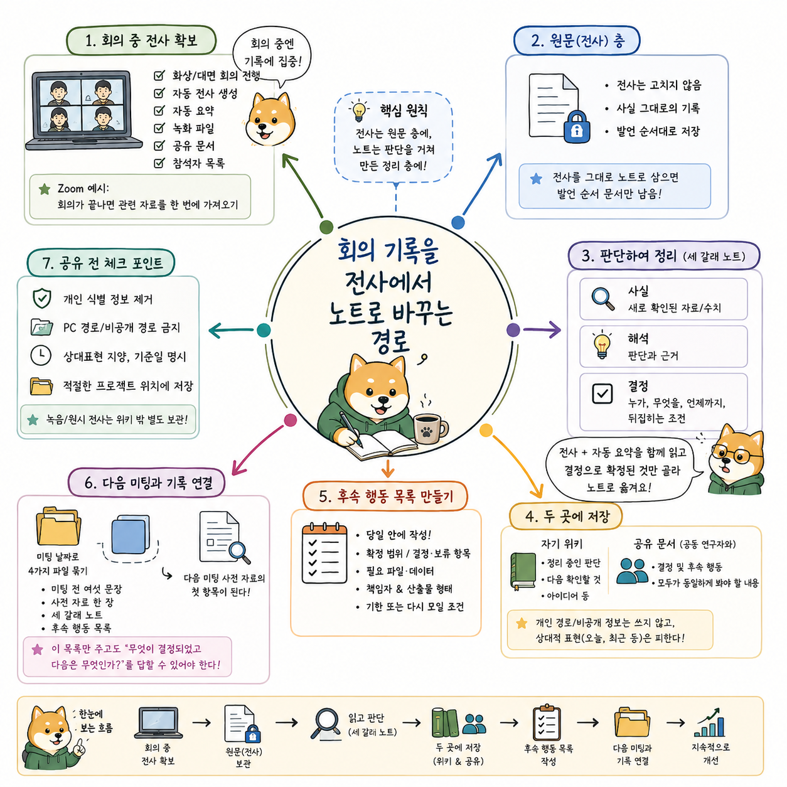
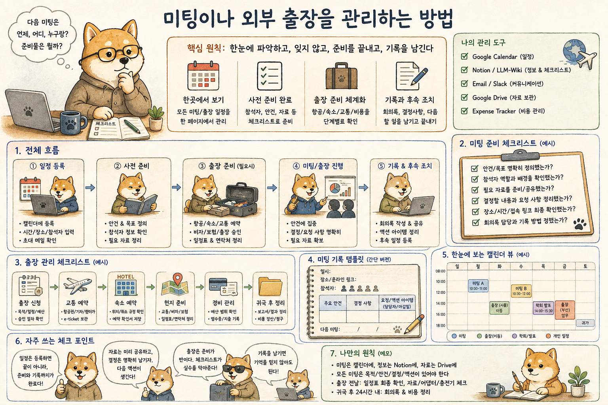

# 24장. Meetings 폴더로 PI의 외부 활동 관리하기

외부 강연 요청 메일 한 통에는 날짜, 장소, 청중, 발표 제목, 초록, bio, CV, 사진, 강연료, 교통비와 회신 기한이 섞여 있다. 수락하려면 캘린더에서 당일 일정과 이동 시간을 확인하고, 답장 초안을 만들고, 발표 준비 시간을 확보해야 한다. 주최 측이 보낸 양식이 있으면 원본을 보존한 채 작성본을 만들고 서명과 개인정보도 필요한 항목만 넣는다. 발표 자료에는 기존 슬라이드와 LLM 위키의 논문을 가져오고 행사 시간과 청중에 맞춰 다시 구성한다. 행사가 끝나면 영수증, 승차권, 지급 서류와 후속 메일이 남는다. 자문과 평가도 순서는 비슷하지만 제출물과 보안 조건이 다르다. 공동연구 미팅은 사전 자료, 회의 전사, 결정, 담당자와 다음 일정이 이어진다. 저희 연구실은 이 외부 활동을 `Meetings` 폴더에서 행사 단위로 관리한다.

제가 `Meetings` 폴더에 넣는 활동은 공동연구 미팅보다 넓다. 대학과 병원의 초청 세미나, 학회의 강연과 좌장, 정부와 연구기관의 자문위원회, 과제와 용역 평가, 학위 심사, 외부 워크숍, 국내외 출장도 같은 폴더에서 다룬다. 예정된 활동은 폴더 최상위에 두고, 끝난 활동은 연도 폴더로 옮긴다. 각 행사 폴더에는 초청 메일과 첨부 파일, 제출한 서류, 현재 발표본, 영수증과 정산 자료가 남는다. `wiki/`에는 여러 행사에서 되풀이되는 절차와 실수를 줄이는 규칙을 기록한다. 에이전트는 이 규칙을 읽고 메일, 캘린더, LLM 위키, 행사 폴더에서 필요한 정보를 찾아 준비물을 만든다. 사람은 수락 여부, 외부 발송, 비용 지출, 공개 범위와 과학적 판단을 승인한다. 아래의 공동연구 사례도 PI의 외부 활동 가운데 반복이 많은 미팅 업무로 이어진다.

# Meetings 폴더가 다루는 활동

활동마다 준비물은 다르지만 요청을 받고 마무리하는 흐름은 반복된다. 그래서 행사 폴더는 활동의 원본과 결과물을 모으고, `wiki/`는 유형별 절차를 알려 준다.

| 활동 | 행사 폴더에서 관리하는 것 | 자주 반복되는 작업 |
|---|---|---|
| 외부 세미나와 특강 | 초청 메일, 제목, 초록, bio, CV, 사진, 발표 자료 | 일정 확인, 회신, 자료 제출, 슬라이드 준비, 강연료 서류 |
| 학회와 워크숍 | 초록, 프로그램, 등록, 발표 자료, 배포 자료 | 제출 마감 확인, 발표 준비, 등록과 출장 정리 |
| 자문과 위원회 | 위촉 자료, 회의 자료, 자문의견서, 참석 기록 | 자료 검토, 의견서 작성, 서명, 자문료 서류 |
| 평가와 심사 | 평가 자료, 평가표, 보안서약서, 제출본 | 이해충돌과 보안 확인, 점수와 의견 작성, 제출 형식 검증 |
| 공동연구 미팅 | 사전 자료, 핵심 논문, 전사, 결정, 후속 행동 | 참석자와 안건 확인, 자료 공유, 회의 기록, 다음 작업 배정 |
| 국내외 출장 | 초청장, 프로그램, 교통, 숙박, 영수증, 보고서 | 이동 일정 확보, 예약 자료 보존, 사후 정산 |

강연 요청을 예로 들면 에이전트는 메일 스레드와 첨부 파일에서 행사명, 주최, 날짜, 장소, 청중, 요청받은 자료와 마감을 뽑는다. 캘린더에서는 실제 약속과 이동 시간, 발표 준비에 쓸 시간을 확인한다. 수락할 수 있는 일정이면 답장 초안을 Gmail에 저장하고 수신자, 제목, 본문, 첨부 예정 파일을 사람에게 보여 준다. 승인을 받은 뒤 메일을 보내고 확정된 일정을 캘린더에 반영한다. 기존 행사 폴더를 날짜와 주최, 행사명으로 검색한 뒤 중복이 없을 때 새 폴더를 만든다. 초청 메일과 원본 양식은 보존하고, 현재 발표본과 제출본은 폴더를 열었을 때 바로 보이게 둔다. 발표가 끝나면 강연료와 출장비에 필요한 증빙을 `청구/`에 모으고 후속 회신을 준비한다. 같은 유형의 행사에서 다시 쓸 수 있는 교훈은 `wiki/seminars/`, `wiki/travel/`, `wiki/documents/`의 해당 문서에 반영한다.

# 외부 활동의 진행 상태

PI의 외부 활동은 요청을 받은 시점부터 끝난 뒤의 정산까지 이어진다. 메일에 초청 내용이 있어도 일정과 역할이 확정되지 않았으면 `조건 확인` 상태다. 수락 메일을 보낸 뒤 공식 일정이 잡히면 `일정 확정`으로 바뀐다. 발표 제목과 초록, CV처럼 먼저 보내야 할 자료가 남아 있으면 `사전 제출 준비`로 적는다. 슬라이드와 자문 의견서, 평가표를 만들고 있으면 산출물의 이름을 상태에 넣는다. 행사 당일이 지나도 영수증과 지급 서류가 남아 있으면 `정산 대기`다. 공동연구 미팅은 `데이터 수신 대기`, `분석 진행`, `결정 대기`처럼 연구의 다음 조건을 상태 이름에 쓴다. `진행 중` 한마디로 적으면 다음에 무엇을 해야 하는지 알 수 없으므로, 기다리는 자료나 사람의 행동을 함께 적는다.

```text
요청 접수
    ↓
일정, 역할, 제출물, 비용 조건 확인
    ↓
수락과 공식 일정 확정
    ↓
행사 폴더 생성과 준비 시간 확보
    ↓
발표 자료, 의견서, 평가표, 서류 준비
    ↓
행사 또는 미팅 진행
    ↓
후속 메일, 정산, 기록
```

상태가 바뀌는 조건은 확인 가능한 문장으로 적는다. `사전 제출 준비`는 초록과 CV를 보냈을 때 끝나고, `슬라이드 준비`는 발표본을 렌더링해 확인했을 때 끝난다. `정산 대기`는 요구된 증빙과 지급 서류를 제출하고 수신 여부를 확인한 뒤 닫는다. 공동연구에서는 기관별 데이터 승인과 분석 담당이 다를 수 있으므로 기관마다 상태를 따로 기록한다. 메일과 캘린더의 내용을 행사 메모에 통째로 복사하지 않고 원본으로 가는 링크와 현재 판단을 남긴다. 원본 메일과 일정이 바뀌면 에이전트는 작업을 시작할 때 다시 읽는다. 이 방식이면 다음 세션에서도 에이전트가 어떤 자료를 기다리는지, 무엇을 만들고 있는지, 어떤 승인이 필요한지 말할 수 있다. 행사명과 상태, 다음 조건을 한 줄로 읽었을 때 다음 행동이 나오면 기록이 작동하는 것이다.

# 정보마다 정본을 맡는 작업 공간

행사 폴더에는 외부 활동을 준비하고 마친 결과가 모이지만 메일과 일정의 원본까지 복사하지 않는다. 초청 조건과 합의는 Gmail 스레드에서 확인하고, 확정된 시간은 Google Calendar에서 확인한다. 행사 폴더에는 주최 측이 보낸 첨부 파일과 작성한 제출본, 현재 발표본, 회의 기록, 영수증을 둔다. LLM 위키는 발표와 자문에 쓸 논문 지식을 제공한다. 분석 결과와 코드는 연구 프로젝트 폴더에서 가져오고, 공동 원고의 문장과 그림은 원고 폴더에서 관리한다. 같은 정보를 여러 폴더에 복사하면 수정된 날짜와 판본이 달라진다. 에이전트는 작업을 시작할 때 각 원본을 다시 읽고 행사 폴더에는 링크와 이번 활동에 필요한 결과물만 남긴다. 무엇을 어디에서 읽고 어디에 저장할지 정하면 준비 과정에서 생기는 중복 파일이 크게 줄어든다.

| 정보와 산출물 | 정본을 확인하는 곳 |
|---|---|
| 초청, 요청, 합의와 회신 | Gmail 스레드 |
| 확정된 행사 시간, 장소, 온라인 접속 정보 | Google Calendar와 공식 초대 |
| 초청장, 원본 양식, 제출본, 발표본, 영수증 | Meetings의 행사 폴더 |
| 반복되는 세미나, 자문, 평가, 출장 절차 | Meetings의 `wiki/` |
| 상대의 이름, 소속, 검증된 연락처 | LLM 위키의 연락처 registry |
| 발표와 자문에 다시 쓸 논문 지식 | LLM 위키 |
| 제안서, 예산, 과제 확약 | Grants 작업 공간 |
| 분석 코드와 결과 | Projects 작업 공간 |
| 공동 원고, 저자 순서, 소속 표기 | Manuscript 작업 공간 |

외부 세미나에서 발표 제목을 정할 때는 초청 메일의 청중과 요청 주제를 읽고, 과학 내용은 LLM 위키와 Projects의 현재 결과에서 가져온다. 제목과 초록, bio, CV를 제출하면 그 파일은 행사 폴더에 남긴다. 캘린더에는 행사 시간과 이동 구간을 기록하고, 슬라이드 준비처럼 옮길 수 있는 작업은 별도의 집중 시간으로 확보한다. 공동연구 미팅에서 분석 방향이 바뀌면 결정은 회의 노트에 남고 실제 코드는 Projects에서 갱신한다. 원고 그림을 바꾸기로 했다면 Manuscript에서 수정하고 미팅 노트에는 결정과 연결 파일만 적는다. 자문료나 강연료 서류에는 행사 폴더의 원본 양식과 본인 정보의 정본을 사용한다. 폴더를 새로 만들기 전에는 같은 날짜와 주최, 행사명이 이미 있는지 최상위와 연도 폴더에서 확인한다. Zoom 링크만 있는 짧은 정기 미팅처럼 보존할 외부 자료가 없으면 기존 프로젝트 기록과 캘린더로 관리하고 빈 행사 폴더를 늘리지 않는다.

# 외부 요청 intake의 구조화

새 요청이 들어오면 메일을 한 장짜리 intake 기록으로 바꾼다. 세미나와 자문, 평가는 요청하는 역할과 산출물이 다르므로 활동 유형을 먼저 적는다. 행사명과 주최 기관, 담당자, 날짜, 장소, 온라인 여부를 확인한다. 주최 측이 원하는 역할이 발표자인지, 좌장인지, 자문위원인지, 평가위원인지도 구분한다. 제목과 초록, CV, 사진, 의견서, 평가표, 보안서약서처럼 제출할 자료와 마감을 적는다. 강연료, 자문료, 평가수당, 출장비의 지급 주체와 필요한 서류를 확인한다. 청중과 공개 범위, 보안 조건은 발표 자료와 외부 공유 범위를 정할 때 사용한다. 마지막에는 현재 답변 상태와 다음 행동, 근거가 된 메일 스레드와 첨부 파일을 남긴다.

| Intake 항목 | 기록할 내용 |
|---|---|
| 활동 유형 | 세미나, 강의, 학회, 자문, 평가, 공동연구 미팅, 출장 |
| 행사와 주최 | 공식 행사명, 기관, 담당자 |
| 일정과 방식 | 날짜, 시간, 장소, 온라인 또는 대면 |
| 맡은 역할 | 발표자, 좌장, 자문위원, 평가위원, 공동연구자 |
| 제출물과 마감 | 제목, 초록, CV, 사진, 발표본, 의견서, 평가표, 양식 |
| 비용과 정산 | 강연료, 자문료, 수당, 교통, 숙박, 지급 주체 |
| 공개와 보안 | 청중, 외부 공유 범위, 보안서약, 자료 반출 조건 |
| 현재 상태 | 검토 중, 수락, 일정 확정, 자료 준비, 정산 대기 |
| 다음 행동과 근거 | 담당자, 기한, 메일 스레드, 첨부 파일 |

Intake 기록에는 확인된 사실과 아직 확인할 항목을 구분해 쓴다. 주최 측이 장소나 강연료를 알려 주지 않았으면 빈칸을 추측으로 채우지 않고 확인 요청을 만든다. 메일 본문은 Gmail 스레드에 그대로 남아 있으므로 행사 기록에는 현재 판단과 원문 링크를 둔다. 담당자의 주소와 소속은 검증된 연락처 registry를 조회한다. 받은 첨부 파일은 행사 폴더에 원본 이름으로 보존하고 작성할 양식은 별도 제출본으로 만든다. 공동연구 미팅이라면 상대가 보낸 데이터 설명과 논문 목록에 현재 위치와 검토 상태를 붙인다. 자문과 평가 자료에는 보안 조건을 적어 공개 발표 자료와 섞이는 일을 막는다. 다음 행동에는 누가 무엇을 언제까지 준비하는지 쓰며, 외부 기관의 답변이나 승인이 먼저 필요하면 그 조건도 함께 남긴다.

# 이메일 스레드에서 복원하는 요청과 결정

메일함에는 외부 활동에서 오간 요청과 합의의 원본이 남는다. 누가 무엇을 언제 요청했고 상대가 무엇에 동의했는지는 Gmail 스레드에서 확인한다. 행사 기록에는 메일 스레드로 가는 링크와 아직 해결되지 않은 내용 한 줄을 둔다. 스레드를 찾을 때 사람 이름의 기억에 의존하지 않고 검증된 연락처 기록에서 주소를 확인한 뒤 그 주소로 찾는다. 찾은 다음에도 최신 한 통만 읽지 않고 스레드 전체를 읽어 지금 살아 있는 요청, 이미 답한 항목, 첨부된 자료, 마감, 참조에 들어 있는 사람을 확인한다. 외부 세미나는 처음 메일에서 제목과 초록만 요청했다가 나중에 CV와 사진, 지급 서류가 추가되기도 한다. 공동연구에서는 데이터 반출 승인이나 공유 범위가 중간에 바뀔 수 있다. 메일 내용을 할 일로 바꿀 때는 요청한 사람, 산출물, 마감과 선행 조건을 분리해 적는다.

메일 초안을 에이전트가 쓰는 것과 메일을 에이전트가 보내는 것은 다른 일이고 순서가 정해져 있다. 초안을 만들고 초안을 파일로 저장하고 사람에게 내용을 보여주고 기다리고 명시적인 승인을 받은 뒤에 발송한다. 답장해 달라거나 메일 보내 달라거나 리마인드 해 달라는 말은 그 순서의 앞부분을 지시한 것이고 초안을 만들어 보여주고 기다리라는 뜻이다. 초안을 한 번 고쳤으면 고친 것을 다시 보여주고 새 승인을 받는데 고친 대목이 수신자거나 첨부거나 약속의 수위일 수 있어서 앞선 승인이 고친 초안에 적용되지 않기 때문이다. 참조에 들어가면 안 되는 사람이 있는지, 첨부한 자료가 그 기관에 나가도 되는 것인지는 협업의 공개 경계를 아는 사람이 판단해야 하고 잘못 나간 메일은 되돌릴 수 없다. 메일 본문에는 내부 지침, 전략, 정산 논리, 판단 과정을 넣지 않고 받는 사람의 관점에서만 쓴다. 에이전트가 만든 초안에는 어느 문서에서 가져왔는지, 어떤 계획으로 이 표현을 골랐는지 같은 문장이 섞여 들어오는 일이 흔하다. 저장하고 발송하기 전에 독자에게 보이는 면을 훑어 지시문과 계획과 도구 상태와 조수 어투를 걷어내는 일이 검토의 절반이고 초안 품질이 안정되면 이 검토가 형식적으로 변하므로 오래된 협업일수록 더 중요해진다.

메일 발송은 되돌릴 수 없어서 사람이 마지막으로 승인한다. 잘못 만든 파일은 지우거나 이전 판으로 되돌릴 수 있지만 나간 메일은 받는 사람의 편지함에 남는다. 정정 메일을 보내면 두 통이 되고 상대가 어느 쪽을 읽었는지 알 수 없다. 세미나 수락 메일의 문장 하나는 일정과 강연 준비의 약속이 되고, 공동연구 회신은 데이터와 인력의 약속으로 읽힌다. 에이전트는 무엇을 답해야 하는지 찾고 관련 자료를 모으며 초안과 첨부를 준비한다. 사람은 수신자와 참조, 일정, 비용, 공개 범위와 약속의 수위를 확인한다. 초안에 내부 판단 과정이나 지시문이 들어가지 않았는지도 받는 사람의 관점에서 다시 읽는다. 승인은 초안 한 건에만 적용하므로 내용을 고친 뒤에는 수정본을 다시 확인한다.

# 약속과 준비라는 일정의 두 층

실제로 참석해야 하는 미팅과 그 미팅을 준비하는 시간은 서로 다른 일정이다. 두 가지를 같은 층에 섞으면 일정표는 가득 차 있는데 준비할 시간이 없고 준비 시간을 아예 적지 않으면 준비는 남는 시간에 하는 일이 되어 전날 밤에 몰린다. 두 층으로 나누는 기준은 이동 가능성이다. 상대와 약속한 시간은 혼자 옮길 수 없고 사전 읽기와 자료 작성과 분석 검토는 옮길 수 있다. 옮길 수 없는 것과 옮길 수 있는 것을 같은 목록에 두면 옮길 수 없는 것이 항상 이긴다. 약속 층에서 정본은 공식 초대다. 여러 사람이 참여하는 일정을 잡을 때는 각자의 가능한 시간을 모으는 단계와 하나의 공식 초대로 확정하는 단계를 구분한다. 확정 전에 개인적으로 잡아 둔 임시 표시가 남아 있으면 같은 시간에 두 항목이 생겨 다음에 어느 것이 진짜인지 알 수 없으므로 공식 초대가 만들어지면 임시 표시는 지운다.

일정을 다루는 에이전트에게 허용하는 범위는 좁게 잡는다. 참석자를 자동으로 초대하거나 화상회의 링크를 자동으로 붙이는 동작은 하지 않는다. 초대는 상대에게 알림을 보내고 상대의 일정을 점유하므로 외부로 나가는 행동이고 외부로 나가는 행동은 사람이 결정한다. 같은 시간대에 겹치는 항목, 확정되지 않은 채 남은 항목, 이동 시간이 확보되지 않은 연속 일정을 찾는 일은 목록이 길수록 사람보다 정확하다. 일정을 바꾸는 작업에는 원장을 하나 붙여, 바꾸기 전에 무엇을 어떻게 바꿀 것인지 먼저 적고 끝난 뒤에 결과를 다시 적는다. 원장에는 이미 적힌 줄을 고치지 않고 시작과 종료를 짝으로 덧붙이기만 하므로 시작만 있고 종료가 없는 줄이 남으면 그 작업이 중간에 끊겼다는 사실이 그대로 드러난다. 상대가 그사이에 시간을 옮겼거나 같은 작업이 두 번 실행되어 항목이 중복되는 일도 이 방식에서 먼저 보인다. 다만 원장은 지나간 일의 기록이므로 지금 일정이 어떻게 되어 있는지는 언제나 일정 자체에서 읽는다.

# 미팅 전의 같은 출발점

좋은 미팅은 각자가 같은 지점에서 출발하는 미팅이다. 자료를 많이 보내면 읽는 사람마다 다른 부분을 읽고 다른 인상을 가지고 들어온다. 사전 자료가 해야 하는 일은 오늘 무엇을 정해야 하는지 참석자에게 알려 주는 것이다. 한 장으로 충분하고 한 장을 넘어가면 읽지 않는 사람이 생긴다. 다섯 항목이면 그 한 장이 채워진다. 이번 협업이 답하려는 질문 한 문장, 이미 확보한 데이터와 핵심 논문의 원본 위치, 지금 가능한 설명과 그와 경쟁하는 설명, 아직 확인되지 않은 사실과 자료의 한계, 그리고 오늘 필요한 결정이다. 마지막 항목은 미팅이 끝났을 때 참이나 거짓으로 판정되는 문장으로 쓴다. 소개나 상호 이해로 적으면 미팅이 끝난 뒤 성공했는지 알 수 없다.

사전 자료에 인용한 핵심 논문은 문헌 위키에 실제로 들여놓는다. 제목만 적어 두면 그 논문의 결과가 왜 이 협업에 중요한지 설명해야 할 때 다시 원문을 찾게 된다. 근거로 쓰겠다고 적은 논문은 원문까지 확인한다. 초록만 읽고 적은 근거는 질문을 받으면 곧바로 흔들리고, 다기관 협업에서 한 번 잃은 신뢰는 다음 분기까지 영향을 준다. 발표 자료는 미팅 하루 전쯤 공유하고 당일 아침에 보내면 참석자는 회의 중에 처음 본다. 여러 기관이 참여하고 시간대가 다르면 하루의 여유가 실제로는 반나절이 되므로 무엇을 읽고 오면 되는지를 자료와 함께 한 줄로 적는다. 학생과 연구원에게는 발표 분량, 각자가 책임질 질문, 미팅 뒤에 남길 산출물을 함께 알린다. 발표 시간과 산출물을 함께 정하면 미팅이 다음 작업으로 이어진다.

# 미팅 중 관찰과 해석과 결정의 분리

미팅 기록에서 가장 자주 무너지는 것은 세 가지가 한 문장에 섞이는 일이다. 어떤 조건에서 어떤 값이 나왔다는 관찰, 그 값이 무엇을 뜻하는지에 대한 해석, 그래서 무엇을 하기로 했다는 결정은 각각 신뢰 수준이 다르다. 관찰은 데이터로 되짚을 수 있고 해석은 나중에 바뀔 수 있으며 결정은 바뀌더라도 언제 왜 바뀌었는지가 남아야 한다. 셋을 한 문장으로 적으면 나중에 어느 부분이 사실이고 어느 부분이 그날의 인상이었는지 구분할 수 없다. 결정되지 않은 것을 결정처럼 적지 않는 규칙도 같은 이유에서 나오고 결론이 나지 않았다면 기록에는 선택지와 아직 정해지지 않았다는 사실과 정하려면 무엇이 더 필요한지를 적는다. 결론이 난 것처럼 적으면 다음 미팅에서 그것을 전제로 논의가 진행되고 뒤늦게 아무도 동의한 적이 없다는 사실이 드러난다. 다기관 협업에서 이 오류의 비용은 특히 큰데, 기관마다 그 전제 위에서 내부 절차를 이미 시작했을 수 있기 때문이다. 그때 새 분석을 요청할 때는 그 분석이 어떤 질문에 답하려는 것인지와 어떤 결과가 나오면 무엇으로 판정할지를 요청에 붙인다. 목적과 판정 기준 없이 넘어간 요청은 결과가 나온 뒤에 해석을 두고 논의를 다시 열고 그 논의의 부담은 분석을 실제로 돌린 사람에게 간다. 확정된 후속 행동은 누가 맡는지, 무엇을 만드는지, 언제까지인지, 시작하려면 먼저 무엇이 있어야 하는지를 갖춘 형태로 적는다. 미팅에서 이해했다고 느낀 역할 분담이 두 주 뒤에 다르게 기억되는 일은 기관이 여럿이면 더 자주 일어나고 네 가지를 적는 데 드는 시간은 몇 분인데 적지 않아서 생기는 지연은 분기 단위다.

1. 지난 미팅의 후속 행동을 하나 고른다
2. 담당자, 산출물, 마감, 선행 조건 네 가지를 갖춘 형태로 다시 적는다

기록을 세 층으로 나누면 이 구분이 파일 구조로 강제된다. 첫 층은 화자 라벨을 붙인 원문 전사로, 손대지 않고 그대로 남기며 여기에는 농담과 중간에 철회된 발언과 잘못 들린 숫자가 들어 있다. 둘째 층은 요약과 할 일과 분석을 담은 정리 노트이고 사람이 전사를 읽고 확인한 판단만 들어간다. 셋째 층은 날짜와 회의와 기록을 잇는 색인이며 어느 날 어떤 회의가 있었고 그 회의의 전사와 정리 노트가 어디에 있는지만 담는다. 세 층을 나누는 이유는 신뢰 수준이 다른 것을 같은 파일에 두면 낮은 쪽이 높은 쪽의 권위를 빌려 가기 때문이다. 전사를 고쳐 읽기 좋게 다듬으면 원자료가 사라지고 참석자가 확인하지 않은 문장이 정리 노트에 섞이면 그 문장이 합의로 취급되어 다음 단계로 넘어간다. 색인이 내용을 담기 시작하면 색인과 정리 노트가 서로 어긋나고 어긋난 뒤에는 둘 다 믿을 수 없게 된다. 자동 전사는 첫 층에만 들어가고 확정된 결정으로 취급하지 않는다.



*PI의 외부 미팅에서는 회의 자료 수집부터 공유 전 검토, 후속 행동, 다음 미팅 연결까지 한 흐름으로 관리한다. 원시 전사와 개인 정보는 공유 문서로 옮기지 않는다.*

# 미팅 후 결과를 원래 작업 공간에 반영하기

미팅이 끝난 직후에 하는 일은 참석자에게 보낼 짧은 요약을 만드는 것이다. 요약에는 결정된 것과 후속 행동만 넣고 논의 과정과 오간 의견은 넣지 않는다. 짧을수록 읽히고 읽혀야 어긋난 이해가 그때 교정된다. 보내는 시점은 미팅 당일이 가장 좋은데 하루가 지나면 참석자의 기억이 각자의 방향으로 정리되어 있기 때문이다. 이 요약도 외부로 나가는 문서이므로 초안을 만들고 보여주고 승인을 받은 뒤에 발송하는 순서를 그대로 따른다. 후속 미팅이 필요하면 새 일정을 만들기 전에 기존 일정과 메일 스레드를 먼저 확인한다. 이미 잡힌 정기 미팅이 있는데 별도 일정을 잡으면 참석자는 비슷한 미팅 두 개에 들어가게 된다. 여러 기관이 참여하면 한 번 모이는 비용이 크므로 정말 모여야 정해지는지를 먼저 따지고 다뤄야 할 것이 하나뿐이면 메일로 끝난다.

미팅에서 나온 결과는 실제 작업을 맡는 공간에 반영한다. 분석 방향의 변경은 Projects에, 원고의 구성과 그림에 관한 결정은 Manuscript에, 제안서에 걸리는 약속은 Grants에 반영하고 각 산출물은 해당 폴더의 파일명 규칙과 검증 절차를 따른다. 이 협업 밖에서도 다시 쓸 문헌 판단은 LLM 위키에 남긴다. 진행 메모나 변경 기록이나 피드백 문서를 행사 폴더 루트에 새로 만들면 폴더마다 형식이 다른 기록이 흩어지고 폴더를 정리할 때 함께 사라진다. 반복해서 확인할 운영 규칙은 Meetings의 위키 로그와 관련 문서에 반영한다. 로그에는 작업을 시작한 이유, 원본 상태, 실행한 내용, 확인 결과, 발견한 문제, 결정, 남은 일과 산출물을 적는다. 확인 결과에는 확인됨, 불일치, 미확인, 보류, 재실행 필요 가운데 하나를 붙여 확인하지 못한 일을 다음 세션에서 다시 찾을 수 있게 한다. 다음 미팅에서 답해야 할 질문도 남겨 두며 질문이 비어 있다면 다음 상태로 넘어갈 조건부터 다시 확인한다.

# 새 분석 공동연구의 역할 배정

합성 사례의 첫 국면은 협업이 막 시작되어 첫 미팅을 준비하는 시점이다. 외부 기관이 데이터를 가지고 있고 분석은 이쪽에서 맡기로 한 상황에서, 연구책임자는 과학적 배경과 질문을 설명하는 역할을 맡는다. 분석을 실제로 수행하는 역할은 원고 준비 단계에 있는 대학원생에게 가는데 그 학생은 이미 자기 주저자 원고를 쓰고 있으므로 이 협업에 쓸 수 있는 시간이 제한된다. 학부 연구생은 배우는 위치로 데이터 구조를 파악하고 박사후연구원은 이 협업이 확장될 방향을 살핀다. 참여자를 나열하는 것으로는 부족해서 과학적 방향을 책임지는 사람, 데이터를 소유하고 반출 권한을 가진 사람, 분석을 수행하는 사람, 배우는 위치로 참여하는 사람을 구분한다. 다기관 연구에서는 데이터 소유자와 분석 수행자가 다른 기관에 있는 경우가 많다. 요청할 사람과 승인할 사람이 기록되지 않으면 모든 요청이 연구책임자를 거치면서 병목이 생긴다. 역할은 프로젝트 책임 기록에 쓰고 학생 개인 기록에는 현재 맡은 작업으로 가는 링크만 둔다.

첫 미팅 전에 공유하는 것은 핵심 논문 두어 편과 데이터 설명이다. 논문은 LLM 위키에 들여놓은 상태로 공유하고 데이터 설명은 상대 기관이 보낸 원본을 그대로 전달한다. 미팅에서 정할 것은 세 가지로 미리 적어 둔다. 각자가 어느 부분을 책임지는지, 데이터에 어떤 경로로 접근하는지, 첫 산출물이 무엇이고 언제까지인지다. 소개와 배경 설명에 미팅의 대부분을 쓰면 이 세 가지는 다음으로 밀리고 다음 미팅은 분기 뒤다. 세 항목이 모두 정해져야 상태를 담당자별 행동으로 바꾼다. 데이터 접근 경로가 정해지지 않았다면 상태를 `데이터 수신 대기`로 두고 해당 기관의 반출 승인을 기다린다. 상대의 신원과 관계 등급은 연락처 registry에 갱신하고 intake 기록에서는 해결된 항목을 지운다.

# 분석 담당자가 바뀔 때

같은 협업의 두 번째 국면은 분석을 맡던 사람이 바뀌는 시점이다. 대학원생이 원고 마무리에 들어가면서 분석 담당이 넘어가야 하는데 이때 흔히 하는 선택이 긴 인수인계 미팅을 한 번 잡는 것이다. 세 시간짜리 미팅에서 데이터 위치와 파이프라인과 결과와 남은 문제를 모두 설명하면, 받는 사람은 그날 이해한 기분으로 나가고 이틀 뒤에 첫 질문을 하게 된다. 한 번에 전달된 맥락은 한 번에 잊히고 잊힌 부분은 대개 예외 처리와 실패한 시도에 관한 것이다. 이미 해 보고 버린 방법을 새 담당자가 다시 시도하는 일이 인수인계 직후에 가장 흔하다. 주제를 나눈 인수인계가 더 잘 작동한다. 첫 만남에서는 프로젝트의 질문, 데이터 위치, 파이프라인 단계, 현재 결과와 남은 문제를 넓게 훑는다. 그다음 만남부터 전처리, 집단 관리, 분석 틀을 하나씩 열어 보면 받는 사람이 사이사이에 직접 실행해 볼 수 있다.

인수인계 문서를 누가 쓰는지도 정해 둔다. 넘기는 사람이 쓰면 그 사람이 이미 아는 것을 기준으로 쓰게 되어, 정작 새로 오는 사람이 막히는 지점이 빠진다. 넘기는 사람은 실행 가능한 파일과 제약 조건을 설명하고 문서는 받는 사람이 자기 말로 다시 쓴다. 다시 쓴 문서를 넘기는 사람이 읽고 틀린 곳을 고치면, 그 문서는 두 사람이 같은 것을 이해했다는 증거가 된다. 담당이 바뀌면 Projects의 담당 기록, 연락처 registry, Manuscript의 저자 목록, 상대 기관에 통지할 창구를 함께 갱신한다. 한 곳만 고치면 나머지는 옛 담당자를 가리킨다. 반출 승인이 개인 단위로 나 있다면 담당 변경과 함께 승인 절차를 다시 시작한다. 문서 인수인계와 승인 대기를 동시에 진행하면 분석이 멈추는 기간을 줄일 수 있다.

# 계산 결과를 실험으로 검증하는 협업

세 번째 국면은 분석에서 나온 결과를 실험으로 확인하기로 한 상황이다. 계산팀과 실험팀이 만날 때 자주 벌어지는 일은 서로가 상대의 제약을 모른 채 논의하는 것이다. 계산팀은 검증하고 싶은 후보를 여럿 제시하고 실험팀은 그중 무엇이 실제로 가능한지를 그때 판단해야 한다. 사전 문서 없이 만나면 미팅은 후보를 하나씩 훑으며 가능한지 묻게 되고 끝난 뒤에는 무엇을 하기로 했는지가 모호해진다. 사전 문서에는 계산에서 나온 결과, 가능한 실험 방식, 필요한 시료와 조건, 판정 기준을 적는다. 판정 기준을 미리 정하면 실험팀은 그 판정이 자기 조건에서 가능한지 바로 답할 수 있다. 실험이 끝난 뒤 기준을 정하면 결과 해석부터 다시 논의하게 된다. 네 항목을 채우는 과정에서 계산 결과가 실험으로 판정하기 어려운 형태임을 발견할 수도 있다.

미팅 준비에서는 참석자의 가능한 시간, 학생이 준비할 자료, 만날 방식, 미리 읽을 논문을 함께 확인한다. 각각 따로 챙기면 대개 미리 읽을 논문이 빠진다. 협업 상태 기록에 이번 미팅에 필요한 것을 적어 두면 준비가 어디까지 되었는지 한 번에 보인다. 여러 기관의 사람이 모이는 미팅은 다시 잡기 어려우므로 자료가 부족하면 필요한 조건을 채운 뒤 새 날짜를 정한다. 미룰 때는 어떤 자료가 오면 다시 잡을지도 함께 적는다. 미팅 후 기록에는 무엇을 만들어 무엇을 측정하고 어떤 대조군을 쓰는지, 결과를 보고 어떤 결정을 내릴지를 남긴다. 결정 기준이 있으면 중간 결과를 보고 계속할지 멈출지 판단할 수 있다. 중단한 결정도 기록해야 같은 후보가 다시 올라왔을 때 이유를 확인할 수 있다.

# Meetings 폴더와 위키의 역할

업무를 소유하는 작업 공간들은 같은 골격을 쓴다. 입구의 지침 파일은 반드시 지켜야 할 것과 어디로 가야 하는지를 담은 얇은 라우터이고 목차 문서가 지도와 현재 규칙 표를, 변경 이력 문서가 구조와 규칙이 어떻게 바뀌어 왔는지를, 그 아래 영역별 문서가 실제 절차와 실패 조건과 검증을 담는다. 어느 작업 공간에 들어가든 읽는 순서는 같아서 지침 파일을 먼저 읽고 목차로 가고 변경 이력의 최근 항목을 훑은 다음 해당 영역의 문서로 내려간다. 목차 문서에 규칙을 채워 넣기 시작하면 규칙이 두 곳에 생기고 두 곳이 어긋나면 어느 쪽을 따라야 할지 알 수 없다. 목차가 길어지고 있다면 규칙을 목차에 쓰고 있다는 신호다. 변경 이력은 규칙이 왜 지금 모습이 되었는지를 복원하는 역사이고 현재 규칙을 덮어쓰지 않으므로 오래된 항목을 읽고 현재 규칙을 추측하는 대신 현재 규칙 문서를 읽는다. 상세 규칙은 그것을 소유한 작업 공간에 두고 전역 파일은 작업 공간 사이의 라우팅과 진짜 전역인 것만 소유한다. 되돌리는 수단이 동기화 서비스의 버전 기록뿐이라는 전제가 규칙 전체를 지배해서 덮어쓰기 전에 먼저 읽고 무엇을 바꿀지 보이고 승인을 받는다.

행사와 미팅을 소유한 작업 공간의 최상위 배치는 이 골격을 그대로 드러낸다.

```text
Meetings/
├── AGENTS.md
├── wiki/
│   ├── index.md                 지도와 현재 규칙
│   ├── log.md                   구조와 규칙의 변경 이력
│   ├── conferences/             학회
│   ├── seminars/                세미나와 강연
│   ├── advisory/                자문
│   ├── evaluations/             평가
│   ├── travel/                  출장
│   ├── documents/               반복되는 서류 작성 절차
│   ├── planning/                일정과 계획
│   ├── slides/                  발표 자료 규칙
│   └── institutions/            기관 정보
├── {연도}/                       지난 행사 보관
└── {날짜}_{주최}_{행사명}/        행사 단위 작업 폴더
```

폴더 이름은 예시이므로 구분 기호와 표기는 각자의 정렬 습관에 맞추면 된다. 작업 단위는 행사 폴더 하나이고 이름은 날짜와 주최와 행사명 세 조각으로 이루어진다. 날짜를 앞에 두면 목록이 시간순으로 정렬되고 주최를 가운데 두면 같은 기관에서 반복되는 행사가 이름만으로 묶인다. 해가 바뀌면 지난 행사를 연도 폴더로 옮겨 최상위에는 지금 준비하는 활동만 남긴다. 위키 아래에서는 학회, 세미나, 자문, 평가, 출장, 서류, 일정, 발표 자료와 기관 정보를 유형별로 나눈다. 유형마다 준비물과 확인 순서가 달라서 관련 문서만 읽고 작업을 시작할 수 있다. 최상위 규칙 파일은 강제 규칙과 문서 위치를 안내하고 세부 절차는 해당 위키 문서가 맡는다. 미팅 기록은 원문 전사, 정리 노트, 색인으로 나누어 확인되지 않은 발언이 결정처럼 읽히는 일을 막는다.



*행사 일정, 사전 준비, 출장 예약, 미팅 진행, 귀국 후 정산을 하나의 작업 단위로 관리하는 예다. 일정과 정보, 자료, 비용 기록은 각각의 정본에서 읽는다.*

## 따라해보기

아래 블록은 AI 도구의 채팅창에 그대로 붙여 넣는 프롬프트다. 행사와 미팅을 소유할 작업 공간을 처음 세울 때 쓰는 프롬프트다. 꺾쇠 안은 자기 경로와 표기로 바꾼다.

```text
<행사 작업 폴더 경로>에 행사와 미팅을 소유할 작업 공간을 만들어 줘.
- 최상위에 AGENTS.md 하나와 wiki/ 하나를 두고 나머지는 행사 폴더로 둔다
- 행사 폴더 이름은 {날짜}_{주최}_{행사명} 형식으로 고정한다
- wiki/에 index.md와 log.md를 만들고 conferences/, seminars/, advisory/,
  evaluations/, travel/, documents/, planning/, slides/, institutions/를 빈 폴더로 만든다
- AGENTS.md에는 다음 네 줄을 강제 규칙으로 적는다
  1. 행사 폴더를 새로 만들기 전에 같은 주최의 기존 폴더가 있는지 먼저 확인한다
  2. 미팅 기록은 원문 전사, 정리 노트, 색인 세 파일로 나누고 전사는 고치지 않는다
  3. 참석자가 확인하지 않은 문장을 정리 노트에 옮기지 않는다
  4. 일정을 바꾸기 전에 무엇을 어떻게 바꿀지 원장에 먼저 적고 끝난 뒤 결과를 덧붙인다
- 지난 해의 행사 폴더는 {연도}/ 아래로 옮기되, 옮길 목록을 먼저 보여주고 승인을 기다린다
```

작업 공간이 나누는 영역은 일의 종류를 따른다. 행사 폴더를 만들고 중복을 확인하는 일, 일정을 두 층으로 운영하고 변경을 원장에 남기는 일, 유형마다 다른 준비물과 완료 기준을 관리하는 일, 출장과 정산을 이어 붙이는 일, 서류와 서명과 제출물을 다루는 일이 각각 다른 영역이다. 초청 세미나와 평가 업무는 필요한 서류와 확인 순서가 달라 서로 다른 문서에서 절차를 관리한다. 규모가 커진 행사 폴더는 자기 지침 파일과 자기 위키를 갖는 중첩 작업 공간으로 운영할 수 있다. 상위 규칙은 하위 폴더에 자체 규칙이 있을 때 그 규칙을 먼저 읽도록 안내한다. 학회 보직처럼 여러 해와 여러 위원회에 걸친 업무는 한 단계 아래에 독립 작업 공간을 둔다. 협력이 오래 지속되어 자체 규칙과 이력이 필요해지면 독립 작업 공간으로 분리한다. 한 번의 행사로 끝나는 일은 Meetings의 공통 규칙을 적용한다. 하나의 외부 공동연구 미팅을 준비하는 경로는 다음과 같이 이어진다.

```text
작업 공간의 지침 파일
    ↓
목차 문서
    ↓
변경 이력의 최근 항목
    ↓
일정 운영 규칙 + 해당 행사 유형 규칙
    ↓
실제 행사 폴더의 원본 자료와 사전 읽기
    ↓
결정과 후속 행동 기록
    ↓
분석, 원고, 과제, LLM 위키의 해당 문서 갱신
```

준비와 진행에서 나온 결과를 실제 작업 공간에 반영하지 않으면 Meetings만 커지고 Projects, Manuscript와 Grants의 기록은 낡는다. 상대가 보낸 초청과 첨부 파일과 영수증은 행사 폴더에 그대로 보존한다. 여러 행사에서 다시 쓸 수 있는 실수 방지 규칙은 Meetings의 위키에 올린다. 같은 유형의 행사에서 두 번 같은 것을 빠뜨렸다면 규칙으로 남길 후보가 된다. 한 번뿐인 사정과 파일 상태는 해당 행사 폴더에 둔다. 공동연구의 분석과 원고, 과제 자료는 각각 Projects, Manuscript와 Grants에서 계속 관리한다. Meetings에는 그 문서로 가는 링크와 이번 미팅의 자료, 결정, 후속 행동이 남는다. 행사 폴더에 다른 작업 공간의 파일을 계속 복사하면 반년 뒤에는 어느 파일이 최신인지 다시 확인해야 한다.

무엇을 규칙으로 올릴지는 네 가지 조건 가운데 하나라도 맞을 때로 정해 두었다. 같은 혼선이 두 번 이상 반복되었거나 한 번이라도 비용이 컸거나 되돌리기 어려웠거나 사람이 앞으로는 이렇게 하라고 교정했거나 다음 세션의 에이전트가 같은 결정을 재현해야 하는 경우다. 올리지 않을 것도 함께 적어 두었는데 그쪽이 실제로는 더 자주 쓰인다. 한 사례에만 해당하는 파일명과 상태, 검증하지 않은 임시 회피책, 특정 도구를 기본값으로 만드는 취향, 검증할 수 없는 감상형 문장이 여기 해당한다. 행사 폴더가 부풀던 시기에 올라오던 것이 대부분 마지막 두 종류였다. 규칙 문장의 형식도 셋으로 고정했다. 어떤 상황에서, 무엇을 하고 무엇으로 확인하는지다. 이 형식에 맞춰 쓰이지 않는 문장은 대개 그 행사의 사연이어서 행사 폴더에 남는다. 승격의 근거는 로그이고 서로 다른 대상 두 건 이상과 로그 항목 세 건 이상에서 같은 위반이 재발하지 않아야 규칙을 굳힌다. 반대 방향도 정의해 두었다. 굳은 규칙이 반복해서 깨지거나 실제 관례와 충돌하면 강제를 권고 수준으로 낮추고 재검토 목록에 올린다.
