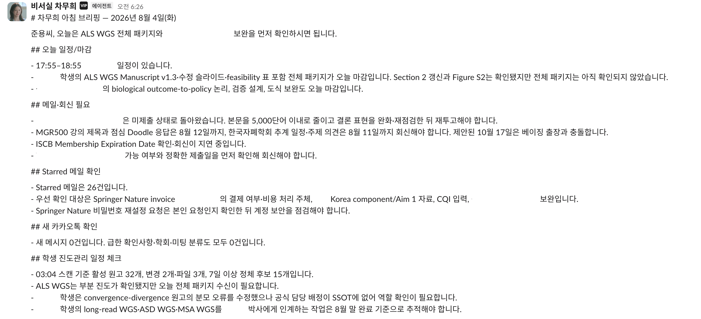
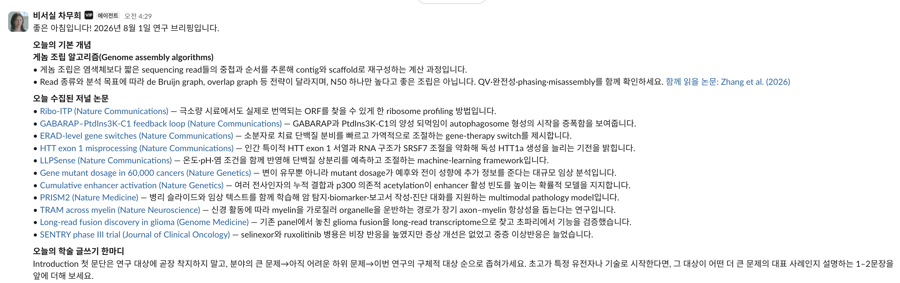
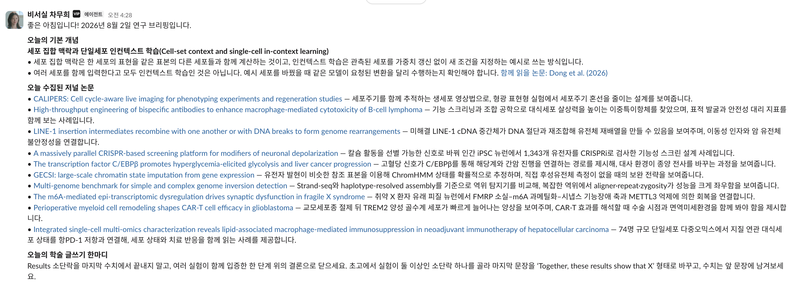

# 28장. 브리핑과 채널로 결과를 받는 법

27장에서 만든 작업들이 무언가를 만들어 낸다. 그것이 사람이 읽는 자리에 도착해야 뜻이 생기고, 도착하지 않으면 매일 도는 작업 하나가 늘었을 뿐이다. 도착하는 자리를 어떻게 나누고 무엇을 어떤 순서로 담을지가 여기서 정해진다. 이 연구실에서는 두 종류의 브리핑이 서로 다른 채널로 온다. 하나는 개인 채널로 오는 아침 브리핑이고 그날 판단할 것을 모은다. 다른 하나는 연구실 공용 채널로 오는 연구 브리핑이고 그날 읽을 것을 건넨다. 두 가지가 담는 것도 읽는 사람도 다르므로 채널을 나누고 형식을 따로 정한다. 채널을 어떻게 나누고 무엇을 내보내지 않을지도 함께 정해 둔다.

# 아침 briefing의 항목과 순서


1. 오늘 확정된 일정과 시간에 민감한 마감
2. 답장이나 결정이 필요한 메일과 각 건의 현재 상태
3. 아직 닫히지 않은 질문과 상대가 회신을 기다리는 항목
4. 학생과 연구원의 진행 상황과 다음에 요청할 구체적인 것
5. 새로 들어온 논문 후보와 위키 반영 상태
6. 원고와 검토 요청의 변화
7. 일정에서 정리할 후보와 새로 잡을 집중 시간 후보
8. 실패한 정보원, 오래된 인계, 담당이 불분명한 항목

실제로 도착하는 보고는 다음과 같은 모양이다. 사람 이름과 과제 이름은 지웠다.



일정과 마감이 맨 위에 있고, 회신이 필요한 메일, 별표 표시한 메일, 메신저, 학생 진행 상황이 차례로 온다. 각 줄이 확인해야 할 것 하나이고 문장이 짧다. 눈여겨볼 것은 상태를 함께 적는 방식이다. 어떤 항목은 확인됐다고 적히고 어떤 항목은 아직 확인되지 않았다고 적히며, 새 메시지가 없으면 0건이라고 적는다. 아무것도 없다는 사실을 적지 않으면 그 정보원을 읽었는지 읽지 못했는지 구분되지 않는다. 마지막 절의 스캔 시각도 같은 성격이다. 그 수치가 언제 기준인지 적혀 있어야 지금 상태로 읽지 않는다.

읽는 순서는 시간이 정해진 것에서 시작해 사람이 기다리는 것, 내가 시작해야 하는 것, 시스템의 상태로 내려간다. 되돌릴 수 없는 것과 오늘 안에 반응해야 하는 것이 뒤쪽에 있으면 그날 놓친다. 시스템 상태를 앞에 두면 실패한 정보원 하나 때문에 정작 오늘의 마감을 늦게 본다. 보고할 것이 없는 작업은 침묵하지 않는다. 아무 말이 없는 것과 할 말이 없다고 말하는 것을 구분하려고, 보고할 것이 없으면 정확히 정해진 토큰을 돌려주게 해 두었다. 침묵을 계약으로 정의해 두면 빈 자리를 보고 그 작업이 오늘 돌기는 했는지 되물을 필요가 없다. 보고의 길이에는 상한을 둔다. 실행 상태 기록을 보면 결과 카드는 매일 쌓이는데 사람이 대부분 열어보지 않고 검토 대기 상태가 압도적으로 많으며, 읽히지 않는 보고서는 실패를 잡아내는 두 경로 가운데 하나를 스스로 닫는 셈이다. 항목 수를 제한하면 우선순위 규칙이 실제로 작동하는지 시험받는다. 스무 개를 다 올릴 수 있으면 순위를 매길 필요가 없고, 여덟 개만 올려야 하면 무엇을 빼는지가 드러난다.

같은 사건이 여러 정보원에 나타나면 한 항목으로 합친다. 회의 일정 변경 하나가 메일과 일정과 메신저에 각각 나타나는 것은 흔한 일이고, 합치지 않으면 사람이 세 번 판단하게 된다. 합칠 때는 어느 정보원에서 나왔는지를 항목 안에 남겨야 나중에 그 항목이 잘못되었을 때 어디를 고칠지 알 수 있다. 우선순위는 마감까지 남은 시간, 다른 사람이 응답을 기다리고 있는지, 미루었을 때 늘어나는 비용, 그 일에 필요한 집중 시간의 길이를 함께 보고 정한다. 방금 도착한 메일이 사흘 전 도착한 메일보다 급하다는 보장은 없고, 오히려 사흘 동안 답하지 않은 쪽이 대개 더 급하다. 집중 시간을 함께 보는 이유는 두 시간이 필요한 일과 몇 분이면 되는 일을 같은 목록에 나란히 두면 짧은 일만 처리되기 때문이다. 사람에 관한 항목은 가장 보수적으로 다룬다. 파트 3이 쓰는 학생 사례는 실제 운영 구조를 일반화하고 사람에 관한 정보는 합성한 것인데, 첫 주저자 원고를 준비하는 단계의 학생과 독립 과제를 준비하는 단계의 연구원은 같은 신호를 보내도 뜻이 다르다. 일주일 동안 산출물이 올라오지 않았다는 관찰은 기록해도 되고, 그 기간을 동기나 성격의 문제로 해석한 문장은 자동화가 만들지 않는다. 자동화가 사람에 대해 만들 수 있는 것은 다음에 무엇을 물어볼지에 대한 후보까지다. 기록의 용도를 먼저 정하지 않으면 활동 기록은 비교와 평가로 흘러가기 쉽고, 한번 그렇게 쓰이기 시작하면 되돌리기 어렵다. 무엇을 기록하지 않을지와 기록으로 무엇을 하지 않을지를 자동화보다 먼저 정한다.

```text
1. 일주일 동안 손으로 두 보고를 만들고 종합해 읽는다
2. 매일 중복으로 올라온 항목과 빠진 정보원을 표시한다
3. 일주일 뒤 중복 제거 규칙과 우선순위 규칙을 고쳐
   계약 문서에 반영한다
```

<!-- AUTHOR: 아침 보고를 자동화하기로 결정한 계기. 어떤 종류의 누락을 반복해서 겪었고, 그때 왜 정보를 더 모으는 방향이 아니라 결정을 드러내는 방향으로 설계를 바꿨는지 한두 단락 -->

# 학생들과 함께 보는 연구 브리핑


앞 절의 브리핑은 한 사람의 하루를 여는 것이고 개인 채널로 온다. 연구실 전체가 함께 보는 브리핑을 하나 더 두면 성격이 달라진다. 이쪽은 결정을 요구하지 않고 그날 읽을 것을 건넨다. 세 부분으로 되어 있다. 먼저 그날의 기본 개념 하나를 두세 줄로 설명하고 함께 읽을 논문 한 편을 붙인다. 다음으로 전날 새로 나온 논문 열 편 남짓을 저널과 함께 나열하고, 각 줄에 그 논문이 무엇을 보였는지를 한 문장으로 적는다. 마지막에 학술 글쓰기에 대한 조언을 한 문단 붙인다. 세 부분의 성격이 서로 다른데, 앞의 것은 배경 지식이고 가운데는 오늘의 재료이며 마지막은 훈련이다.



가운데 부분이 9장에서 만든 후보 목록의 출력이다. 관심 저널과 주제어로 모은 후보를 사람이 읽을 수 있는 길이로 줄여 내보내는 것이고, 각 줄이 한 문장인 이유는 그 이상이면 아무도 끝까지 읽지 않기 때문이다. 제목만 나열하면 무엇이 새로운지 알 수 없고, 초록을 붙이면 길어져서 넘긴다. 한 문장에 무엇을 보였는지가 들어 있으면 그중 두세 편을 눌러 보게 된다. 저널 이름을 함께 적는 이유는 그것이 판단의 재료가 되기 때문이다. 같은 주제라도 어느 저널에 실렸는지가 그 논문이 무엇을 주장하려 했는지를 알려 준다. 링크는 원문으로 바로 가게 걸어 두고, 위키에 이미 들어온 논문이면 그 사실도 함께 표시한다.



앞뒤의 두 부분이 이 형식을 학습 장치로 만든다. 기본 개념은 그날의 논문 목록과 무관하게 정해도 되고, 그 분야에서 학생이 알아야 하는 것을 순서대로 하나씩 내보내면 몇 달이면 한 바퀴가 돈다. 두 줄로 설명하고 함께 읽을 논문을 하나 붙이는 형식이 지켜지면 읽는 부담이 매일 같아진다. 글쓰기 조언도 같은 방식이다. 서론의 첫 문단을 어떻게 좁혀 가는지, 결과의 소단락을 어떤 문장으로 닫는지처럼 원고를 쓸 때 실제로 걸리는 자리를 하나씩 다룬다. 21장에서 하루 30분의 글쓰기 훈련을 권했는데, 이 한 문단이 그날 무엇을 연습할지 정해 주는 자리가 된다.

이 브리핑을 자동화할 때 주의할 것이 둘 있다. 첫째는 논문 요약의 정확성이다. 한 문장 요약은 초록만 보고 만들어지므로 틀릴 수 있고, 그 문장을 근거로 삼는 사람이 생긴다. 그래서 이 목록은 읽을 것을 고르는 데까지만 쓰고, 위키에 들어가는 것은 6장의 절차를 거친 뒤라고 채널 안내에 적어 둔다. 둘째는 개념 설명과 글쓰기 조언이 매일 새로 만들어진다는 점이다. 반복되거나 서로 어긋나는 일이 생기므로 지금까지 내보낸 개념 목록을 위키에 남기고 다음 것을 고를 때 그 목록을 읽게 한다. 남기지 않으면 몇 주면 같은 개념이 다시 나온다.

# 자동화의 산출물이 도착하는 채널


자동화가 만든 목록은 사람이 읽는 자리에 도착해야 뜻이 생긴다. 실패를 알리는 장치가 없는 구조에서 발견 경로는 하류 보고서의 한 줄과 사람이 결과 카드를 여는 것 두 가지뿐이고, 둘 다 사람이 무언가를 열어야 시작된다. 그래서 그 보고가 어디에 도착하는지가 탐지 설계의 마지막 구간이 된다. 산출물이 들어오는 자리는 개인이 혼자 쓰는 workspace의 채널이다. 혼자 쓰는 이유는 자동화가 만드는 것이 대부분 판단 이전의 재료라는 데 있다. 후보 목록과 실패 표시와 미확인 항목은 사람이 한 번 걸러야 뜻이 정해지고, 걸러지기 전 상태를 여럿이 함께 보면 정리되지 않은 것이 공유된다. 연구실 workspace와는 두 조직을 잇는 연결 기능으로 필요한 채널만 연다. 두 workspace를 합치지 않는 이유는 접근권이고, 개인 쪽에는 아침 보고와 실패 표시처럼 사람이 걸러야 할 것이 들어오며 연구실 쪽에는 걸러진 결과만 간다. 25장에서 접근권을 따라 문서를 갈라 둔 원리를 채널에 적용한 것이다.

자동화의 산출물을 채널 하나에 몰지 않는다. 나누는 기준은 읽는 사람이 다른가와 읽는 시점이 다른가 두 가지다. 아침에 한 번 훑고 그날의 순서를 정하는 보고와, 도착할 때마다 확인하는 자료 알림과, 학생이 함께 보는 채널은 성격이 갈린다. 앞의 것은 하루에 한 번 열면 되고 가운데 것은 열어 둔 채 흘려보내도 된다. 셋을 한 채널에 몰면 하루에 한 번 읽어야 할 것이 그때그때 들어오는 것들 사이에 묻히고, 사람은 스크롤을 올려 어제 것을 찾게 된다. 잘게 나누는 쪽으로 가면 채널마다 하루 분량이 몇 줄로 줄고, 몇 줄을 보려고 열어야 할 곳이 여럿이면 결국 아무것도 열지 않는다. 열리지 않는 채널은 실패를 잡아내는 두 경로 가운데 하나를 스스로 닫는 셈이다. 그래서 채널 수는 사람이 하루에 그것을 몇 번 열 마음이 있는지를 기준으로 정한다. 성격이 갈리는 것을 억지로 붙이지 않고, 같은 시점에 같은 사람이 읽는 것을 굳이 떼지 않는 선에서 멈춘다.

채널을 여럿으로 나눈 뒤에도 내보내는 지점은 늘리지 않는다. 발송을 담당하는 지점을 하나 두고 모든 작업이 보낼 내용을 그리로 넘기며, 대기 폴더와 배달 워커와 영수증이 그 구현이다. 채널이 셋이면 보내는 자리도 셋이어야 할 것 같지만, 어느 채널로 갈지는 넘기는 쪽이 요청에 적으면 되고 실제로 올리는 일은 한 자리가 맡는다. 발송 지점이 하나면 자격 증명도 한 자리에만 있다. 작업마다 자격 증명을 따로 두면 그중 하나가 낡아도 나머지가 정상으로 도는 동안 드러나지 않고, 매일 발송이 실패하는데 아무도 모르는 상태가 이어진다. 두 번째 설정 권위가 만들어졌던 사고가 정확히 그 모양이었다. 설정 권위를 하나로 모으는 이유가 그것이다. 발송 경로가 하나면 그 경로가 막혔을 때 모든 채널이 함께 조용해지므로, 한 채널만 조용한 상태와 전부 조용한 상태가 구분되고 어디를 봐야 하는지가 정해진다.

보내는 이름도 하나로 모은다. 모든 자동화가 같은 봇 이름으로 보내고 사람의 계정으로는 보내지 않는다. 사람 계정으로 나가면 받는 쪽이 사람이 쓴 것으로 읽는다. 자동화가 만드는 것은 판단 이전의 재료인데, 사람 이름이 붙으면 그 재료에 사람이 검토한 무게가 붙는다. 학생이 받는 자료 알림이 지도교수 계정에서 오면 그것은 골라서 보내 준 자료가 되고, 실제로는 검색 결과 목록일 뿐인데도 그렇게 읽힌다. 답장이 어디로 갈지도 갈린다. 사람 계정으로 나간 메시지에는 답장이 오고, 봇 이름으로 나간 메시지에는 답장이 오지 않거나 오더라도 사람이 나중에 읽으면 된다는 것이 서로 알려진다. 작업마다 이름을 따로 만들면 받는 쪽에서 그 이름들이 무엇을 뜻하는지 익혀야 하고, 작업 구성을 바꿀 때마다 익힌 것이 어긋난다. 어느 작업이 보냈는지는 메시지 안에 적으면 되고, 보내는 이름은 기계가 보냈다는 사실 하나만 전달하면 된다.

구독 요금과 교육 기관 할인 조건은 본문의 다른 내용보다 훨씬 빨리 바뀌므로 부록 A에 두었다. 조직 간 연결은 양쪽 workspace의 관리자가 각각 승인해야 열리므로, 연구실 쪽과 채널을 잇기로 했다면 무엇을 왜 잇는지 설명할 수 있어야 한다. 채널을 정할 때 함께 정해 둘 것은 그 자리에서 지난 것을 얼마나 거슬러 볼 수 있어야 하는가다. 사흘 만에 알아차린 실패의 시작 시점을 찾으려면 사흘 전 메시지가 그 자리에 남아 있어야 한다. 채널을 기록 보관소로 삼지는 않는다. 되짚어야 할 것은 실행 기록 층에 남고, 채널에는 사람이 그 기록을 열어 볼 계기가 도착한다. 이 구분을 지키면 보이는 범위가 줄어도 잃는 것이 알림 하나에 그친다.

## 따라해보기

아래 블록은 AI 도구의 채팅창에 그대로 붙여 넣는 프롬프트다. 채널 구조를 먼저 세우고 자동화를 붙인다. 아래 프롬프트를 에이전트에게 그대로 넘기면 채널 목록과 발송 규칙이 지침 파일에 남는다.

```text
내 개인 workspace에 자동화 산출물이 들어올 채널을 성격별로 만든다.
읽는 사람이 다르거나 읽는 시점이 다른 것을 서로 다른 채널로 나눈다.
채널은 <아침 보고>, <자료 알림>, <실패 표시>로 시작하고 셋을 넘기지 않는다.
자동화가 보낼 채널을 작업마다 하나씩 지정하고 그 대응을 표로 적는다.
발송을 담당하는 지점을 하나 정하고, 자격 증명은 그 지점만 갖게 한다.
다른 작업은 보낼 내용을 대기 폴더에 파일로 쓰고 그 지점에 넘기게 한다.
봇 이름을 <봇 이름>으로 정하고 모든 자동화가 이 이름으로 보내게 한다.
사람 계정으로 보내는 경로는 만들지 않는다.
연구실 workspace와 연결할 채널을 <연결할 채널> 하나만 고른다.
그 채널에는 사람이 확인을 마친 결과만 올린다는 규칙을 적는다.
정한 것을 <지침 파일 경로>에 채널 표와 규칙 문장으로 남긴다.
채널을 만들거나 조직 간 연결을 여는 동작은 하지 말고 계획만 제시한다.
```

# 읽히고 있는지 확인하는 법

브리핑을 만들어 두면 그것이 읽히고 있는지는 따로 확인해야 안다. 매일 도착하는 것은 며칠이면 배경이 되고, 배경이 된 뒤에는 열지 않아도 열었다고 느낀다. 확인하는 방법은 결과에서 거슬러 올라가는 것이다. 지난달에 이 브리핑 때문에 실제로 바뀐 결정이 있었는지 세어 본다. 아침 브리핑이라면 그 목록을 보고 순서를 바꾸거나 미루기로 한 일이 있었는지가 기준이고, 연구 브리핑이라면 거기서 본 논문을 실제로 위키에 들인 적이 있는지가 기준이다. 한 달 동안 하나도 없다면 그 브리핑은 정보를 만들고 있을 뿐 결정을 돕고 있지 않다. 그때 할 일은 형식을 다듬는 것이 아니라 그 브리핑을 끄거나 담는 것을 바꾸는 것이다. 형식을 다듬으면 읽기 좋은 보고서가 하나 더 생기고 읽지 않는 상태는 그대로다.

담는 것을 바꿀 때 먼저 볼 것은 길이다. 항목이 늘어나면 읽는 사람은 훑게 되고, 훑기 시작하면 그 안에서 무엇이 중요한지가 사라진다. 항목을 늘리는 대신 무엇을 빼도 되는지를 정한다. 며칠 동안 아무 결정도 만들지 않은 항목이 그 후보다. 반대로 매번 사람이 직접 확인하러 가는 자리가 있다면 그것이 빠진 항목이고, 그 자리를 브리핑에 넣으면 확인하러 가는 일이 없어진다. 이 조정은 몇 달에 한 번이면 충분하고, 조정한 내용은 27장에서 만든 운영 계약 문서에 남긴다. 어느 항목을 왜 뺐는지 적어 두지 않으면 몇 달 뒤에 같은 항목이 다시 들어온다.
