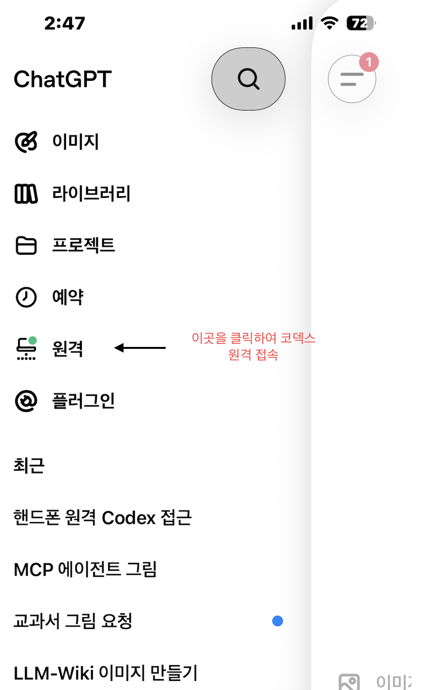
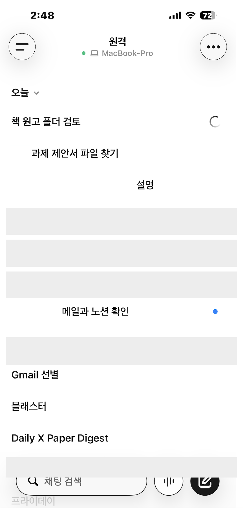

# 30장. 원격으로 에이전트 이어서 쓰기

에이전트에게 시킨 일이 끝나기를 책상 앞에서 기다릴 필요는 줄었다. 배치 ingest를 걸어 두고 강의를 하러 가거나, 제안서 자료를 모으라고 시켜 두고 회의에 들어가는 일이 실제로 자주 생긴다. 문제는 그 사이에 에이전트가 확인을 요청하며 멈추는 경우다. 되돌릴 수 없는 동작 앞에서 승인을 기다리도록 13장에서 설계해 두었으므로, 사람이 자리에 없으면 그 작업은 몇 시간 동안 멈춘 채로 있게 된다. 돌아와 보면 승인 창 하나 때문에 오후가 통째로 비어 있고, 그 창을 누르는 데 걸리는 시간은 3초다. 이동하는 시간이 긴 사람일수록 이 손실이 크다. 학회에 다녀오는 사흘 동안 아무것도 진행되지 않는 것과, 이동 중에 승인 몇 번과 후속 지시 몇 줄이 들어가는 것은 결과가 다르다. 휴대폰에서 그 기계에 붙는 방법이 이 장의 내용이고, 실제로 작업하는 것은 여전히 그 기계다.

# 켜 둔 기계 한 대라는 전제

이 방식은 항상 켜져 있는 컴퓨터 한 대를 전제로 한다. 휴대폰이 하는 일은 켜져 있는 기계 위에서 도는 에이전트에 붙어 지시를 넣고 결과를 보는 것까지이고, 코드를 돌리고 파일을 여는 쪽은 그 기계다. 호스트가 잠자기로 들어갔거나 네트워크가 끊겼거나 앱이 닫혀 있으면 원격 연결은 성립하지 않는다. 그래서 이 방식을 쓰기로 했다면 먼저 정할 것이 어느 기계를 켜 둘 것인가다. 연구실 책상의 데스크톱을 쓰는 사람도 있고, 전용으로 작은 기계를 하나 두는 사람도 있다. 나는 노트북 한 대를 연구실에 켜 둔 채로 두고 이동할 때는 다른 노트북을 들고 다닌다. 켜 두는 기계에는 절전 설정을 손봐야 하는데, 화면만 꺼지고 시스템은 깨어 있는 상태로 두지 않으면 몇 시간 뒤에 연결이 사라진다. 전원과 네트워크가 끊길 수 있는 자리에 두지 않는 것도 같은 이유이고, 실제로 이 방식이 무너지는 가장 흔한 원인은 그 기계가 잠들어 버리는 것이다.

기계가 둘이 되면 폴더를 어떻게 할지가 곧바로 문제가 된다. 두 기계에 각각 사본을 두고 손으로 맞추는 방식은 오래가지 않고, 2장에서 본 대로 한쪽만 고쳐지는 순간부터 어느 것이 최신인지 알 수 없게 된다. 나는 Dropbox로 두 기계를 잇는다. 파일 수가 많은 폴더에서는 동기화 서비스 사이에 실제로 차이가 있어서, 몇만 건 규모의 문서와 PDF를 다루는 폴더에는 Dropbox가 안정적이었다. 동기화된 폴더를 쓸 때 함께 정해야 할 것이 하나 있다. 두 기계가 공유하는 것은 문서이고, 검색 색인과 잠금 파일처럼 그 기계에서만 쓰는 상태는 공유하지 않는다. 색인을 동기화 폴더 안에 두면 두 기계가 같은 파일을 동시에 쓰면서 충돌 사본을 만들고, 그 사본이 색인을 망가뜨린다. 11장에서 각 기계가 자기 홈 아래에 런타임과 색인 버전과 잠금을 따로 둔다고 한 규칙이 여기서도 그대로 적용된다. 문서는 공유하고 상태는 기계마다 따로 두는 이 분리가 원격으로 붙어 쓸 때 특히 중요한데, 원격에서 시작한 작업이 만든 문서를 들고 다니는 기계에서 그대로 열 수 있어야 이 방식이 값을 하기 때문이다.

# 연결을 세우는 절차

연결은 호스트 쪽 데스크톱 앱에서 시작한다. 사이드바에서 원격 설정을 고르면 QR 코드가 나오고 그것을 휴대폰으로 읽으면 된다. 휴대폰 앱에서 계정과 작업 공간을 확인하고, 다단계 인증이나 통합 로그인이나 패스키를 쓰고 있다면 그 절차를 마친다. 설정을 마친 뒤에는 호스트 쪽 설정의 연결 항목에서 지금 무엇이 연결되어 있는지 확인할 수 있다. 요구 사항은 몇 가지로 정해져 있다. 양쪽 기기가 같은 계정과 같은 작업 공간으로 로그인되어 있어야 하고, 호스트에는 최신 데스크톱 앱이 깔려 있어야 하며, 그 기계가 깨어 있고 온라인이고 로그인된 상태여야 한다. 기관이나 조직 계정을 쓰는 경우에는 관리자가 원격 제어 접근을 켜 두어야 한다. 이 조건들은 모두 켜져 있는 기계 한 대라는 전제를 다시 말한 것이고, 하나라도 어긋나면 휴대폰 쪽에서는 호스트가 목록에 보이지 않는 형태로 나타난다.

연결이 서면 휴대폰 앱의 사이드바에 원격 항목이 생긴다. 그 항목으로 들어가면 지금 붙어 있는 기계의 이름과 연결 상태가 위에 표시되고, 그 아래에 그 기계에서 도는 작업이 목록으로 나온다. 화면에서 눈여겨볼 것은 각 줄의 상태 표시다. 돌고 있는 작업에는 회전하는 표시가 붙고, 사람의 답을 기다리는 작업에는 점이 붙는다. 목록을 훑는 데 몇 초면 되므로 이동 중에 확인하기에 알맞고, 무엇이 멈춰 있는지가 이 두 표시만으로 드러난다. 아래 화면은 실제로 연결해 둔 상태이며 작업 이름 몇 줄은 개인정보와 심사 정보를 담고 있어 지웠다. 지운 줄이 무엇이었는지보다 중요한 것은 한 기계 위에서 성격이 다른 작업이 동시에 도는 모양이고, 원고를 검토하는 작업과 메일을 훑는 작업과 자료를 찾는 작업이 각각 자기 대화로 살아 있다.

# 휴대폰에서 할 수 있는 일

휴대폰에서 할 수 있는 일은 호스트의 대화에 참여하는 것으로 정리된다. 호스트의 프로젝트 안에서 새 대화를 시작할 수 있고 이미 돌고 있는 대화를 이어서 지시할 수 있다. 에이전트가 물어보는 것에 답할 수 있고 명령과 동작을 승인할 수 있으며, 결과로 나온 변경 내용과 테스트 결과와 터미널 출력과 화면 갈무리를 그대로 볼 수 있다. 작업이 끝나면 알림이 오고, 연결해 둔 기계가 여럿이면 그 사이를 옮겨 다닐 수 있으며, 대화를 호스트와 지금 쓰는 컴퓨터 사이에서 넘길 수도 있다. 실제로 이동 중에 가장 자주 하는 일은 셋이다. 멈춰 있는 승인을 처리하는 일, 방향이 어긋난 작업에 한 줄을 더해 돌려세우는 일, 그리고 끝난 작업의 결과를 보고 다음 작업을 걸어 두는 일이다. 세 가지 모두 몇 문장이면 끝나고, 그 몇 문장이 들어가는 것과 들어가지 않는 것 사이에 반나절이 걸려 있다. 긴 지시가 필요하면 14장에서 다룬 음성 입력을 그대로 쓰면 되고, 그쪽이 이 상황에 특히 잘 맞는다.

같은 화면에서 하지 않는 편이 나은 일도 있다. 정확해야 하는 값을 넣는 일이 그렇고, 판단이 큰 결정을 내리는 일이 그렇다. 휴대폰 화면에서는 결과의 앞부분만 보게 되고 앞부분만 보고 내리는 판단은 대체로 낙관적이다. 변경 내용을 끝까지 읽지 않은 채 승인하는 습관이 붙으면 13장에서 세운 경계가 형식만 남는다. 그래서 이동 중에 처리할 것과 책상에 앉아서 볼 것을 미리 나눠 두는 편이 낫다. 되돌릴 수 있는 동작은 밖에서 승인하고, 되돌릴 수 없는 동작은 화면을 제대로 볼 수 있을 때까지 미룬다. 미루기로 했으면 그 사실을 대화에 한 줄 적어 둔다. 적어 두지 않으면 돌아와서 그 작업이 왜 멈춰 있는지 다시 확인하게 되고, 그 확인이 승인 자체보다 오래 걸린다.

# 휴대폰이 할 수 없는 일

휴대폰은 저장소의 파일이나 셸 명령이나 MCP 서버에 직접 닿지 않는다. 그 접근은 모두 호스트를 거치고, 파일과 자격 증명과 권한과 로컬 설정은 그 기계에 남는다. 이 구조가 이 방식의 안전성을 만드는 부분이기도 하다. 22장에서 본 연결들이 어디에 설치되어 있는지가 원격에서도 그대로 유지되므로, 휴대폰을 잃어버렸다고 해서 그 연결들이 함께 나가지 않는다. 반대로 호스트가 열 수 없는 것은 휴대폰에서도 열리지 않는다. 로그인이 필요한 웹 서비스나 데스크톱 앱을 쓰는 작업이라면 그 로그인이 호스트 쪽에 있어야 하고, 없으면 원격에서도 같은 자리에서 막힌다. 호스트가 잠들었거나 오프라인이거나 앱이 닫혀 있으면 아무것도 되지 않는다는 조건은 앞에서 말한 것과 같다. 이 세 가지가 이 방식의 한계를 거의 다 설명하고, 남는 것은 호스트가 붙어 있는 망이 끊기거나 느려지는 경우다.

보안 쪽에서 정해 둘 것도 있다. 원격 연결은 호스트에서 도는 앱 서버를 SSH로 시작하고 관리하는 구조이고, 그 전송 경로를 공유망이나 공개망에 그대로 열어 두지 말라고 공식 문서가 명시한다. 기관 밖에서 붙어야 한다면 VPN이나 메시 네트워크를 거치는 편이 안전하다. 연구실 공용 기계를 호스트로 쓰는 경우에는 한 가지가 더 붙는다. 그 기계에 붙은 계정으로 열리는 모든 것이 원격에서도 열리므로, 사람마다 접근 범위가 다른 자료가 그 기계에 있다면 호스트는 개인 기계로 두는 편이 낫다. 16장에서 상용 서비스에 올리면 안 되는 자료를 다뤘는데, 그 자료를 다루는 기계를 원격 호스트로 삼는 결정은 같은 판단을 한 번 더 하는 일이다. 승인과 보안 통제는 원격에서도 그대로 작동하므로, 원격이라는 이유로 경계가 자동으로 넓어지거나 좁아지지는 않는다. 넓어지는 것은 사람이 이동 중에 확인을 대충 하기 시작할 때다.

# 이 방식이 값을 하는 작업

이 방식이 잘 맞는 작업에는 공통점이 있다. 시작하는 데 사람의 판단이 필요하고, 도는 동안에는 필요 없으며, 중간에 한두 번 확인을 요청하는 작업이다. 배치 ingest가 대표적이다. 대상 목록을 정해 주고 나면 추출과 정리와 종합 연결은 기계가 순서대로 하고, 중간에 걸리는 것은 제외 저널 판정이나 중복 판정처럼 사람이 한 번 봐 줘야 하는 몇 건이다. 자료를 모으는 작업도 그렇고, 27장에서 만든 예약 작업이 남긴 결과를 확인하고 다음 처리를 지시하는 일도 그렇다. 반대로 잘 맞지 않는 작업은 사람의 판단이 계속 들어가야 하는 것들이다. 원고의 논지를 다시 세우는 일이나 근거의 강도를 정하는 일을 휴대폰 화면에서 하면 대체로 대충 하게 된다. 이 구분은 21장에서 나눈 것과 같은 선 위에 있어서, 에이전트가 대신할 수 있는 쪽이 원격으로 돌리기에도 알맞고 사람이 해야 하는 쪽은 자리에 앉아서 하는 편이 낫다.

이 방식이 실제로 바꾸는 것은 작업을 걸어 두고 자리를 뜨는 일이 가능해진다는 점이다. 이동 중에 처리한 승인 몇 건은 그 결과로 따라오는 것이다. 자리를 뜨면 멈춘다는 것을 알면 사람은 긴 작업을 걸지 않게 되고, 그래서 하루가 짧은 작업으로만 채워진다. 걸어 두고 나갈 수 있으면 반나절이 걸리는 배치를 오전에 걸고 강의를 하러 갈 수 있다. 이 차이가 실제로 쌓이는 곳은 위키의 크기이고, 넣지 못한 채 목록에만 있던 논문들이 이 방식으로 줄어들었다. 다만 켜 둔 기계 한 대가 늘 필요하다는 조건은 그대로이고, 그 기계가 잠들면 이 모든 것이 성립하지 않는다. 이 방식을 쓰기로 했다면 앱의 설정보다 그 기계의 절전 설정을 먼저 확인한다.
